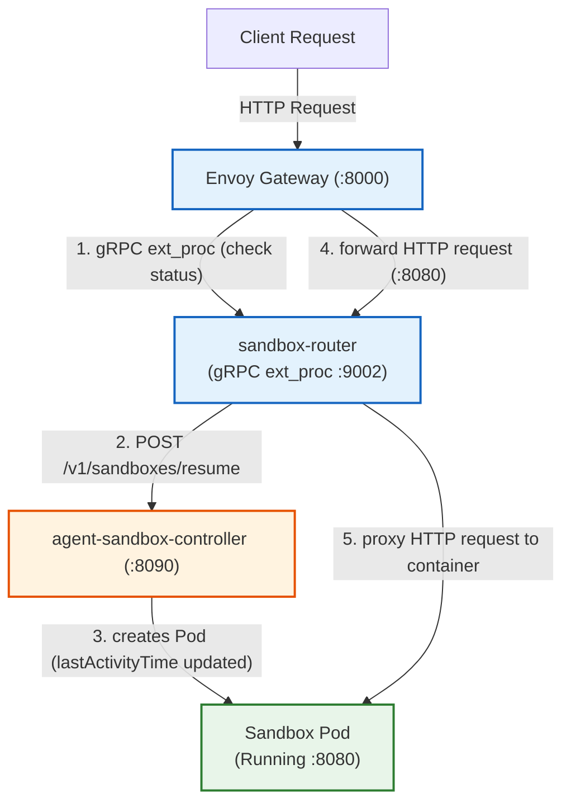
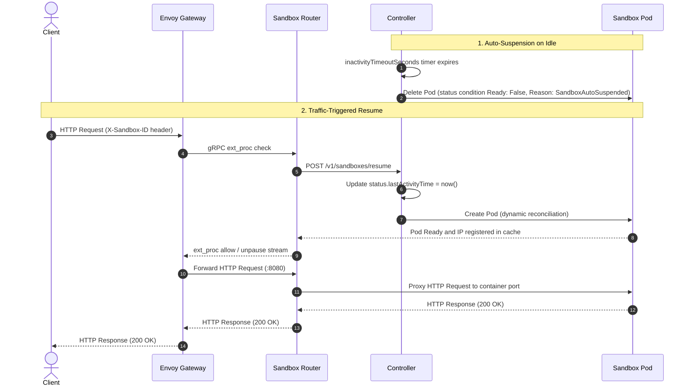

# Auto-Suspension and Traffic-Triggered Resume

In agentic AI workflows and interactive development environments, sandboxes often experience long periods of inactivity between user prompts or automated tool invocations. Keeping pod workloads running continuously during idle periods wastes compute resources and inflates infrastructure costs.

Agent Sandbox provides **Auto-Suspension and Traffic-Triggered Resume**:

* **Auto-Suspension**: When a sandbox remains inactive for a configured duration (`inactivityTimeoutSeconds`), the control plane automatically terminates its underlying Kubernetes Pod while preserving user intent (`.spec.operatingMode` remains `Running`). Sandbox suspension status is indicated via status conditions:
  - **`Ready` Condition**: Transitioned to `Status: "False"` with Reason **`SandboxAutoSuspended`** for idle suspension.
  - **`Suspended` Condition**: Transitioned to `Status: "True"` with Reason `PodTerminated`.
  The `Sandbox` resource, its stable identity, and any persistent volumes remain intact.
* **Traffic-Triggered Resume**: When new HTTP requests arrive for a suspended sandbox, Envoy Gateway intercepts the request stream via the **Sandbox Router** (`ext_proc`). The router signals the control plane (`POST /v1/sandboxes/resume`) to update `status.lastActivityTime` to `now()`, which prompts the controller to dynamically provision a fresh Pod, wait for it to become ready, and transparently proxy the request without dropping client connections.

> [!NOTE]
> **Controller-Level Opt-In & Network Security (Admin Guardrail)**: Auto-Suspension is disabled by default (`--enable-auto-suspend-and-resume=false`; `controller.enableAutoSuspendAndResume: false` in Helm). To use it, administrators explicitly enable the flag on the controller (which is protected out-of-the-box by a bundled Kubernetes `NetworkPolicy` isolating ingress to port `:8090` exclusively to `sandbox-router` pods). See [Security & Access Control (:8090 REST API)](#security--access-control-8090-rest-api) below for setup instructions.

### Architecture & Request Flow



### Lifecycle & Resume Sequence




## Installation & Prerequisites

To enable Auto-Suspension and Traffic-Triggered Resume on your cluster, install the required Gateway API dependencies and deploy the auto-suspension overlay:

#### 1. Install Kubernetes Gateway API & Envoy Gateway

Ensure your cluster has [Kubernetes Gateway API CRDs](https://github.com/kubernetes-sigs/gateway-api) (`v1.2.0+`) and [Envoy Gateway](https://gateway.envoyproxy.io/) (`v1.2.0+`) installed:

```bash
# 1. Install standard Gateway API CRDs
kubectl apply -f https://github.com/kubernetes-sigs/gateway-api/releases/download/v1.2.0/standard-install.yaml

# 2. Install Envoy Gateway via Helm
helm install eg oci://docker.io/envoyproxy/gateway-helm --version v1.2.0 -n envoy-gateway-system --create-namespace
```

#### 2. Deploy Agent Sandbox with Auto-Suspension (Kubectl or Helm)

You can install the controller and auto-suspension components using either static manifests (`kubectl`) or Helm (`helm`).

##### Option A: Installation via `kubectl` (Static Manifests)

Apply the core CRDs and base controller, then apply the auto-suspension overlay ([k8s/auto-suspension.yaml](../k8s/auto-suspension.yaml)) which enables the controller flag, port `:8090`, NetworkPolicy, and data-plane components:

```bash
# 1. Apply core Sandbox CRDs and controller (or extensions.yaml for extensions)
kubectl apply -f https://github.com/kubernetes-sigs/agent-sandbox/releases/latest/download/controller.yaml

# 2. Enable the auto-suspension flag on the controller (appends flag cleanly for core or extensions)
kubectl patch deployment agent-sandbox-controller -n agent-sandbox-system \
  --type='json' -p='[{"op": "add", "path": "/spec/template/spec/containers/0/args/-", "value": "--enable-auto-suspend-and-resume=true"}]'

# 3. Apply the auto-suspension data-plane & NetworkPolicy overlay
kubectl apply -f https://github.com/kubernetes-sigs/agent-sandbox/releases/latest/download/auto-suspension.yaml
```

##### Option B: Installation via Helm Chart (`helm`)

The Agent Sandbox Helm chart manages the control-plane controller (`agent-sandbox-controller`). To deploy with auto-suspension enabled:

1. **Install/Upgrade the Controller via Helm**:
   ```bash
   helm upgrade --install agent-sandbox oci://registry.k8s.io/agent-sandbox/charts/agent-sandbox \
     --namespace agent-sandbox-system \
     --set controller.enableAutoSuspendAndResume=true
   ```

2. **Apply the Data-Plane Router & Gateway Overlay**:
   Deploy the `sandbox-router` and Envoy Gateway `ext_proc` extension policy ([k8s/auto-suspension.yaml](../k8s/auto-suspension.yaml)):
   ```bash
   kubectl apply -f https://github.com/kubernetes-sigs/agent-sandbox/releases/latest/download/auto-suspension.yaml
   ```

##### Option C: Local Development with Kind

For local development and testing, you can create a kind cluster with Envoy Gateway and the auto-suspension overlay pre-installed using:

```bash
AUTO_SUSPENSION=true make deploy-kind
```

## Configuring Auto-Suspension on a Sandbox

You can enable auto-suspension on any `Sandbox` by setting `.spec.autoSuspension.inactivityTimeoutSeconds` to the desired idle duration in seconds (e.g., `300` for 5 minutes, `3600` for 1 hour):

```yaml
apiVersion: agents.x-k8s.io/v1beta1
kind: Sandbox
metadata:
  name: demo-sandbox
  namespace: default
spec:
  operatingMode: Running
  autoSuspension:
    inactivityTimeoutSeconds: 300
  podTemplate:
    spec:
      containers:
      - name: web
        image: python:3.10-alpine
        command: ["python3", "-m", "http.server", "8888"]
        ports:
        - containerPort: 8888
```

## End-to-End Verification Guide

### 1. Apply a Sandbox with an Idle Timeout

Create a test sandbox configured to suspend after 60 seconds of inactivity:

```bash
cat <<EOF | kubectl apply -f -
apiVersion: agents.x-k8s.io/v1beta1
kind: Sandbox
metadata:
  name: demo-sandbox
  namespace: default
spec:
  operatingMode: Running
  autoSuspension:
    inactivityTimeoutSeconds: 60
  podTemplate:
    spec:
      containers:
      - name: web
        image: python:3.10-alpine
        command: ["python3", "-m", "http.server", "8888"]
        ports:
        - containerPort: 8888
EOF
```

### 2. Verify Idle Suspension

Wait at least 65 seconds (1 minute inactivity duration plus reconciliation margin) without sending traffic to the sandbox, then inspect its status:

```bash
kubectl get sandbox demo-sandbox
```

**Expected Output:**

```text
NAME           READY   REASON             AGE
demo-sandbox   False   SandboxSuspended   70s
```

You can confirm that the underlying Pod has been garbage-collected:

```bash
kubectl get pods -n default
```

### 3. Send Traffic to Trigger Auto-Resume

Port-forward the Envoy Gateway listener to your local machine:

```bash
kubectl port-forward -n envoy-gateway-system svc/envoy-agent-sandbox-system-sandbox-gateway-f1bf2275 8000:80 &
```

Send an HTTP request targeting `demo-sandbox` by supplying `X-Sandbox-ID` and `X-Sandbox-Namespace` headers:

```bash
curl -i -H "X-Sandbox-ID: demo-sandbox" -H "X-Sandbox-Namespace: default" http://localhost:8000/
```

**What Happens Behind the Scenes:**
1. Envoy Gateway intercepts the request and calls the `sandbox-router` `ext_proc` service (`:9002`).
2. Recognizing that `demo-sandbox` is suspended, the router issues a `POST /v1/sandboxes/resume` request to the controller (`:8090`).
3. The controller updates `status.lastActivityTime` to the current timestamp, which prompts the reconciler to provision a fresh Pod while `.spec.operatingMode` remains `Running`.
4. Once the new Pod starts and registers its IP in the router's informer cache, `ext_proc` unpauses the request pipeline and proxies the request to the container.

**Expected Output:**

```http
HTTP/1.1 200 OK
Content-Type: text/html
...
```

## Performance, Latency & Cost Impact

Opting into Auto-Suspension and Traffic-Triggered Resume introduces tradeoffs between idle compute cost savings, control plane overhead, and first-request resume latency.

### 1. Latency Impact: Cold-Start Spike vs. Steady-State

| Sandbox State | Request Handling Path | Expected Latency Impact |
| :--- | :--- | :--- |
| **Suspended (Cold Start)** | Request held by Envoy `ext_proc` &rarr; `POST /v1/sandboxes/resume` &rarr; Pod schedule & image pull &rarr; Proxy | **1s – 3s** (cached/lightweight images)<br/>**5s – 15s+** (large images or cold nodes) |
| **Running (Steady-State)** | Envoy `ext_proc` in-memory Informer cache check &rarr; Proxy | **< 0.05ms** (negligible L7 overhead; zero Kubernetes API calls) |

* **Cold-Start Resume Spike**: The first HTTP request to a suspended sandbox experiences a latency spike equal to the time required for Kubernetes to schedule the Pod, pull the container image, and pass container readiness checks. Using pre-cached images or lightweight base images (such as Alpine or Distroless) keeps resume spikes under 2–3 seconds.
* **Steady-State Fast-Path**: Once the Pod is `Running`, the `sandbox-router` resolves `ext_proc` authorization requests from its local in-memory pod cache in under `0.05ms`.

### 2. Cost Impact: Compute Savings vs. Gateway Overhead

* **70% – 90% Compute Cost Reduction**: Keeping pods continuously running during idle agent reasoning gaps or user think-time inflates CPU and GPU costs. Suspending idle pods frees cluster nodes for scaling down or running other workloads.
* **Control Plane Resource Overhead**:
  * **`sandbox-router` Deployment**: Runs as a lightweight Go gRPC service (`replicas: 1` by default in [k8s/auto-suspension.yaml](../k8s/auto-suspension.yaml), but can be scaled horizontally for high availability), consuming roughly **10m CPU** and **32Mi memory** per replica.
  * **Envoy Gateway**: Requires a running Gateway proxy (typically **100m CPU** and **128Mi memory** per replica).
  * **Net Cost Impact**: For clusters running multiple sandboxes, the infrastructure savings from suspending even 2–3 idle CPU/GPU pods vastly outweigh the fixed compute cost of the `sandbox-router` and Envoy Gateway.
* **Persistent Storage Costs**: When a sandbox is suspended (`status.conditions[Suspended] = True`), its underlying Kubernetes PersistentVolumeClaims (PVCs) remain bound to preserve state and workspace files. Storage costs for attached volumes continue to accrue while suspended.

## Recommendations, Best Practices & Limitations

### Recommendations & Best Practices
* **Recommended Inactivity Timeout (`300` to `3600` seconds)**: For interactive AI agent development and notebooks, we recommend an `inactivityTimeoutSeconds` between **`300` (5 minutes) and `3600` (1 hour)**.
* **Minimum Safety Floor (`60s`)**: Avoid setting `inactivityTimeoutSeconds` under **`60 seconds`** in production. Extremely short idle timeouts can race with Kubernetes image pull / container startup times and the 10-second `sandbox-router` telemetry flush interval (`--activity-flush-interval=10s`), leading to premature suspension during pod startup.
* **Long-Running Autonomous Jobs**: For agent runtimes executing long autonomous loops (such as OpenClaw running a 30-minute agent task) without incoming HTTP requests, set `inactivityTimeoutSeconds` longer than the maximum expected job duration (e.g., `7200` seconds / 2 hours), **OR** configure the agent runtime to send periodic heartbeat POST requests to the controller's `/v1/sandboxes/activity` endpoint while busy.
* **Explicit Target Port (`X-Sandbox-Port`)**: If your runtime listens on a non-default port (such as OpenClaw on port `18789`), always include the `X-Sandbox-Port: <port>` header in client requests so `ext_proc` verifies TCP readiness on the correct container port before unpausing Envoy.
* **Cluster-Wide vs. Namespace-Scoped Routers**: We recommend a single shared `sandbox-router` (`--cache-namespace=""`, default). For multi-tenant isolation, scope a dedicated router to a single namespace (`--cache-namespace=<tenant-ns>`) via a Kustomize patch or container arg override, and replace the `ClusterRoleBinding` with a namespace-scoped `RoleBinding`.
* **Production High Availability (`replicas: 2+`)**: [k8s/auto-suspension.yaml](../k8s/auto-suspension.yaml) defaults to `1` replica for local development. In production, scale `sandbox-router` to **`2+` replicas** (`kubectl scale -n agent-sandbox-system deployment/sandbox-router --replicas=2` or via Kustomize `replicas:` override) for stateless active-active high availability.

### Limitations & Known Considerations
* **L7 Header-Only Activity Tracking vs. Open Streams**: Currently, `ext_proc` calls `RecordActivity` only when `handleRequestHeaders` is invoked at the start of an HTTP request. Long-lived open connections (such as WebSockets, Server-Sent Events, or streaming LLM token responses) or long-running offline agent loops that do not emit incoming HTTP request headers will count toward the idle timer.
  * *Recommendation*: Set `inactivityTimeoutSeconds` longer than the maximum expected open stream or task duration, or configure agent workloads to send periodic heartbeats to `POST /v1/sandboxes/activity`.
* **Configurable Resume Timeout for Kata VMs & Large Container Images**: When a suspended sandbox resumes, `sandbox-router` holds the client HTTP request open for a default deadline of **60 seconds** while waiting for the Pod IP and target TCP port readiness.
  * **Kata & VM Workloads**: Kata workloads run inside lightweight virtual machines and require VM boot, `kata-agent` initialization, and VM network namespace setup on top of container start. To allow extra time for VM boot on cold nodes or large uncached images, configure the `--default-resume-timeout` flag on the `sandbox-router` deployment (e.g., `--default-resume-timeout=120s`, default is `60s`).
* **Pod Startup Latency on Resume**: First-request latency after auto-resume depends on your Kubernetes cluster's Pod scheduling speed and image pulling time. Using pre-cached images or smaller runtime base images minimizes cold-start wake-up latency.
* **Gateway API Dependency**: Traffic-triggered resume requires an Envoy Gateway `v1.2.0+` deployment with `ext_proc` gRPC support. Direct ClusterIP or node-port traffic that bypasses Envoy Gateway will not trigger auto-resume for suspended sandboxes.

## Security & Access Control (`:8090` REST API)

In `v1beta1`, the auto-suspension REST server (`/v1/sandboxes/resume` and `/v1/sandboxes/activity` on port `8090`) does not perform native authentication or authorization.

To prevent unauthorized workloads from reaching the controller and modifying Sandbox operating modes or activity timestamps:

1. **Secure by Default**: The `--enable-auto-suspend-and-resume` flag on `agent-sandbox-controller` defaults to `false` (and `controller.enableAutoSuspendAndResume: false` in Helm). When disabled, the `:8090` HTTP server is never started.
2. **NetworkPolicy Isolation Included Out-of-the-Box**: When deploying Auto-Suspension using `auto-suspension.yaml`, a Kubernetes `NetworkPolicy` is **automatically included** that restricts ingress to port `8090` exclusively from `sandbox-router` pods:

```yaml
apiVersion: networking.k8s.io/v1
kind: NetworkPolicy
metadata:
  name: allow-sandbox-router-to-controller-suspension-api
  namespace: agent-sandbox-system
spec:
  podSelector:
    matchLabels:
      app: agent-sandbox-controller
  policyTypes:
  - Ingress
  ingress:
  - from:
    - podSelector:
        matchLabels:
          app: sandbox-router
    ports:
    - protocol: TCP
      port: 8090
```

> [!WARNING]
> **CNI NetworkPolicy Enforcement & Security Posture**:
> The `:8090` REST API (`/v1/sandboxes/resume` and `/v1/sandboxes/activity`) relies on Kubernetes `NetworkPolicy` enforcement to restrict ingress to `sandbox-router` pods. If your Kubernetes cluster CNI does not support or enforce `NetworkPolicy` (e.g., basic Flannel or cloud clusters with NetworkPolicy enforcement disabled), any pod on the cluster network can call port `:8090` and control sandbox states.
> 
> Native Kubernetes `TokenReview` or mTLS client certificate authentication will be added to port `:8090` in a follow-up release. On clusters without active CNI `NetworkPolicy` enforcement, ensure port `:8090` is isolated using CNI-native policies (e.g., Cilium or Calico) or service mesh authorization rules.

## Routing Header Reference

When sending traffic through Envoy Gateway to a sandbox, include the following HTTP headers:

| Header | Required | Default | Description |
| :--- | :--- | :--- | :--- |
| `X-Sandbox-ID` | **Yes** (or `Host`) | N/A | The name of the target `Sandbox` resource. |
| `X-Sandbox-Namespace` | Optional | `default` | The Kubernetes namespace where the sandbox resides. |
| `X-Sandbox-Port` | Optional | `8888` | The target container port inside the sandbox Pod. |
| `Host` / `:authority` | Optional | N/A | Can be used instead of explicit ID/Namespace headers in the format `<id>.<namespace>.sandbox.local`. |

## Troubleshooting

### Checking Envoy Gateway `ext_proc` Configuration
If requests return `502 Bad Gateway`, check if the `ext_proc` filter is active in Envoy Gateway:
```bash
kubectl get envoyextensionpolicy -n agent-sandbox-system
```
Ensure `sandbox-ext-proc-policy` shows `Accepted: True`.

### Inspecting Router and Controller Logs
Check `sandbox-router` logs to see if Envoy forwarded request headers to `ext_proc`:
```bash
kubectl logs -n agent-sandbox-system deployment/sandbox-router --tail=20
```

Check `agent-sandbox-controller` logs to confirm it received the `POST /v1/sandboxes/resume` request:
```bash
kubectl logs -n agent-sandbox-system deployment/agent-sandbox-controller --tail=20
```

## Runnable Examples

* **OpenClaw AI Agent Gateway (`gVisor`/standard runtime)**: See [examples/openclaw-gvisor-sandbox/openclaw-sandbox-auto-suspension.yaml](../examples/openclaw-gvisor-sandbox/openclaw-sandbox-auto-suspension.yaml) and [examples/openclaw-gvisor-sandbox/README.md](../examples/openclaw-gvisor-sandbox/README.md) for a full example of idling out and traffic-resuming an AI agent gateway.
* **Hermes Agent (Agents-as-a-Service)**: See [examples/hermes-agents-as-a-service/05-simple-sandbox-auto-suspension.yaml](../examples/hermes-agents-as-a-service/05-simple-sandbox-auto-suspension.yaml) and [examples/hermes-agents-as-a-service/README.md](../examples/hermes-agents-as-a-service/README.md) for a standalone Hermes agent sandbox with idle scale-to-zero and persistent volume state (`/opt/data`).
* **Kata Containers on GKE (Hardware VM Isolation)**: See [examples/kata-gke-sandbox/sandbox-kata-auto-suspension.yaml](../examples/kata-gke-sandbox/sandbox-kata-auto-suspension.yaml) and [examples/kata-gke-sandbox/README.md](../examples/kata-gke-sandbox/README.md) for an example combining hardware microVM isolation (`runtimeClassName: kata-qemu`) with auto-suspension.

