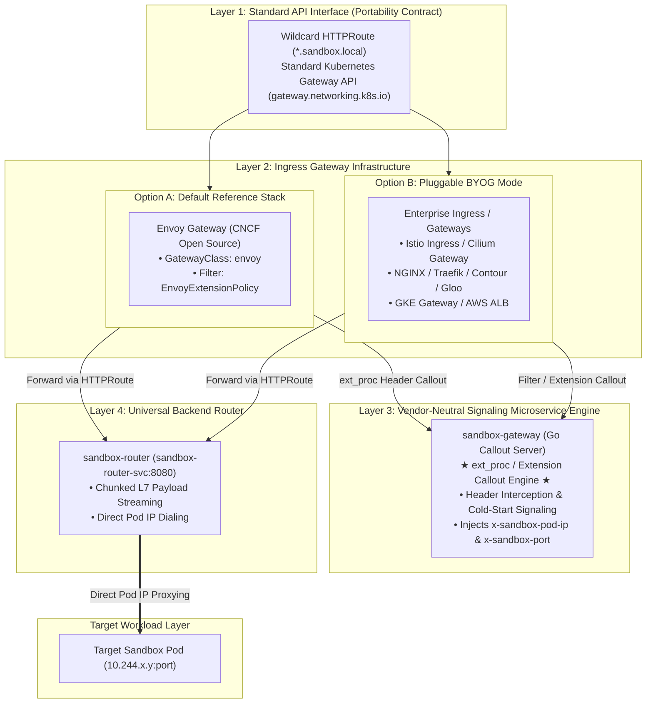
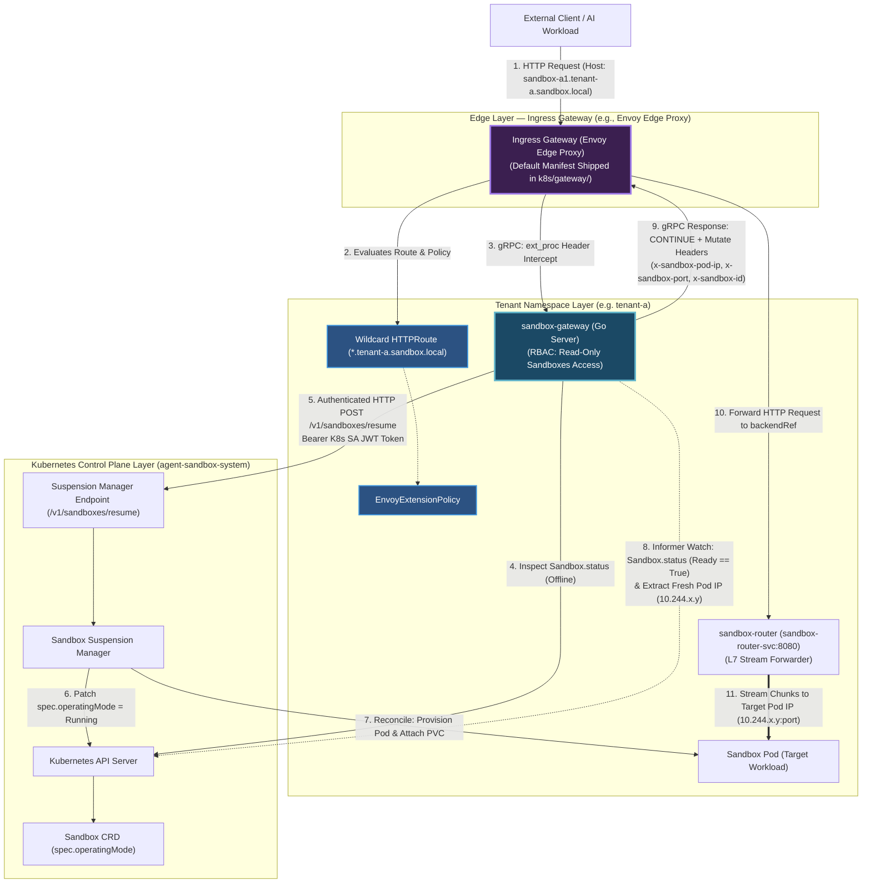
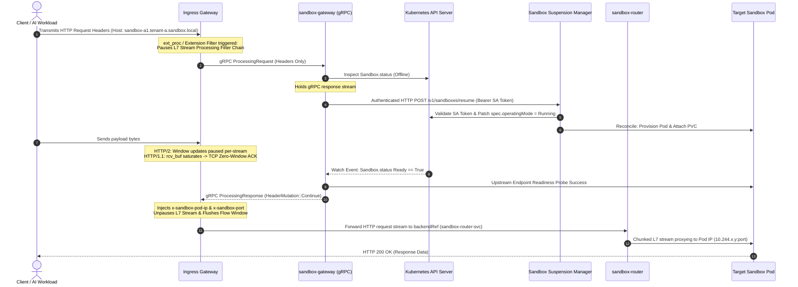

# KEP-1174: Agent Sandbox Gateway (Request-Buffering Auto-Resume)

<!--
TOC is auto-generated via `make toc-update`.
-->

<!-- toc -->
- [Summary](#summary)
- [Motivation](#motivation)
  - [Goals](#goals)
  - [Non-Goals](#non-goals)
- [Proposal](#proposal)
  - [Proposed Architectural Framing: Default OSS Gateway &amp; Pluggable BYOG Model](#proposed-architectural-framing-default-oss-gateway--pluggable-byog-model)
  - [High-Level Design](#high-level-design)
  - [Components Scope of KEP-1174](#components-scope-of-kep-1174)
  - [Detailed Operational Step-by-Step Flow](#detailed-operational-step-by-step-flow)
  - [Rationale for <code>sandbox-router</code> Inclusion &amp; Canonical Envoy Integration](#rationale-for-sandbox-router-inclusion--canonical-envoy-integration)
    - [1. Why <code>sandbox-router</code> was Included as the Universal L7 Target](#1-why-sandbox-router-was-included-as-the-universal-l7-target)
    - [2. Why Envoy Gateway is Shipped as the Default Reference Stack](#2-why-envoy-gateway-is-shipped-as-the-default-reference-stack)
    - [3. Data-Plane Performance &amp; Warm-Path Direct Routing Options](#3-data-plane-performance--warm-path-direct-routing-options)
  - [Rationale for Per-Tenant Deployment over Control Plane Co-Location](#rationale-for-per-tenant-deployment-over-control-plane-co-location)
  - [Determining Sandbox Resume Need &amp; Container Readiness](#determining-sandbox-resume-need--container-readiness)
    - [Operational Strategy Comparison](#operational-strategy-comparison)
  - [Formal Interface Contract Specification](#formal-interface-contract-specification)
    - [Contract 1: Ingress Gateway <span class="math inline">\(\rightarrow\)</span> <code>sandbox-gateway</code> (Callout Phase)](#contract-1-ingress-gateway--sandbox-gateway-callout-phase)
    - [Contract 2: <code>sandbox-gateway</code> <span class="math inline">\(\rightarrow\)</span> Ingress Gateway (Unpause &amp; Header Mutation)](#contract-2-sandbox-gateway--ingress-gateway-unpause--header-mutation)
    - [Contract 3: <code>sandbox-gateway</code> <span class="math inline">\(\rightarrow\)</span> <code>sandbox-suspension-manager</code> (Thaw Signaling)](#contract-3-sandbox-gateway--sandbox-suspension-manager-thaw-signaling)
    - [Contract 4: Ingress Gateway <span class="math inline">\(\rightarrow\)</span> <code>sandbox-router</code> (L7 Forwarding)](#contract-4-ingress-gateway--sandbox-router-l7-forwarding)
    - [Contract 5: <code>sandbox-router</code> <span class="math inline">\(\rightarrow\)</span> Target Sandbox Pod (Direct Stream Proxy)](#contract-5-sandbox-router--target-sandbox-pod-direct-stream-proxy)
  - [Resume Endpoint Interface](#resume-endpoint-interface)
  - [Stream Flow Control &amp; Request Holding Mechanics](#stream-flow-control--request-holding-mechanics)
  - [API Changes](#api-changes)
- [Scalability](#scalability)
  - [Component-by-Component Impact Analysis (100,000 Request Surge)](#component-by-component-impact-analysis-100000-request-surge)
    - [1. External Clients &amp; Kernel Sockets (Zero Connection Drops)](#1-external-clients--kernel-sockets-zero-connection-drops)
    - [2. Ingress Gateway (Data Plane &amp; Memory Bounding)](#2-ingress-gateway-data-plane--memory-bounding)
    - [3. <code>sandbox-gateway</code> Callout Service (Stateless Multi-Replica HA Topology)](#3-sandbox-gateway-callout-service-stateless-multi-replica-ha-topology)
    - [4. <code>sandbox-router</code> Streaming Proxy Tier](#4-sandbox-router-streaming-proxy-tier)
- [Deployment Strategy &amp; Integration Methodologies](#deployment-strategy--integration-methodologies)
  - [1. Architectural Segmentation (Control Plane vs Tenant Isolation)](#1-architectural-segmentation-control-plane-vs-tenant-isolation)
  - [2. Operational Deployment Models](#2-operational-deployment-models)
    - [Model A: Declarative GitOps / Helm Mode (Zero Reconciler Overhead — <em>Preferred OSS Standard</em>)](#model-a-declarative-gitops--helm-mode-zero-reconciler-overhead--preferred-oss-standard)
    - [Model B: Dynamic Gateway Controller Auto-Provisioning (<code>gateway_controller.go</code>)](#model-b-dynamic-gateway-controller-auto-provisioning-gateway_controllergo)
  - [3. Bring-Your-Own-Gateway (BYOG) &amp; Extension Discovery](#3-bring-your-own-gateway-byog--extension-discovery)
- [Security](#security)
  - [Core Security Guarantees](#core-security-guarantees)
  - [Threat Model &amp; Mitigation Analysis](#threat-model--mitigation-analysis)
- [Prometheus Metrics &amp; Observability](#prometheus-metrics--observability)
- [Future Work](#future-work)
- [Implementation Plan](#implementation-plan)
  - [Phase 1: Prototype Verification &amp; Proof-of-Concept (Validated)](#phase-1-prototype-verification--proof-of-concept-validated)
  - [Phase 2: Core Microservice Engine &amp; Base Manifest Packaging (<code>cmd/sandbox-gateway</code>)](#phase-2-core-microservice-engine--base-manifest-packaging-cmdsandbox-gateway)
  - [Phase 3: Dynamic Extension Reconciler, SDK Migration &amp; End-to-End Testing](#phase-3-dynamic-extension-reconciler-sdk-migration--end-to-end-testing)
<!-- /toc -->

## Summary

This KEP introduces **`sandbox-gateway`**, an opt-in extension for `agent-sandbox` that provides zero-loss request-buffering auto-suspension and auto-resume (sleep/wake) capabilities across Kubernetes environments.

The architecture standardizes on the Kubernetes Gateway API (`gateway.networking.k8s.io`) as its declarative control plane interface, providing **Envoy Gateway** as its default open-source reference implementation while supporting a pluggable **Bring-Your-Own-Gateway (BYOG)** model across both Envoy-native proxies (Istio, Cilium Gateway, Contour, Gloo) via `ext_proc` and non-Envoy proxies (NGINX, Traefik, GKE Gateway, AWS ALB) via standard HTTP header callout adapters.

A lightweight callout engine (`cmd/sandbox-gateway`) intercepts incoming HTTP headers, manages authenticated cold-start thaw signaling via `sandbox-suspension-manager`, and injects routing headers (`x-sandbox-id`, `x-sandbox-pod-ip`, `x-sandbox-port`, `x-sandbox-namespace`). Upon unblocking, requests route either through **`sandbox-router`** (`sandbox-router-svc`) for universal Gateway API compatibility or directly to the target Sandbox Pod IP via dynamic warm-path endpoint bypassing. This decouples data-plane streaming from control-plane signaling while guaranteeing multi-cloud operational portability and high performance.

## Motivation

The primary motivation for this KEP is to introduce a scalable, standards-compliant request-buffering auto-resume capability for `agent-sandbox`: https://github.com/kubernetes-sigs/agent-sandbox/issues/968.

`sandbox-gateway` addresses these challenges by decoupling the data plane into three clear responsibilities:
1. **Edge Flow Control & Memory Protection (Ingress Gateway)**: Envoy Gateway (or any BYOG edge proxy) holds incoming client connection streams at the header phase during container cold starts ($5\text{s} - 10\text{s}$ boot window). Payload bytes remain held on the client machine via L7 flow control / TCP Zero-Window ACKs, preventing proxy OOM crashes.
2. **Stateless Control-Plane Signaling (`sandbox-gateway`)**: A namespaced microservice inspects `Sandbox.status`, triggers out-of-band thaw signals to `sandbox-suspension-manager`, and mutates request headers upon readiness.
3. **Universal Data-Plane Routing (`sandbox-router`)**: By having standard Gateway API `HTTPRoute` rules point to `sandbox-router-svc`, any Ingress Gateway can route traffic using standard Kubernetes `Service` primitives. `sandbox-router` receives the mutated headers and proxies request streams directly to the target Sandbox Pod IP using low-memory chunked streaming.

### Goals
* **Transparent Cold-Start Buffering**: Pause incoming client HTTP request streams transparently during sandbox wakeups without client modifications, connection drops, or gateway timeout errors.
* **Universal Gateway Portability (BYOG)**: Standardize on Kubernetes Gateway API routing primitives, providing Envoy Gateway as the default reference implementation while enabling any Gateway or Ingress controller (Istio, Cilium, NGINX, Traefik, GKE Gateway, AWS ALB) to integrate seamlessly.
* **Cold-Start Memory Safety**: Hold request payloads at the edge socket layer during wakeups, capping proxy RAM footprint and preventing OOM crashes during container cold starts.
* **Control Plane & Thundering-Herd Protection**: Safeguard cluster worker nodes and the Kubernetes control plane from scheduling storms under high concurrent request volumes.
* **High Availability & Multi-Tenant Isolation**: Provide stateless, multi-replica per-tenant resilience without single points of failure (SPOF) or noisy-neighbor cross-tenant interference.

### Non-Goals
* **Inactivity Detection & Sleep Scheduling**: Managing container idle timers or traffic-based sleep transitions (deferred to Future Work).
* **End-User Authentication**: Validating user identity, OAuth/OIDC tokens, or application-level authorization inside `sandbox-gateway`.

## Proposal

We propose adding **`sandbox-gateway`**, an optional namespaced extension for `agent-sandbox` that delivers transparent request-buffering auto-suspension and auto-resume capabilities. It decouples standard Kubernetes Gateway API host routing (`gateway.networking.k8s.io`) from proxy filter execution. CNCF Envoy Gateway is shipped as the standard, out-of-the-box reference implementation, while a pluggable Bring-Your-Own-Gateway (BYOG) model allows enterprise platforms to attach their existing ingress infrastructure (Istio, Cilium, NGINX, Traefik, Contour, Gloo Edge, Cloud Gateways) to the same standard `sandbox-gateway` signaling engine.

### Proposed Architectural Framing: Default OSS Gateway & Pluggable BYOG Model

`sandbox-gateway` structures its architectural responsibilities across four decoupled layers:



1. **Standard Host Routing Contract**: 
   All host matching and routing rules rely strictly on standard **Kubernetes Gateway API primitives (`gateway.networking.k8s.io`)**, specifically wildcard `HTTPRoute` resources pointing `backendRefs` to `sandbox-router-svc:8080`. This guarantees 100% API-level portability across any Kubernetes cluster or cloud provider.

2. **Default Reference Open-Source Infrastructure**: 
   To ensure a zero-dependency, out-of-the-box experience for local development (`make deploy-kind`), Kind, Minikube, and standard open-source Kubernetes clusters, `agent-sandbox` ships **Envoy Gateway** (an official CNCF open-source project) as its default reference implementation (`gatewayClassName: envoy`). Pre-packaged base extension manifests include `EnvoyExtensionPolicy` to attach the `ext_proc` callout filter automatically.

3. **Pluggable Bring-Your-Own-Gateway (BYOG) Model & Adapter Classification**: 
   The `sandbox-gateway` callout microservice (`cmd/sandbox-gateway`) provides a dual-interface architecture to support diverse enterprise ingress proxies:
   - **Class 1: Envoy-Based Gateway Implementations (Native `ext_proc`)**: Platforms using Envoy Gateway, Istio Ingress, Cilium Gateway (Envoy mode), Contour, or Gloo Edge connect natively using Envoy's standard `ext_proc` gRPC callout interface (`envoy.service.ext_proc.v3.ExternalProcessor`).
   - **Class 2: Non-Envoy & Cloud-Native Ingress Controllers (HTTP/gRPC Callout Adapters)**: Platforms operating non-Envoy infrastructure (NGINX Ingress, Traefik, GKE Gateway, AWS ALB) interface with `sandbox-gateway` via standard HTTP/gRPC header callout endpoints (`POST /v1/callout/headers` on Port `8081`) or native extension hooks (e.g. NGINX `auth_request` / WASM / Lua, Traefik ForwardAuth / Middleware, GCP Service Extensions, AWS ALB Target Group callouts). This guarantees universal BYOG portability across any ingress proxy without forcing Envoy proxy replacements.

### High-Level Design



### Components Scope of KEP-1174

1. **Callout Microservice Engine (`sandbox-gateway`)**: The Go gRPC callout microservice (`cmd/sandbox-gateway`) implementing header interception, singleflight request deduplication, `Sandbox.status` readiness inspection, and L7 stream flow control holds.
2. **Default Ingress Gateway Provided by System**: **Envoy Edge Proxy** (via Envoy Gateway) is shipped as the standard, out-of-the-box default Gateway implementation (`k8s/gateway/gateway.yaml`). Enterprise clusters may alternatively use Bring-Your-Own-Gateway (BYOG) mode with any API Gateway or Ingress proxy.
3. **L7 Backend Router (`sandbox-router`)**: The namespaced proxy deployment and service (`sandbox-router-svc`) that receives mutated routing headers (`x-sandbox-id`, `x-sandbox-pod-ip`, `x-sandbox-port`, `x-sandbox-namespace`) from the Ingress Gateway and streams payloads directly to the target Sandbox Pod IP using chunked streaming.
4. **Extension Manifests Shipped (`k8s/extensions/auto-suspension-gateway/base/`)**: Declarative manifests strictly containing tenant-scoped primitives: `EnvoyExtensionPolicy`, `Deployment` (`sandbox-gateway`), `Deployment` (`sandbox-router`), `Service` (`sandbox-router-svc`), and read-only `RBAC`.
5. **Manager Integration (Out-of-Band Endpoint)**: The authenticated `Sandbox Suspension Manager` endpoint (`POST /v1/sandboxes/resume`) hosted by the core controller manager.

### Detailed Operational Step-by-Step Flow

1. **Interception**: Incoming HTTP requests matching an `HTTPRoute` attached to an `EnvoyExtensionPolicy` trigger the Ingress Gateway to execute an `ext_proc` gRPC header callout.
2. **Callout**: The Ingress Gateway fires a gRPC header callout to the local per-tenant `sandbox-gateway` service.
3. **Status Check & Controller Signal**: `sandbox-gateway` inspects `Sandbox.status` via its local Informer cache. If the sandbox is suspended or not ready, it sends an authenticated HTTP request (`POST /v1/sandboxes/resume`) carrying its projected ServiceAccount JWT token to **Sandbox Suspension Manager**.
4. **Validation & Thaw**: Sandbox Suspension Manager verifies the caller's JWT via `TokenReview`, checks namespace authorization, and patches `spec.operatingMode = Running`.
5. **Flow Control & Cold-Start Protection**: While the gRPC callout stream is held, the Ingress Gateway pauses processing for that specific HTTP request stream using HTTP/2 L7 flow control or HTTP/1.1 TCP Zero-Window holds. Client payload bytes remain on the client machine, protecting proxy RAM.
6. **Resume, Dynamic IP Resolution & Header Mutation**: Once `Sandbox.status` reports `Ready == True`, `sandbox-gateway` extracts the fresh Pod IP (`pod.Status.PodIP`) and container port from the real-time Informer watch, verifies upstream socket accessibility, and responds to Envoy with `Status: CONTINUE` along with target header mutations (`x-sandbox-id`, `x-sandbox-pod-ip`, `x-sandbox-port`, `x-sandbox-namespace`).
7. **Forwarding to `sandbox-router` & Target Sandbox Pod**: The Ingress Gateway unpauses the HTTP pipeline and forwards the request to `sandbox-router-svc:8080`. `sandbox-router` parses `x-sandbox-pod-ip` and `x-sandbox-port` and streams payloads directly to the target Sandbox Pod IP (`10.244.x.y:port`).

### Rationale for `sandbox-router` Inclusion & Canonical Envoy Integration

#### 1. Why `sandbox-router` was Included as the Universal L7 Target
- **Universal Gateway Compatibility**: Relying on proxy-specific dynamic destination capabilities (such as Envoy `ORIGINAL_DST` clusters) locks the system into Envoy-only ingress controllers. By introducing `sandbox-router` as a standard Kubernetes Service (`sandbox-router-svc`), standard `HTTPRoute` rules point to a regular Service `backendRef`, allowing **any** API Gateway or Ingress controller to be introduced (BYOG).
- **Decoupled Responsibilities**: Data-plane payload streaming is delegated to `sandbox-router` via memory-safe chunked streaming, while `sandbox-gateway` remains a pure, lightweight control-plane signaling engine.

#### 2. Why Envoy Gateway is Shipped as the Default Reference Stack
- **L7 Stream-Level Flow Control & Memory Bounding**: Envoy's `ext_proc` header filter allows pausing individual HTTP streams prior to ingesting request body payloads, capping proxy RAM at $<256\text{MB}$ even under concurrent multi-gigabyte client request surges.
- **Explicit Timeout Configuration**: Envoy `ext_proc` callouts are configured with extended timeouts (`grpc_service.timeout: 180s`) to accommodate container cold starts ($5\text{s} - 10\text{s}$) without raising premature HTTP 504 gateway timeouts.
- **Universal Cloud Parity**: Pre-packaging Envoy Gateway ensures zero-dependency local testing (`make deploy-kind`) and consistent multi-cloud deployment across GKE, EKS, AKS, and bare-metal environments.

#### 3. Data-Plane Performance & Warm-Path Direct Routing Options
While `sandbox-router-svc` provides a universal backend target for standard Gateway API `HTTPRoute` rules, routing all warm data-plane traffic through `sandbox-router` introduces an additional proxy hop (`Client -> Ingress Gateway -> sandbox-router -> Target Sandbox Pod`), consuming additional CPU/RAM and network bandwidth. To optimize performance, the architecture supports two operational data-plane routing modes:
- **Mode A: Standard Managed Router (`sandbox-router`) [Default OSS Standard]**: All requests route through `sandbox-router-svc:8080`. Ideal for simple deployment across any standard Gateway API controller without requiring dynamic endpoint management.
- **Mode B: Dynamic Endpoint / Warm-Path Direct Bypassing [High-Performance Enterprise Mode]**: Once a Sandbox enters `Ready == True`, the optional `gateway_controller.go` or `sandbox-gateway` dynamically populates Kubernetes EndpointSlices or xDS endpoints for host routes targeting warm sandboxes. Subsequent requests from warm sandboxes bypass `sandbox-router` entirely, routing directly from `Ingress Gateway -> Target Sandbox Pod IP`, reducing steady-state proxy overhead and latency to zero.

### Rationale for Per-Tenant Deployment over Control Plane Co-Location

1. **Multi-Tenant Fault Isolation**: Deploying `sandbox-gateway` and `sandbox-router` per-tenant guarantees that heavy cold-start surges, memory footprint, or socket usage in `tenant-a` are strictly isolated from `tenant-b`.
2. **Zero-Trust Security Perimeter & Privilege Separation**: The central control plane holds cluster-wide write RBAC. Per-tenant callout pods carry zero write permissions on the Kubernetes API, using read-only Informers (`get/list/watch sandboxes`) in the local namespace.
3. **Independent Horizontal Pod Autoscaling (HPA)**: Platform operators can scale `sandbox-gateway` and `sandbox-router` replicas independently per namespace based on individual tenant request volumes.

### Determining Sandbox Resume Need & Container Readiness

#### Operational Strategy Comparison

| Operational Strategy | How Resume Need is Determined | How Container Readiness is Detected | K8s RBAC Requirement | Performance Profile |
| :--- | :--- | :--- | :--- | :--- |
| **Strategy A: Read-Only K8s RBAC (`Sandbox.status` Watch + Endpoint Sync)** — *Chosen* | Informer cache lookup: checks if `spec.operatingMode == "Running"` & `Ready == True` | Informer Event Push + Target Pod Endpoint Probe | Read-only (`get/list/watch sandboxes`) | Sub-millisecond warm routing; zero 503 errors during cold-starts |
| **Strategy B: Active L7 HTTP Probing** — *Zero-RBAC Mode* | HTTP probe against container endpoint: if probe fails/refused $\rightarrow$ sandbox is offline | Active L7 HTTP Health Check: retries `GET /healthz` until application returns 200 OK | **Zero RBAC** (No K8s API token mounted) | Sub-millisecond warm routing; avoids sidecar SYN-ACK false positives |

### Formal Interface Contract Specification

#### Contract 1: Ingress Gateway $\rightarrow$ `sandbox-gateway` (Callout Phase)
* **Protocol**: gRPC `envoy.service.ext_proc.v3.ExternalProcessor` (native for Envoy-based proxies) OR HTTP/1.1 / HTTP/2 `POST /v1/callout/headers` (adapter endpoint for non-Envoy BYOG proxies like NGINX, Traefik, AWS ALB).
* **Processing Mode**: Header Phase Only (`requestHeaderMode: SEND`, `requestBodyMode: SKIP`).
* **Inbound Identification**: Sandbox identity parsed from `:authority` / `Host` subdomain (e.g. `sandbox-a1.tenant-a.sandbox.local`) or explicit `x-sandbox-id` headers.

#### Contract 2: `sandbox-gateway` $\rightarrow$ Ingress Gateway (Unpause & Header Mutation)
* **gRPC Response Type**: `extproc.ProcessingResponse_RequestHeaders`
* **Response Status**: `extproc.CommonResponse_CONTINUE` (Unpauses held HTTP stream).
* **Required SetHeaders Mutations**:
  1. `x-sandbox-gateway-processed: "true"`
  2. `x-sandbox-pod-ip: <target_pod_ip>` (e.g., `10.244.1.42`)
  3. `x-sandbox-port: <container_port>` (e.g., `5678`)
  4. `x-sandbox-id: <sandbox_id>` (e.g., `sandbox-a1`)
  5. `x-sandbox-namespace: <namespace>` (e.g., `tenant-a`)

#### Contract 3: `sandbox-gateway` $\rightarrow$ `sandbox-suspension-manager` (Thaw Signaling)
* **Transport Protocol**: HTTP/1.1 or HTTP/2 `POST`
* **Endpoint URL**: `http://sandbox-suspension-manager.agent-sandbox-system.svc.cluster.local:8090/v1/sandboxes/resume`
* **Security Header**: `Authorization: Bearer <k8s-projected-serviceaccount-token>`
* **Request Payload Schema**: `{"namespace": "<tenant_namespace>", "sandboxName": "<sandbox_id>"}`

#### Contract 4: Ingress Gateway $\rightarrow$ `sandbox-router` (L7 Forwarding)
* **Target Backend**: `sandbox-router-svc:8080` (matched via standard `HTTPRoute` `backendRefs`).
* **Inbound Headers**: Must contain `x-sandbox-pod-ip` (or `x-sandbox-id`) and `x-sandbox-port`.

#### Contract 5: `sandbox-router` $\rightarrow$ Target Sandbox Pod (Direct Stream Proxy)
* **Forwarding Layer**: Chunked L7 proxying to `<x-sandbox-pod-ip>:<x-sandbox-port>`.
* **Memory Overhead**: Low per-stream memory footprint (~64KB chunk buffers).

### Resume Endpoint Interface

The **Sandbox Suspension Manager** exposes a dedicated authenticated internal signaling server on Port `8090`:

* **URL**: `POST http://sandbox-suspension-manager.agent-sandbox-system.svc.cluster.local:8090/v1/sandboxes/resume`
* **Headers**:
  ```http
  Authorization: Bearer <k8s-projected-serviceaccount-jwt>
  Content-Type: application/json
  ```
* **Request Payload**:
  ```json
  {
    "namespace": "tenant-a",
    "sandboxName": "workspace-123"
  }
  ```
* **Authentication & Authorization**:
  The manager validates the bearer JWT using the Kubernetes `TokenReview` API, extracting the caller's ServiceAccount namespace identity (`system:serviceaccount:tenant-a:sandbox-gateway`). If the caller's namespace does not match `"namespace": "tenant-a"` in the request body, the manager rejects the call with `403 Forbidden`.

### Stream Flow Control & Request Holding Mechanics

To guarantee memory safety when handling large payloads during container cold-starts while preventing Head-of-Line (HoL) blocking on multiplexed connections, the proposal combines Envoy L7 stream flow control with L4 TCP socket flow control:



1. **HTTP Pipeline Pause**: When the Ingress Gateway receives HTTP request headers targeting a suspended sandbox, the callout filter halts processing for that specific stream (`requestHeaderMode: Send`, `requestBodyMode: Skip`).
2. **Stream-Level Flow Control**:
   - **HTTP/2 & HTTP/3**: The Ingress Gateway halts sending `WINDOW_UPDATE` frames for the specific request stream, holding the payload locally on the client without affecting concurrent streams on the shared TCP connection.
   - **HTTP/1.1**: Socket read calls pause, saturating kernel `rcv_buf` and sending TCP Zero-Window ACKs to the client.
3. **Wakeup & Synchronized Unblock**: Once `Sandbox.status` reports `Ready == True` AND `sandbox-gateway` confirms upstream pod endpoint connectivity, `sandbox-gateway` returns `HeaderMutation::Continue` with injected `x-sandbox-pod-ip` and `x-sandbox-port` headers. The Ingress Gateway unpauses the stream filter chain and forwards the request to `sandbox-router-svc`.
4. **Target Pod Stream Proxying**: `sandbox-router` parses the routing headers and proxies the request payload stream directly to the target Sandbox Pod IP using low-memory chunked streaming.

### API Changes

This proposal requires no core changes to the Sandbox schema, relying solely on the existing `v1beta1.Sandbox` properties:
* `spec.operatingMode`: Toggled between `Running` and `Suspended` by the Sandbox Suspension Manager.

## Scalability

Operating at a scale of **100,000 concurrent sandbox cold-start requests** within a single tenant namespace requires strict data-plane and control-plane isolation. The section below details how the system handles a 100,000 request surge across every architectural component:

### Component-by-Component Impact Analysis (100,000 Request Surge)

#### 1. External Clients & Kernel Sockets (Zero Connection Drops)
* **Behavior**: Clients transmitting requests encounter kernel TCP sliding window flow control.
* **Impact**: When the Ingress Gateway halts socket `read()` calls, the Gateway node's OS kernel receive buffers fill up, triggering **TCP Zero-Window ACKs** to all 100,000 client sockets.
* **Result**: Clients gracefully enter the **TCP Persist State**, holding request payload data locally on their own machines ($10\text{ GB}+$ of payload data held local) with **zero HTTP 502/504 connection drops**.

#### 2. Ingress Gateway (Data Plane & Memory Bounding)
* **Behavior**: Intercepts headers and evaluates wildcard routing (`*.tenant.domain.com`).
* **Impact**: Payload bytes never enter Ingress Gateway user-space process RAM during the cold-start window. Memory usage remains strictly constrained at **$<256\text{MB}$**.
* **Result**: Static wildcard routes point to a fixed Service (`sandbox-router-svc`), avoiding dynamic xDS configuration reloads and etcd write congestion, maintaining 100% data-plane forwarding performance.

#### 3. `sandbox-gateway` Callout Service (Stateless Multi-Replica HA Topology)
* **High Availability (HA)**: `sandbox-gateway` runs as a stateless multi-replica `Deployment` ($N \ge 2$) with HorizontalPodAutoscaler (HPA) enabled. Ingress Gateways load-balance callouts across all healthy replicas.
* **Ingress Rate Limiting**: Request rate limiting is offloaded natively to the Ingress Gateway's local rate limit filter. The Gateway meters incoming HTTP traffic targeting cold sandboxes *at the data plane* before issuing callouts, protecting both the callout microservice and control plane from thundering-herd surges.
* **Control-Plane Thaw Idempotency & Singleflight Deduplication**: Duplicate resume signals sent by different `sandbox-gateway` replicas for the *same* sleeping sandbox are handled idempotently by the central `Sandbox Suspension Manager`. If `spec.operatingMode` is already `Running`, the manager returns `200 OK` immediately without performing extra Kubernetes API patches or etcd writes.
* **Broadcast Watch Event Unblock**: Because every `sandbox-gateway` replica runs an Informer watching `Sandbox.status`, when `Sandbox.status` becomes `Ready == True`, the Kubernetes API server broadcasts the status watch event to **all** replicas simultaneously. Each replica holding streams for that target sandbox immediately unblocks the Ingress Gateway in parallel.

#### 4. `sandbox-router` Streaming Proxy Tier
* **Stateless Scaling**: `sandbox-router` runs as a stateless `Deployment` ($N \ge 2$) behind `sandbox-router-svc` with HPA configured on CPU and network throughput.
* **Chunked Memory Efficiency**: Streams data wire-to-wire using low-memory chunk buffers (~64KB per active connection), allowing high throughput without OOM proxy crashes.

## Deployment Strategy & Integration Methodologies

The architecture decouples system control-plane signaling from tenant data-plane callout processing, supporting both pure declarative GitOps pipelines and automated operator workflows.

### 1. Architectural Segmentation (Control Plane vs Tenant Isolation)

Production enterprise deployments enforce strict security and fault-isolation micro-segmentation:

* **System Control Plane Layer (`agent-sandbox-system` Namespace)**:
  * **Ingress Gateway Proxy (`Gateway`)**: Deployed once per cluster by **Platform Admins** via central infrastructure pipelines (`k8s/gateway/gateway.yaml` using Envoy Gateway or BYOG).
  * **Core Controller Manager (`agent-sandbox-controller`)**: Deployed by Platform Admins. Hosts the authenticated **Sandbox Suspension Manager** signaling endpoint (`POST /v1/sandboxes/resume` on Port `8090`).
* **Tenant Data Plane Layer (`tenant-a`, `tenant-b`, ... Namespaces)**:
  * **Callout Engine (`sandbox-gateway`)**: Per-tenant Go callout deployment exposing Port `50051`. Operates with read-only K8s API permissions (`get/list/watch sandboxes`).
  * **Backend Router (`sandbox-router`)**: Per-tenant deployment exposing `sandbox-router-svc:8080` to receive Ingress traffic and proxy payloads to target Pod IPs.
  * **Routing & Policy Attachments**: Tenant-scoped wildcard `HTTPRoute` CR (`*.tenant-a.sandbox.local`) pointing `backendRefs` to `sandbox-router-svc:8080` and attached filter policy (`EnvoyExtensionPolicy` or provider equivalent).

### 2. Operational Deployment Models

Operators select between two standard deployment approaches:

#### Model A: Declarative GitOps / Helm Mode (Zero Reconciler Overhead — *Preferred OSS Standard*)
Platform teams apply standard base manifests (`k8s/extensions/auto-suspension-gateway/base/`) once per tenant namespace via Helm (`extensions.autoSuspensionGateway.enabled=true`) or Kustomize (`kubectl apply -k`):

1. **Deploy Tenant Callout & RBAC**: Apply `sandbox-gateway` `Deployment`, `Service`, and read-only `ServiceAccount` in `tenant-a`.
2. **Deploy Tenant Router**: Apply `sandbox-router` `Deployment` and `sandbox-router-svc` `Service` in `tenant-a`.
3. **Deploy Wildcard `HTTPRoute`**: Apply an `HTTPRoute` in `tenant-a` with `hostnames: ["*.tenant-a.sandbox.local"]` pointing `backendRefs` to `sandbox-router-svc:8080`.
4. **Attach Filter Policy**: Apply `EnvoyExtensionPolicy` (or BYOG filter hook) targeting `HTTPRoute` with `extProc` set to `sandbox-gateway-svc:50051`.

*Once deployed, users can spin up thousands of `Sandbox` CRDs in `tenant-a` with zero additional YAML edits or controller reconciliations. Requests automatically resolve dynamic target Pod IPs on demand.*

#### Model B: Dynamic Gateway Controller Auto-Provisioning (`gateway_controller.go`)
Platform operators label target namespaces (`kubectl label namespace tenant-a agents.x-k8s.io/auto-suspension=enabled`). The optional `gateway_controller.go` detects the label and uses **Server-Side Apply (SSA)** to automatically inject the `sandbox-gateway` Deployment, `sandbox-router` Deployment, `sandbox-router-svc`, wildcard `HTTPRoute` CR, and `EnvoyExtensionPolicy` attachment into `tenant-a`.

### 3. Bring-Your-Own-Gateway (BYOG) & Extension Discovery

`agent-sandbox` standardizes on Kubernetes Gateway API (`gateway.networking.k8s.io/v1`), ensuring core `HTTPRoute` routing specs remain identical across all ingress proxies:

* **Dynamic Extension Discovery**: The `gateway_controller.go` inspects cluster API Group/Kind resources to auto-detect installed gateway controllers:
  * **Envoy Gateway**: Provisions `EnvoyExtensionPolicy` (`gateway.envoyproxy.io/v1alpha1`).
  * **GKE Native Gateway**: Attaches GCP Service Extensions targeting `sandbox-gateway-svc:50051` and configures NEGs for `sandbox-router-svc`.
  * **Istio / Cilium / Contour / Gloo Edge / NGINX / Traefik**: Operates in BYOG mode, attaching native provider policy attachments targeting `sandbox-gateway-svc:50051`.

## Security

The `sandbox-gateway` extension adheres to a zero-trust security architecture designed to enforce tenant isolation, protect control plane RBAC boundaries, and safeguard customer data payloads.

### Core Security Guarantees

1. **Zero Write-RBAC Boundary**: The tenant-scoped `sandbox-gateway` and `sandbox-router` pods carry **no write, patch, or delete permissions** on the Kubernetes API. All state mutations (`spec.operatingMode = Running`) are delegated out-of-band to the central `Sandbox Suspension Manager`.
2. **Cryptographically Authenticated Signaling**: Signaling calls to the `Sandbox Suspension Manager` (`POST /v1/sandboxes/resume`) require a Kubernetes projected ServiceAccount JWT token. The manager validates caller identity via `TokenReview` API before executing state mutations.
3. **Payload Confidentiality & Header-Only Interception**: Callouts to `sandbox-gateway` are hardcoded to `requestHeaderMode: Send` and `requestBodyMode: Skip`. Customer request payload bodies flow directly from the Ingress Gateway through `sandbox-router` and **never enter `sandbox-gateway` process memory**.
4. **Multi-Tenant Isolation**: `sandbox-gateway` and `sandbox-router` pods run within individual tenant namespaces. Kubernetes RBAC and NetworkPolicies prevent cross-tenant metadata inspection or cross-namespace network access.

### Threat Model & Mitigation Analysis

| Threat & Attack Vector | Mitigation & Security Control |
| :--- | :--- |
| **1. Header Spoofing & Open Proxy / SSRF Attack**<br/>External client sends spoofed `x-sandbox-pod-ip` or target headers to force routing to arbitrary internal IPs. | **Ingress Header Stripping & Callout Invalidation**:<br/>The Ingress Gateway strips untrusted incoming `x-sandbox-*` headers at the edge boundary. Only `sandbox-gateway` is authorized to inject `x-sandbox-pod-ip` and `x-sandbox-port`, setting target Pod IPs strictly validated against the K8s Informer status watch. |
| **2. Cross-Tenant Request Forgery**<br/>Compromised `sandbox-gateway` in `tenant-a` sends `POST /v1/sandboxes/resume` targeting `tenant-b`. | **ServiceAccount TokenReview Verification**:<br/>Manager validates the projected SA bearer token via K8s `TokenReview` API. Rejects requests where `system:serviceaccount:tenant-a` tries to resume resources outside `tenant-a` with `403 Forbidden`. |
| **3. Direct Manager Endpoint Exposure (Port 8090)**<br/>Untrusted container inside a sandbox sends direct HTTP calls to the manager signaling port. | **Dual-Layer Defense (L4 NetworkPolicy + L7 SA Auth)**:<br/>L4 NetworkPolicy drops Port 8090 TCP traffic unless originating from `sandbox-gateway` pods. L7 TokenReview rejects requests lacking valid SA JWT tokens with `401 Unauthorized`. |
| **4. Denial of Service (DoS) / Flooding**<br/>Attacker floods gateway with cold-start requests to overwhelm the controller or API Server. | **Multi-Layered Rate Limiting & Flow Control**:<br/>Ingress Gateway edge rate limiting drops excess traffic. Go `singleflight` deduplicates concurrent cold-start requests targeting the same sandbox into 1 call. TCP sliding window pauses socket reads. |
| **5. Read-Only K8s RBAC Exposure**<br/>Attacker compromises `sandbox-gateway` pod to inspect tenant resources. | **Namespace Scope & Write Omission**:<br/>Namespaced `RoleBinding` restricts read-only access (`get/list/watch sandboxes`) to the local tenant namespace. API Server blocks cross-tenant reads (`403 Forbidden`). All mutation verbs (`create/update/patch`) are omitted. |

## Prometheus Metrics & Observability

`sandbox-gateway` and `Sandbox Suspension Manager` expose low-cardinality Prometheus metrics on Port `9090` (`/metrics`). Dynamic strings (sandbox names, pod IPs, UIDs) are strictly omitted from labels in compliance with Kubernetes SIG metrics conventions.

| Metric Name | Type | Description | Allowed Labels (Bounded Enums) |
| :--- | :--- | :--- | :--- |
| `sandbox_gateway_callouts_total` | Counter | Total Ingress Gateway callouts processed | `result`: `success`, `failure`, `timeout`<br/>`phase`: `warm_pass`, `cold_resume` |
| `sandbox_gateway_hold_duration_seconds` | Histogram | Callout stream hold latency during container cold starts | `phase`: `cold_resume`, `endpoint_probe` |
| `sandbox_gateway_signaling_requests_total` | Counter | Outgoing thaw signaling requests sent to controller manager | `result`: `accepted`, `idempotent_noop`, `unauthorized`, `rate_limited` |
| `sandbox_gateway_active_held_streams` | Gauge | Active client request streams currently held during cold starts | None |
| `sandbox_suspension_manager_thaw_requests_total` | Counter | Control plane thaw signaling requests received by manager | `status`: `patched`, `already_running`, `forbidden`, `error` |

W3C trace context headers (`traceparent`, `tracestate`) are propagated across callouts and signaling requests for distributed tracing.

## Future Work

* **Workload Signaling Extensions**: Providing standardized container sidecars and client SDKs to allow AI agent workloads running inside a Sandbox to actively signal custom execution states, scheduled hibernation timers, or immediate suspend readiness.
* **Gateway-Level Idleness & Inactivity Detection**: Passive traffic analysis at the Gateway level to track active connection streams, detect prolonged idleness, and automatically initiate auto-suspension transitions when traffic ceases for a configurable duration.
* **Traffic-Based Last Activity Tracking**: Updating `status.suspensionState.lastActivityTime` via batch status flushing from Gateway activity metrics to provide precise inactivity auditing.

## Implementation Plan

The implementation of `sandbox-gateway` is divided into three chronological phases:

### Phase 1: Prototype Verification & Proof-of-Concept (Validated)
* **Status**: Complete (refer to runnable PoC in [examples/auto-resume-sandbox/](../../examples/auto-resume-sandbox/)).
* **Deliverables**:
  1. Prototype Go callout server (`cmd/gateway/main.go`) implementing Envoy `ext_proc` gRPC specification (`ProcessingRequest` / `ProcessingResponse`).
  2. Verified header interception (`x-sandbox-id`, `x-sandbox-namespace`), singleflight request collapsing (`singleflight.Group`), dynamic header injection (`x-sandbox-pod-ip`, `x-sandbox-port`), and L7 byte streaming through `sandbox-router`.
  3. Sample Kubernetes manifests (`EnvoyExtensionPolicy`, wildcard `HTTPRoute`, `sandbox-router-svc`, `Gateway`) validated against a local Kind cluster.

### Phase 2: Core Microservice Engine & Base Manifest Packaging (`cmd/sandbox-gateway`)
* **Deliverables**:
  1. Productize the Go container binary (`cmd/sandbox-gateway`) exposing the single-purpose callout engine on Port `50051`.
  2. Implement `client-go` Informer status watcher for real-time `Sandbox.status.conditions` (`Ready == True`) pushes, fresh Pod IP extraction (`pod.Status.PodIP`), and target TCP endpoint socket verification.
  3. Integrate singleflight request deduplication (`context.WithoutCancel`), target header mutation (`x-sandbox-pod-ip`, `x-sandbox-port`, `x-sandbox-id`), and Prometheus metrics instrumentation.
  4. Author base extension manifests under `k8s/extensions/auto-suspension-gateway/base/` (`Deployment` for `sandbox-gateway`, `Deployment` for `sandbox-router`, `Service` `sandbox-router-svc`, `ServiceAccount`, `ClusterRoleBinding`, `EnvoyExtensionPolicy`).

### Phase 3: Dynamic Extension Reconciler, SDK Migration & End-to-End Testing
* **Deliverables**:
  1. Implement Namespace extension reconciler in `extensions/controllers/autosuspension_controller.go` watching label `agents.x-k8s.io/auto-suspension: "enabled"`.
  2. Provision tenant callout workloads, `sandbox-router` workloads, `sandbox-router-svc`, wildcard `HTTPRoute` CRs, and `EnvoyExtensionPolicy` attachments via Server-Side Apply (SSA).
  3. Update Python (`k8s-agent-sandbox`) and Go SDK connectors to target Gateway API wildcard host subdomains (`http://{sandbox_name}.{namespace}.sandbox.local`).
  4. Add automated e2e integration test suite under `test/e2e/` and incorporate into the official Helm chart (`extensions.autoSuspensionGateway.enabled`).
