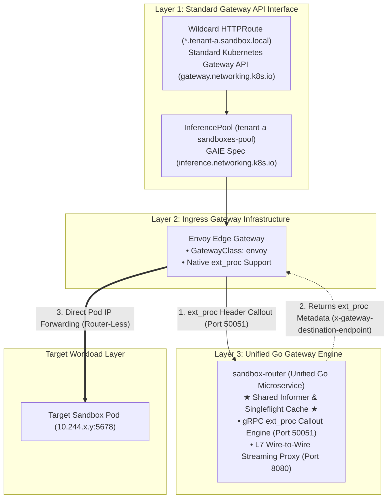
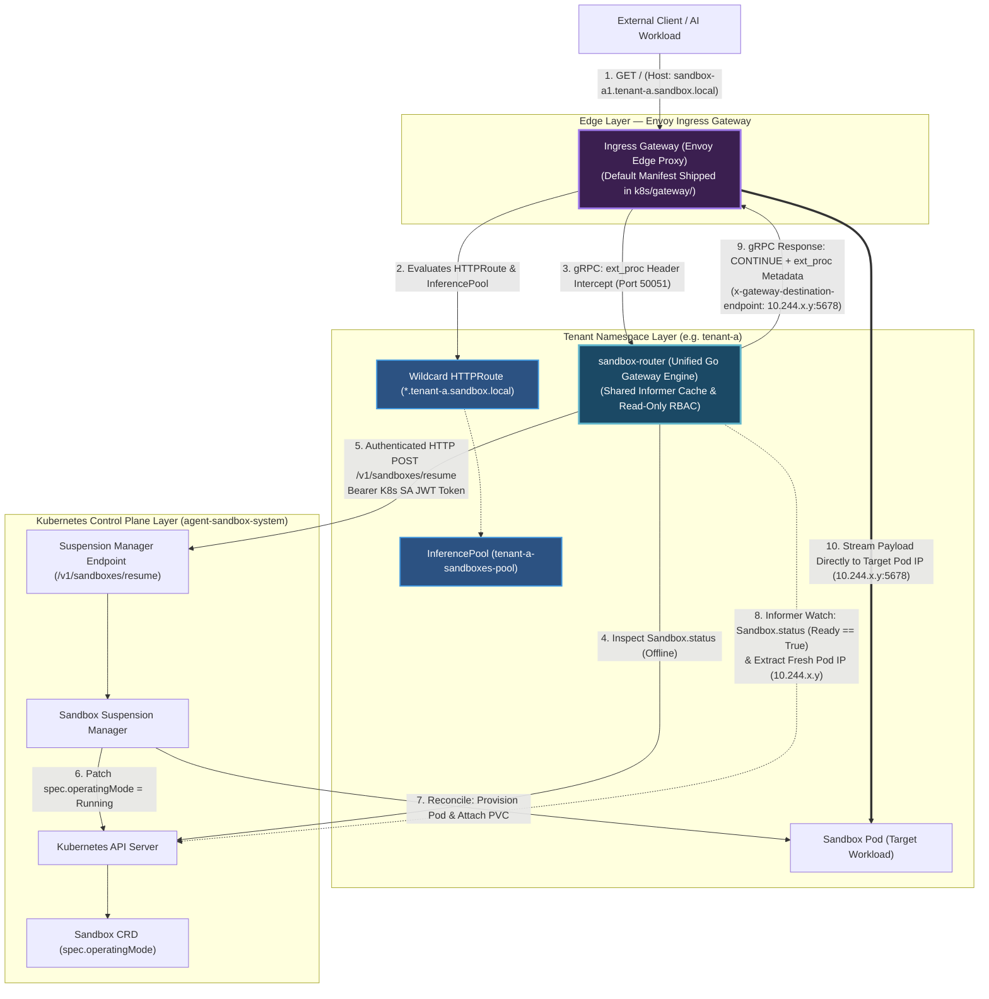
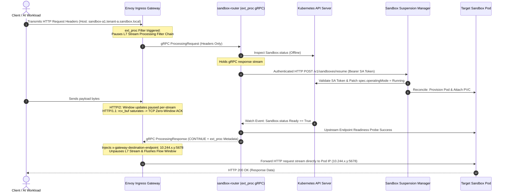

# KEP-1174: Agent Sandbox Gateway (Request-Buffering Auto-Resume)

<!--
TOC is auto-generated via `make toc-update`.
-->

<!-- toc -->
- [Summary](#summary)
- [Motivation](#motivation)
  - [Goals](#goals)
  - [Non-Goals](#non-goals)
- [Proposal](#proposal)
  - [Proposed Architectural Framing: Default Envoy Gateway Stack](#proposed-architectural-framing-default-envoy-gateway-stack)
  - [High-Level Design](#high-level-design)
  - [Components Scope of KEP-1174](#components-scope-of-kep-1174)
  - [Detailed Operational Step-by-Step Flow](#detailed-operational-step-by-step-flow)
  - [Architectural Rationale for Unified <code>sandbox-router</code> &amp; Canonical Envoy Integration](#architectural-rationale-for-unified-sandbox-router--canonical-envoy-integration)
    - [1. Why <code>sandbox-router</code> Consolidates Callout &amp; Proxying into One Microservice](#1-why-sandbox-router-consolidates-callout--proxying-into-one-microservice)
    - [2. Why Envoy Gateway is Shipped as the Default Reference Stack](#2-why-envoy-gateway-is-shipped-as-the-default-reference-stack)
- [Alternatives Considered](#alternatives-considered)
  - [1. In-Line L7 Wire Proxying for All Traffic (Routing Every Request Through <code>sandbox-router</code>)](#1-in-line-l7-wire-proxying-for-all-traffic-routing-every-request-through-sandbox-router)
  - [2. <code>ext_proc</code> Header Callout with HTTPRoute Backend Directing to <code>sandbox-router</code> (No <code>InferencePool</code>)](#2-ext_proc-header-callout-with-httproute-backend-directing-to-sandbox-router-no-inferencepool)
- [Architectural Limitations &amp; Trade-Offs](#architectural-limitations--trade-offs)
  - [Stream Flow Control &amp; Request Holding Mechanics](#stream-flow-control--request-holding-mechanics)
  - [API Changes](#api-changes)
- [Scalability](#scalability)
  - [Component-by-Component Impact Analysis (100,000 Request Surge)](#component-by-component-impact-analysis-100000-request-surge)
    - [1. External Clients &amp; Kernel Sockets (Zero Connection Drops)](#1-external-clients--kernel-sockets-zero-connection-drops)
    - [2. Ingress Gateway (Data Plane &amp; Memory Bounding)](#2-ingress-gateway-data-plane--memory-bounding)
    - [3. <code>sandbox-router</code> Unified Microservice (Stateless Multi-Replica HA Topology)](#3-sandbox-router-unified-microservice-stateless-multi-replica-ha-topology)
- [Cost &amp; Infrastructure Economic Impact Analysis](#cost--infrastructure-economic-impact-analysis)
  - [1. Microservice Resource Footprint &amp; Overhead](#1-microservice-resource-footprint--overhead)
  - [3. Economic Comparison Matrix](#3-economic-comparison-matrix)
- [Deployment Strategy &amp; Integration Methodologies](#deployment-strategy--integration-methodologies)
  - [1. Deployment Architecture](#1-deployment-architecture)
  - [2. Integration Steps &amp; Customer Opt-In Workflow](#2-integration-steps--customer-opt-in-workflow)
    - [Step A: Platform Infrastructure Setup (One-Time per Tenant)](#step-a-platform-infrastructure-setup-one-time-per-tenant)
    - [Step B: Customer / User Opt-In Workflow (Enabling Auto-Resume for a Sandbox)](#step-b-customer--user-opt-in-workflow-enabling-auto-resume-for-a-sandbox)
- [Security](#security)
  - [Core Security Guarantees](#core-security-guarantees)
  - [Threat Model &amp; Mitigation Analysis](#threat-model--mitigation-analysis)
- [Prometheus Metrics &amp; Observability](#prometheus-metrics--observability)
- [Future Work](#future-work)
- [Implementation Plan](#implementation-plan)
  - [Phase 1: Prototype Verification &amp; Proof-of-Concept (Validated)](#phase-1-prototype-verification--proof-of-concept-validated)
  - [Phase 2: Extend <code>sandbox-router</code> Microservice (<code>sandbox-router/</code>)](#phase-2-extend-sandbox-router-microservice-sandbox-router)
  - [Phase 3: SDK Integration, Helm Packaging &amp; End-to-End Testing](#phase-3-sdk-integration-helm-packaging--end-to-end-testing)
<!-- /toc -->

## Summary

This KEP extends the existing **`sandbox-router`** component in `agent-sandbox` to provide zero-loss request-buffering auto-resume (cold-start thaw) capabilities via Envoy External Processor (`ext_proc`) callouts across Kubernetes environments.

The architecture standardizes on standard Kubernetes Gateway API `HTTPRoute` (`gateway.networking.k8s.io`) and Gateway API Inference Extension (`inference.networking.k8s.io` `InferencePool`) resources as its declarative control plane interface. It equips **`sandbox-router`** to act as an External Processor engine (`ext_proc` gRPC on `:50051`) for **Envoy Gateway**, enabling **router-less, zero-extra-hop data-plane forwarding** directly to Sandbox Pod IPs upon cold-start completion.

`sandbox-router` combines real-time `Sandbox.status` Informer watching, singleflight request deduplication, cold-start thaw signaling via `sandbox-suspension-manager`, Envoy `ext_proc` gRPC callouts (`:50051`), and low-memory wire-to-wire L7 chunked proxying (`:8080`).

## Motivation

The primary motivation for this KEP is to introduce a scalable, standards-compliant request-buffering auto-resume capability for `agent-sandbox`: https://github.com/kubernetes-sigs/agent-sandbox/issues/968.

`sandbox-router` addresses these challenges by consolidating responsibilities into a unified architecture:
1. **Edge Flow Control & Memory Protection (Ingress Gateway)**: Envoy Gateway holds incoming client connection streams at the header phase during container cold starts ($3\text{s} - 5\text{s}$ boot window). Payload bytes remain held on the client machine via L7 flow control / TCP Zero-Window ACKs, preventing proxy OOM crashes.
2. **Stateless Control-Plane Signaling & External Processor Engine (`sandbox-router`)**: `sandbox-router` inspects `Sandbox.status` via a local Informer cache, triggers out-of-band thaw signals to `sandbox-suspension-manager`, and handles Envoy `ext_proc` metadata injection.
3. **Direct Data-Plane Routing (Router-Less)**: `ext_proc` metadata (`x-gateway-destination-endpoint`) enables direct Envoy-to-Pod IP forwarding (`10.244.x.y:port`), eliminating intermediate proxy hops.

### Goals
* **Transparent Cold-Start Buffering**: Pause incoming client HTTP request streams transparently during sandbox wakeups without client modifications, connection drops, or gateway timeout errors.
* **Direct Pod IP Forwarding (Router-Less)**: Route request payloads directly from Envoy Ingress to target Sandbox Pod IPs via standard `ext_proc` metadata (`x-gateway-destination-endpoint`), eliminating intermediate proxy hops and minimizing latency overhead (`< 1-3ms`).
* **Standard Kubernetes API Integration**: Standardize on Kubernetes Gateway API `HTTPRoute` (`gateway.networking.k8s.io`) and Gateway API Inference Extension `InferencePool` (`inference.networking.k8s.io`).
* **Cold-Start Memory Safety**: Hold request payloads at the edge socket layer during wakeups, capping proxy RAM footprint and preventing OOM crashes during container cold starts.
* **Control Plane & Thundering-Herd Protection**: Safeguard cluster worker nodes and the Kubernetes control plane from scheduling storms under high concurrent request volumes.
* **High Availability & Multi-Tenant Isolation**: Provide stateless, multi-replica per-tenant resilience without single points of failure (SPOF) or noisy-neighbor cross-tenant interference.

### Non-Goals
* **Inactivity Detection & Sleep Scheduling**: Managing container idle timers or traffic-based sleep transitions (deferred to Future Work).
* **End-User Authentication**: Validating user identity, OAuth/OIDC tokens, or application-level authorization inside `sandbox-router`.

## Proposal

We propose extending the existing **`sandbox-router`** microservice in `agent-sandbox` to support cold-start thaw signaling via Envoy External Processor (`ext_proc`) callouts. Rather than requiring all warm data-plane traffic to proxy through `sandbox-router-svc` for every request, `sandbox-router` exposes an `ext_proc` gRPC callout interface (`:50051`) attached to Gateway API Inference Extension (`inference.networking.k8s.io`) `InferencePool` resources.

When a request arrives for a suspended sandbox, Envoy holds the HTTP stream while executing an `ext_proc` callout to `sandbox-router`. `sandbox-router` inspects `Sandbox.status` via its local Informer cache, issues an authenticated thaw signal (`POST /v1/sandboxes/resume`) to `sandbox-suspension-manager`, and returns destination metadata (`x-gateway-destination-endpoint`) once the sandbox pod becomes ready, allowing Envoy to stream payloads directly to the target Sandbox Pod IP. CNCF Envoy Gateway is shipped as the standard, out-of-the-box reference implementation.

### Proposed Architectural Framing: Default Envoy Gateway Stack

`sandbox-router` structures its architectural responsibilities across three decoupled layers:



1. **Standard Host Routing Contract**: 
   All host matching and routing rules rely strictly on standard **Kubernetes Gateway API primitives (`gateway.networking.k8s.io`)** (`HTTPRoute`) pointing `backendRefs` to **Gateway API Inference Extension (`inference.networking.k8s.io`) `InferencePool`** resources. This guarantees 100% API-level portability across any Kubernetes cluster or cloud provider.

2. **External Processor (`ext_proc`) Callout Integration**: 
   Each tenant `InferencePool` attaches `sandbox-router-svc` as its callout reference. Incoming requests targeting an `InferencePool` trigger an `ext_proc` gRPC callout to `sandbox-router:50051`. Upon cold-start thaw completion, `sandbox-router` returns `x-gateway-destination-endpoint: <Pod-IP>:<Port>` in `ext_proc` metadata, allowing Envoy to stream payloads **directly to the target Sandbox Pod IP** without intermediate proxy routers.

### High-Level Design



### Components Scope of KEP-1174

1. **Unified Gateway Microservice (`sandbox-router`)**: The consolidated Go microservice binary (`cmd/sandbox-router`) exposing:
   - **Port `50051` (gRPC `ext_proc`)**: Envoy `ext_proc` callout engine for router-less direct Pod IP forwarding.
   - **Port `8080` (HTTP Proxy)**: Low-memory wire-to-wire L7 chunked streaming proxy to target Pod IPs.
2. **Default Ingress Gateway Provided by System**: **Envoy Edge Proxy** (via Envoy Gateway) is shipped as the standard default Gateway implementation (`k8s/gateway/gateway.yaml`).
3. **Extension Manifests Shipped (`examples/auto-resume-sandbox/manifests/envoy-gateway-epp/`)**: Declarative manifests containing tenant-scoped primitives: `InferencePool`, `HTTPRoute`, `Deployment` (`sandbox-router`), `Service` (`sandbox-router-svc`), and read-only `RBAC`.
4. **Manager Integration (Out-of-Band Endpoint)**: The authenticated `Sandbox Suspension Manager` endpoint (`POST /v1/sandboxes/resume`) hosted by the core controller manager.

### Detailed Operational Step-by-Step Flow

1. **Interception**: Incoming HTTP requests matching an `HTTPRoute` referencing an `InferencePool` trigger the Ingress Gateway to execute an `ext_proc` gRPC header callout to `sandbox-router:50051`.
2. **Status Check & Controller Signal**: `sandbox-router` inspects `Sandbox.status` via its shared local Informer cache. If the sandbox is suspended or not ready, singleflight deduplicates concurrent requests, and `sandbox-router` sends an authenticated HTTP request (`POST /v1/sandboxes/resume`) carrying its projected ServiceAccount JWT token to **Sandbox Suspension Manager**.
3. **Validation & Thaw**: Sandbox Suspension Manager verifies the caller's JWT via `TokenReview`, checks namespace authorization, and patches `spec.operatingMode = Running`.
4. **Flow Control & Cold-Start Protection**: While the callout stream is held, the Ingress Gateway pauses processing for that specific HTTP request stream using HTTP/2 L7 flow control or HTTP/1.1 TCP Zero-Window holds. Client payload bytes remain on the client machine, protecting proxy RAM.
5. **Resume & Direct Forwarding**: Once `Sandbox.status` reports `Ready == True`, `sandbox-router` extracts the fresh Pod IP (`pod.Status.PodIP`) and container port from the Informer watch, and responds to Envoy with `Status: CONTINUE` + `ext_proc` metadata (`x-gateway-destination-endpoint: <Pod-IP>:<Port>`). Envoy unpauses and streams payloads directly to the target Sandbox Pod IP (`10.244.x.y:port`).

### Architectural Rationale for Unified `sandbox-router` & Canonical Envoy Integration

#### 1. Why `sandbox-router` Consolidates Callout & Proxying into One Microservice
- **Shared Informer Memory Footprint**: Both callout handling and L7 proxying require tracking `Sandbox.status` and target `PodIP`s. Consolidating into a single Go binary avoids duplicating K8s API Informers, reducing API server load and memory overhead per tenant namespace.
- **Operational Simplicity**: Tenants deploy a single `sandbox-router` `Deployment` and `Service` per namespace instead of managing two separate microservices.

#### 2. Why Envoy Gateway is Shipped as the Default Reference Stack
- **L7 Stream-Level Flow Control & Memory Bounding**: Envoy's `ext_proc` header filter allows pausing individual HTTP streams prior to ingesting request body payloads, capping proxy RAM at $<256\text{MB}$ even under concurrent multi-gigabyte client request surges.
- **Explicit Timeout Configuration**: Envoy `ext_proc` callouts are configured with extended timeouts (`grpc_service.timeout: 180s`) to accommodate container cold starts ($5\text{s} - 10\text{s}$) without raising premature HTTP 504 gateway timeouts.
- **Universal Cloud Parity**: Pre-packaging Envoy Gateway ensures zero-dependency local testing (`make deploy-kind`) and consistent multi-cloud deployment across GKE, EKS, AKS, and bare-metal environments.

## Alternatives Considered

### 1. In-Line L7 Wire Proxying for All Traffic (Routing Every Request Through `sandbox-router`)
* **Description**: Route all warm and cold data-plane traffic through `sandbox-router-svc` as a full L7 reverse proxy.
* **Why Rejected**: Proxying every warm request through an in-line proxy pod introduces additional latency, increases CPU/RAM resource costs, and incurs per-GB bandwidth overhead. The chosen External Processor (`ext_proc`) model allows Envoy Gateway to route warm traffic **directly to Sandbox Pod IPs** with zero intermediate proxy hops.

### 2. `ext_proc` Header Callout with HTTPRoute Backend Directing to `sandbox-router` (No `InferencePool`)
* **Description**: Use Envoy `ext_proc` callouts solely for cold-start thaw signaling while standard `HTTPRoute` points its `backendRef` to `sandbox-router-svc`. In this design, `sandbox-router` acts as an in-line reverse proxy forwarding data-plane traffic to target Pod IPs after thaw completion without `InferencePool` endpoint picker metadata.
* **Why Rejected**: This model forces all data-plane payload traffic to proxy through `sandbox-router` pods for both warm and cold sandboxes, introducing an extra network hop and consuming extra CPU/memory resources on the router. Attaching `ext_proc` to GAIE `InferencePool` resources enables returning `x-gateway-destination-endpoint` metadata, allowing Envoy Gateway to route warm traffic **directly to target Sandbox Pod IPs** with zero intermediate proxy hops.

## Architectural Limitations & Trade-Offs

While the `sandbox-router` auto-resume architecture provides high performance and scale-to-zero efficiency, operators should be aware of the following technical scope boundaries and limitations:

1. **Protocol Constraint (L7 HTTP/1.1, HTTP/2, gRPC Only)**:
   * **Scope**: Request-buffering auto-resume relies on Layer 7 HTTP header interception via Envoy `ext_proc`.
   * **Limitation**: Non-HTTP protocols (e.g. raw TCP streams, UDP, custom binary RPCs without HTTP headers) cannot leverage header-driven stream pausing. Non-HTTP workloads must remain in `Running` mode or use out-of-band signaling to trigger thaws prior to connecting.

2. **Ingress Infrastructure Prerequisites**:
   * **Scope**: Auto-resume requires an Ingress Gateway supporting Kubernetes Gateway API (`gateway.networking.k8s.io`), Gateway API Inference Extension (`inference.networking.k8s.io`), and Envoy `ext_proc` callouts.
   * **Limitation**: Legacy Kubernetes Ingress controllers (e.g., standard NGINX Ingress) that lack native `ext_proc` header callout stream pausing cannot be used out-of-the-box without additional proxy sidecars.

3. **Inactivity Detection & Auto-Scale-to-Zero Out of Scope**:
   * **Scope**: KEP-1174 governs request-driven auto-thaw (wake-on-request).
   * **Limitation**: Automated idle detection and scale-to-suspended transitions (suspending a sandbox after $N$ minutes of zero request traffic) are explicitly out of scope for KEP-1174 and are managed by secondary background controllers or metrics-based autoscalers (e.g., KEDA or custom CRD controllers).

4. **Client Read Timeout Requirements**:
   * **Scope**: The Ingress Gateway holds client HTTP connection streams during cold starts using TCP Zero-Window or HTTP/2 stream flow control.
   * **Limitation**: Client applications and SDKs must configure request read timeouts sufficiently high ($\ge 30\text{s}$) to avoid client-side connection aborts while waiting for cold container initialization.

### Stream Flow Control & Request Holding Mechanics

To guarantee memory safety when handling large payloads during container cold-starts while preventing Head-of-Line (HoL) blocking on multiplexed connections, the proposal combines Envoy L7 stream flow control with L4 TCP socket flow control:



1. **HTTP Pipeline Pause**: When the Ingress Gateway receives HTTP request headers targeting a suspended sandbox, the callout filter halts processing for that specific stream (`requestHeaderMode: Send`, `requestBodyMode: Skip`).
2. **Stream-Level Flow Control**:
   - **HTTP/2 & HTTP/3**: The Ingress Gateway halts sending `WINDOW_UPDATE` frames for the specific request stream, holding the payload locally on the client without affecting concurrent streams on the shared TCP connection.
   - **HTTP/1.1**: Socket read calls pause, saturating kernel `rcv_buf` and sending TCP Zero-Window ACKs to the client.
3. **Wakeup & Synchronized Unblock**: Once `Sandbox.status` reports `Ready == True` AND `sandbox-router` confirms upstream pod endpoint connectivity, `sandbox-router` returns `HeaderMutation::Continue` with `ext_proc` metadata `x-gateway-destination-endpoint`. The Ingress Gateway unpauses the stream filter chain and overrides the destination IP.
4. **Target Pod Stream Proxying**: Envoy proxies the request payload stream directly to the target Sandbox Pod IP using low-memory chunked streaming.

### API Changes

This proposal requires no core changes to the Sandbox schema, relying solely on the existing `v1beta1.Sandbox` properties:
* `spec.operatingMode`: Toggled between `Running` and `Suspended` by the Sandbox Suspension Manager.

## Scalability

Operating at a scale of **100,000 concurrent sandbox cold-start requests** within a single tenant namespace requires strict data-plane and control-plane isolation. The section below details how the system handles a 100,000 request surge across every architectural component:

### Component-by-Component Impact Analysis (100,000 Request Surge)

#### 1. External Clients & Kernel Sockets (Zero Connection Drops)
* **Behavior**: Clients transmitting requests encounter kernel TCP sliding window flow control.
* **Impact**: When the Ingress Gateway halts socket `read()` calls, the Gateway node's OS kernel receive buffers fill up, triggering **TCP Zero-Window ACKs** to all 100,000 client sockets.
* **Result**: Clients gracefully enter the **TCP Persist State**, holding request payload data locally on their own machines ($10\text{ GB}+$ of payload data held local) with **zero HTTP 502/504 connection drops**.

#### 2. Ingress Gateway (Data Plane & Memory Bounding)
* **Behavior**: Intercepts headers and evaluates wildcard routing (`*.tenant.domain.com`).
* **Impact**: Payload bytes never enter Ingress Gateway user-space process RAM during the cold-start window. Memory usage remains strictly constrained at **$<256\text{MB}$**.
* **Result**: Static wildcard routes point to a fixed Service (`sandbox-router-svc`), avoiding dynamic xDS configuration reloads and etcd write congestion, maintaining 100% data-plane forwarding performance.

#### 3. `sandbox-router` Unified Microservice (Stateless Multi-Replica HA Topology)
* **High Availability (HA) & Stateless Scaling**: `sandbox-router` runs as a stateless multi-replica `Deployment` ($N \ge 2$) behind `sandbox-router-svc` with HorizontalPodAutoscaler (HPA) enabled based on CPU, network throughput, and active connection stream count. Ingress Gateways load-balance callouts and proxy traffic across all healthy replicas.
* **Ingress Rate Limiting**: Request rate limiting is offloaded natively to the Ingress Gateway's local rate limit filter. The Gateway meters incoming HTTP traffic targeting cold sandboxes *at the data plane* before issuing callouts, protecting both the router microservice and control plane from thundering-herd surges.
* **Control-Plane Thaw Idempotency & Singleflight Deduplication**: Duplicate resume signals sent by different `sandbox-router` replicas for the *same* sleeping sandbox are handled idempotently by the central `Sandbox Suspension Manager`. If `spec.operatingMode` is already `Running`, the manager returns `200 OK` immediately without performing extra Kubernetes API patches or etcd writes.
* **Broadcast Watch Event Unblock & Low-Memory Streaming**: Because every `sandbox-router` replica runs a single shared Informer watching `Sandbox.status`, when `Sandbox.status` becomes `Ready == True`, the Kubernetes API server broadcasts the status watch event to **all** replicas simultaneously. Each replica holding streams for that target sandbox immediately unblocks the Gateway or proxies data wire-to-wire using low-memory chunk buffers (~64KB per active connection).

## Cost & Infrastructure Economic Impact Analysis

A critical consideration for platform operators and users is whether adopting the `sandbox-router` auto-resume architecture introduces additional infrastructure expenses or reduces overall operational costs.


### 1. Microservice Resource Footprint & Overhead

The `sandbox-router` extension is engineered to be lightweight, avoiding expensive runtime overhead:

* **Low Memory & CPU Footprint**: `sandbox-router` runs as a compiled Go binary using shared `client-go` Informer caches. Base resource requests per tenant deployment are minimal (`cpu: 50m`, `memory: 64Mi`).
* **Router-Less Direct Data Plane (Zero Extra Proxy Hops)**: Because `sandbox-router` operates as an `ext_proc` callout engine returning `x-gateway-destination-endpoint` metadata, Envoy Gateway routes warm data-plane traffic **directly to the target Sandbox Pod IP**. Warm payloads do not proxy through `sandbox-router`, avoiding extra CPU/RAM consumption and eliminating per-GB proxy bandwidth fees.

### 3. Economic Comparison Matrix

| Cost Factor | Always-On Model (24/7) | Auto-Resume Model (`sandbox-router`) | Net Financial Impact |
| :--- | :--- | :--- | :--- |
| **`sandbox-router` Extension Cost** | N/A | Negligible (~50m CPU, 64Mi RAM per tenant) | Minor fixed footprint (~$1–$2/mo per tenant) |
| **Data Plane Bandwidth & Proxy Hops** | Direct Pod forwarding | Direct Pod forwarding (via Envoy `ext_proc` metadata) | **$0 extra data transfer cost** |
| **Request Holding RAM Impact** | N/A | Held at client TCP/L7 socket layer (Kernel TCP Zero-Window) | **$0 proxy RAM expansion** |

## Deployment Strategy & Integration Methodologies

### 1. Deployment Architecture
The request-buffering auto-resume capability is structured across two operational layers:

* **System Control Plane (`agent-sandbox-system`)**:
  * **Ingress Gateway (`Gateway`)**: Central Envoy Gateway deployed by platform admins (`k8s/gateway/gateway.yaml`).
  * **Controller Manager (`agent-sandbox-controller`)**: Hosts the internal signaling server (`POST /v1/sandboxes/resume` on Port `8090`).

* **Tenant Namespace (`tenant-a`, `tenant-b`)**:
  * **`sandbox-router` Engine**: Per-tenant Go microservice watching `Sandbox.status` and serving `ext_proc` callouts on Port `50051`.
  * **Tenant `InferencePool` & Wildcard `HTTPRoute`**: Tenant-scoped `InferencePool` referencing `sandbox-router-svc:50051` as its callout target, and wildcard `HTTPRoute` (`*.tenant-a.sandbox.local`).

### 2. Integration Steps & Customer Opt-In Workflow

#### Step A: Platform Infrastructure Setup (One-Time per Tenant)
Platform teams onboard a tenant namespace (`tenant-a`) via Helm (`extensions.autoSuspensionGateway.enabled=true`) or Kustomize (`kubectl apply -k`):

1. **Deploy Tenant Router & RBAC**: Apply `sandbox-router` `Deployment`, `sandbox-router-svc` `Service`, and read-only `ServiceAccount` in `tenant-a`.
2. **Deploy Tenant `InferencePool`**: Apply `InferencePool` (`tenant-a-sandboxes-pool`) in `tenant-a` setting `endpointPickerRef` to `sandbox-router-svc:50051`.
3. **Deploy Wildcard `HTTPRoute`**: Apply `HTTPRoute` in `tenant-a` matching `hostnames: ["*.tenant-a.sandbox.local"]` pointing `backendRefs` to `tenant-a-sandboxes-pool`.

#### Step B: Customer / User Opt-In Workflow (Enabling Auto-Resume for a Sandbox)
Once the tenant infrastructure is deployed, end-users opt in individual `Sandbox` workloads to auto-resume by following three simple steps:

1. **Include Pool Matching Label**: Add the label matching the tenant's `InferencePool` selector in the `Sandbox` definition:
   ```yaml
   spec:
     podTemplate:
       metadata:
         labels:
           app.kubernetes.io/part-of: agent-sandbox
   ```
2. **Set Initial Mode to Suspended**: Set `spec.operatingMode: Suspended` (or toggle `spec.operatingMode: Suspended` during idle periods).
3. **Access Sandbox via Gateway Subdomain**: Route HTTP traffic to the sandbox using the tenant gateway URL pattern:
   `http://<sandbox-name>.<tenant-namespace>.sandbox.local`

*When a client sends an HTTP request to a suspended sandbox's URL, Envoy Gateway holds the request stream, `sandbox-router` triggers an out-of-band thaw signal to `sandbox-suspension-manager`, and request payloads stream seamlessly to the container as soon as it enters `Ready == True` status.*

## Security

The `sandbox-router` extension adheres to a zero-trust security architecture designed to enforce tenant isolation, protect control plane RBAC boundaries, and safeguard customer data payloads.

### Core Security Guarantees

1. **Zero Write-RBAC Boundary**: The tenant-scoped `sandbox-router` pods carry **no write, patch, or delete permissions** on the Kubernetes API. All state mutations (`spec.operatingMode = Running`) are delegated out-of-band to the central `Sandbox Suspension Manager`.
2. **Cryptographically Authenticated Signaling**: Signaling calls to the `Sandbox Suspension Manager` (`POST /v1/sandboxes/resume`) require a Kubernetes projected ServiceAccount JWT token. The manager validates caller identity via `TokenReview` API before executing state mutations.
3. **Payload Confidentiality & Header-Only Interception**: Callouts to `sandbox-router` are hardcoded to `requestHeaderMode: Send` and `requestBodyMode: Skip`. Customer request payload bodies flow directly through Envoy or streaming chunk buffers and **never trigger unneeded in-memory parsing**.
4. **Multi-Tenant Isolation**: `sandbox-router` pods run within individual tenant namespaces. Kubernetes RBAC and NetworkPolicies prevent cross-tenant metadata inspection or cross-namespace network access.

### Threat Model & Mitigation Analysis

| Threat & Attack Vector | Mitigation & Security Control |
| :--- | :--- |
| **1. Header Spoofing & Open Proxy / SSRF Attack**<br/>External client sends spoofed `x-gateway-destination-endpoint` or target headers to force routing to arbitrary internal IPs. | **Ingress Header Stripping & Callout Invalidation**:<br/>The Ingress Gateway strips untrusted incoming `x-gateway-destination-endpoint` headers at the edge boundary. Only `sandbox-router` is authorized to resolve target Pod endpoints, setting `x-gateway-destination-endpoint` strictly validated against the K8s Informer status watch. |
| **2. Cross-Tenant Request Forgery**<br/>Compromised `sandbox-router` in `tenant-a` sends `POST /v1/sandboxes/resume` targeting `tenant-b`. | **ServiceAccount TokenReview Verification**:<br/>Manager validates the projected SA bearer token via K8s `TokenReview` API. Rejects requests where `system:serviceaccount:tenant-a` tries to resume resources outside `tenant-a` with `403 Forbidden`. |
| **3. Direct Manager Endpoint Exposure (Port 8090)**<br/>Untrusted container inside a sandbox sends direct HTTP calls to the manager signaling port. | **Dual-Layer Defense (L4 NetworkPolicy + L7 SA Auth)**:<br/>L4 NetworkPolicy drops Port 8090 TCP traffic unless originating from `sandbox-router` pods. L7 TokenReview rejects requests lacking valid SA JWT tokens with `401 Unauthorized`. |
| **4. Denial of Service (DoS) / Flooding**<br/>Attacker floods gateway with cold-start requests to overwhelm the controller or API Server. | **Multi-Layered Rate Limiting & Flow Control**:<br/>Ingress Gateway edge rate limiting drops excess traffic. Go `singleflight` deduplicates concurrent cold-start requests targeting the same sandbox into 1 call. TCP sliding window pauses socket reads. |
| **5. Read-Only K8s RBAC Exposure**<br/>Attacker compromises `sandbox-router` pod to inspect tenant resources. | **Namespace Scope & Write Omission**:<br/>Namespaced `RoleBinding` restricts read-only access (`get/list/watch sandboxes`) to the local tenant namespace. API Server blocks cross-tenant reads (`403 Forbidden`). All mutation verbs (`create/update/patch`) are omitted. |

## Prometheus Metrics & Observability

`sandbox-router` and `Sandbox Suspension Manager` expose low-cardinality Prometheus metrics on Port `9090` (`/metrics`). Dynamic strings (sandbox names, pod IPs, UIDs) are strictly omitted from labels in compliance with Kubernetes SIG metrics conventions.

| Metric Name | Type | Description | Allowed Labels (Bounded Enums) |
| :--- | :--- | :--- | :--- |
| `sandbox_router_callouts_total` | Counter | Total Ingress Gateway callouts processed | `result`: `success`, `failure`, `timeout`<br/>`phase`: `warm_pass`, `cold_resume` |
| `sandbox_router_hold_duration_seconds` | Histogram | Callout stream hold latency during container cold starts | `phase`: `cold_resume`, `endpoint_probe` |
| `sandbox_router_signaling_requests_total` | Counter | Outgoing thaw signaling requests sent to controller manager | `result`: `accepted`, `idempotent_noop`, `unauthorized`, `rate_limited` |
| `sandbox_router_active_held_streams` | Gauge | Active client request streams currently held during cold starts | None |
| `sandbox_suspension_manager_thaw_requests_total` | Counter | Control plane thaw signaling requests received by manager | `status`: `patched`, `already_running`, `forbidden`, `error` |

W3C trace context headers (`traceparent`, `tracestate`) are propagated across callouts and signaling requests for distributed tracing.

## Future Work

* **Workload Signaling Extensions**: Providing standardized container sidecars and client SDKs to allow AI agent workloads running inside a Sandbox to actively signal custom execution states, scheduled hibernation timers, or immediate suspend readiness.
* **Gateway-Level Idleness & Inactivity Detection**: Passive traffic analysis at the Gateway level to track active connection streams, detect prolonged idleness, and automatically initiate auto-suspension transitions when traffic ceases for a configurable duration.
* **Traffic-Based Last Activity Tracking**: Updating `status.suspensionState.lastActivityTime` via batch status flushing from Gateway activity metrics to provide precise inactivity auditing.

## Implementation Plan

The implementation of `sandbox-router` is divided into three chronological phases:

### Phase 1: Prototype Verification & Proof-of-Concept (Validated)
* **Status**: Complete (refer to runnable PoC in [examples/auto-resume-sandbox/](../../../examples/auto-resume-sandbox/)).
* **Deliverables**:
  1. Prototype Go server implementing Envoy `ext_proc` gRPC specification (`ProcessingRequest` / `ProcessingResponse`).
  2. Verified header interception (`x-sandbox-id`, `x-sandbox-namespace`), singleflight request collapsing (`singleflight.Group`), dynamic metadata injection (`x-gateway-destination-endpoint`), and L7 byte streaming.
  3. Sample Kubernetes manifests (`InferencePool`, wildcard `HTTPRoute`, `sandbox-router-svc`, `Gateway`) validated against a local Kind cluster.

### Phase 2: Extend `sandbox-router` Microservice (`sandbox-router/`)
* **Deliverables**:
  1. Extend the existing `sandbox-router` microservice ([sandbox-router/](../../sandbox-router/)) to expose an `ext_proc` gRPC callout engine on Port `50051` alongside the existing L7 reverse proxy on Port `8080`.
  2. Implement shared `client-go` Informer status watcher for real-time `Sandbox.status` pushes, fresh Pod IP extraction, and target TCP endpoint socket verification.
  3. Integrate singleflight request deduplication (`context.WithoutCancel`), `ext_proc` metadata injection (`x-gateway-destination-endpoint`), and Prometheus metrics instrumentation.
  4. Author base extension manifests (`Deployment` for `sandbox-router`, `Service` `sandbox-router-svc`, `ServiceAccount`, `ClusterRoleBinding`, `InferencePool`).

### Phase 3: SDK Integration, Helm Packaging & End-to-End Testing
* **Deliverables**:
  1. Package tenant infrastructure manifests (`Deployment`, `Service`, `InferencePool`, `HTTPRoute`) into Helm chart templates.
  2. Update Python (`k8s-agent-sandbox`) and Go SDK connectors to support Gateway API wildcard host routing (`http://{sandbox_name}.{namespace}.sandbox.local`).
  3. Add automated e2e integration test suite under `test/e2e/` testing request-buffering auto-resume cold thaws end-to-end.
