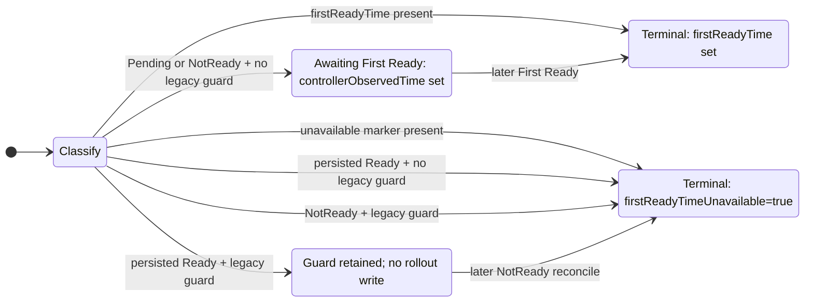

# KEP-1348: Observe SandboxClaim startup from status events

<!--
TOC is auto-generated via `make toc-update`.
-->

<!-- toc -->
- [Summary](#summary)
- [Motivation](#motivation)
  - [Problem](#problem)
  - [Goals](#goals)
  - [Non-goals](#non-goals)
- [Proposal](#proposal)
  - [Terminology](#terminology)
  - [User Stories](#user-stories)
  - [High-Level Design](#high-level-design)
    - [API Changes](#api-changes)
    - [API Stability and Feature Enablement](#api-stability-and-feature-enablement)
    - [Timestamp Ownership](#timestamp-ownership)
    - [Startup Observer](#startup-observer)
    - [Metrics](#metrics)
    - [Annotation Migration](#annotation-migration)
    - [Existing Claim Migration](#existing-claim-migration)
- [Rollout and Compatibility](#rollout-and-compatibility)
- [Risks and Mitigations](#risks-and-mitigations)
- [Scalability](#scalability)
  - [API Server Interaction Budget](#api-server-interaction-budget)
  - [Controller and Startup Observer Resource Bounds](#controller-and-startup-observer-resource-bounds)
- [Testing and Acceptance Criteria](#testing-and-acceptance-criteria)
  - [Performance](#performance)
- [Graduation Criteria](#graduation-criteria)
  - [Alpha](#alpha)
  - [Beta](#beta)
  - [GA](#ga)
- [Alternatives](#alternatives)
<!-- /toc -->

## Summary

The SandboxClaim controller records startup metrics during reconciliation. This KEP stores Admission
Observation, Controller Observation, and First Ready times as write-once fields in SandboxClaim
status, alongside a true-only marker for unrecoverable First Ready times; the admission annotation
remains the webhook-to-controller handoff. A leader-elected
`SandboxClaimMetricsObserver` controller records the existing Prometheus histograms through its own
workqueue when a cache Update adds `firstReadyTime`. The Claim controller makes no
observability-related metadata PATCHes for normal new Claims, and status retains the timing data
when the observer loses a sample.

## Motivation

### Problem

The SandboxClaim controller handles startup observability in its authoritative reconcile path:

1. On the first active reconcile, it writes `controller-first-observed-at` and any trace context to
   Claim metadata.
2. After persisting the first `Ready=True` status, it records the three startup latency metrics.
3. It then writes `claim-first-ready-at` in a metadata PATCH to guard against duplicate observations
   on later Ready transitions.

A normal Claim that reaches Ready incurs up to two observability-related metadata PATCHes.
The second PATCH changes no Claim state. If it fails, Reconcile returns an error even though status
persistence and metric recording have succeeded. A failure after the Ready write also leaves the
Claim Ready without the guard, so after restart the controller records the sample again.
Persisted status keeps the facts inspectable without a Prometheus sample.

Until the [Performance](#performance) criteria are met, this KEP claims only that the proposed
controller eliminates those writes. Effects on API server load, etcd write load, and Claim Ready
latency remain unmeasured.

### Goals

- Preserve these histograms, their labels, and their millisecond bucket behavior:
  - `agent_sandbox_claim_startup_latency_ms`
  - `agent_sandbox_claim_controller_startup_latency_ms`
  - `agent_sandbox_creation_latency_ms`
- Persist the four write-once `status.startup` fields in v1beta1.
- Record all First Ready latency metrics outside `SandboxClaimReconciler.Reconcile`.
- Reduce observability-related Claim metadata PATCHes to zero on normal cold and warm-pool paths.
- Stop persisting trace context on Claims while propagating the current Reconcile context directly
  to created or adopted Sandboxes.
- Reuse the manager cache without adding a LIST, WATCH, or direct API read.
- Keep cache event handling and metric delivery off the Claim workqueue's critical path.
- Upgrade existing Claims without replaying metrics for Claims that were already Ready.
- Keep Claim status reconciliation and migration idempotent under retries, conflicts, leader
  changes, Ready flaps, and controller restarts.

### Non-goals

- Exactly-once or durable metric delivery. Prometheus observations stay process-local and
  best-effort.
- Measuring caller-to-apiserver latency. Admission timing starts when the webhook receives the
  AdmissionReview, not when the caller sends the CREATE.
- Removing Claim annotations used by the existing startup observability path. The `/status`
  subresource cannot update annotations, so cleanup would require separate metadata PATCHes without
  improving correctness.
- Changing `AssignedSandboxNameAnnotation`, the assigned Sandbox transaction, or other business
  mutations.
- Persisting trace transport data in Claim status or preserving trace continuity across every Claim
  reconcile.
- Reconstructing a historical First Ready time when no trustworthy persisted source exists.

## Proposal

### Terminology

- **Admission Observation**: the time when the optional admission webhook received the CREATE
  request.
- **Controller Observation**: the earliest known observation of a Claim by an active Claim controller.
- **First Ready**: the first `Ready=True` result computed by the Claim controller; recovery and resume
  do not count.
- **Startup Observer**: the independent `SandboxClaimMetricsObserver` controller that records
  best-effort metrics from persisted First Ready transitions.
- **Process-Local Observation**: the first time the current controller process saw the Claim, held in
  memory keyed by Claim UID; restart or leader handoff clears it, so a same-name recreation starts
  fresh. Fallback for `controllerObservedTime` when no persisted source exists.

### User Stories

- As a cluster operator investigating a slow Claim, I can inspect the available `status.startup`
  timestamps without relying on a Prometheus sample that may have been lost.
- As a platform administrator upgrading existing Claims, I can distinguish a Claim that has not
  reached First Ready from one whose First Ready timestamp cannot be recovered.

### High-Level Design

```mermaid
flowchart TB
    subgraph Current["Current"]
        direction LR
        C0["SandboxClaim stored"] --> C1["First active Reconcile"]
        C1 --> C2["Metadata PATCH 1<br/>controller time + optional trace context"]
        C2 -->|"later First Ready"| C3["Ready status PATCH"]
        C3 --> C4["Record histograms"]
        C4 --> C5["Metadata PATCH 2<br/>First Ready guard"]
    end

    subgraph Proposed["Proposed"]
        direction LR
        P0["SandboxClaim stored"] --> P1["Claim Reconcile"]
        P1 --> P2["Existing status PATCH<br/>startup fields join Claim status"]
        P2 --> P3["Manager cache Update"]
        P3 -->|"firstReadyTime: nil to non-nil"| P4["Startup Observer"]
        P4 --> P5["Record histograms"]
    end
```



The status write is authoritative. The cache event and Prometheus observation are downstream
best-effort consequences. Losing a metric event never changes the Claim or triggers an API retry.

#### API Changes

Add the startup status type to v1beta1, the storage version. The deprecated v1alpha1 API keeps its
schema. Conversion to v1alpha1 drops the fields; the Kubernetes conversion contract permits data
loss in the older-version direction.

| JSON field under `status.startup` | Go type | Meaning |
| --- | --- | --- |
| `admissionObservedTime` | `*metav1.MicroTime` | Optional time when the admission webhook received CREATE. |
| `controllerObservedTime` | `*metav1.MicroTime` | Earliest known observation by an active Claim controller. |
| `firstReadyTime` | `*metav1.MicroTime` | First time the Claim controller computed `Ready=True`. |
| `firstReadyTimeUnavailable` | `bool` | Optional true-only marker used when legacy evidence proves First Ready but no trustworthy timestamp can be recovered. |

All three fields use `metav1.MicroTime` because the persisted values feed
millisecond-resolution histograms. `metav1.Time` serializes JSON at whole-second precision;
`metav1.MicroTime` retains microsecond precision across apiserver round trips. The observer
converts durations to milliseconds only after subtracting the persisted values, preserving the
existing histogram bucket behavior.

CEL transition rules enforce the API contract for every `/status` writer. Each timestamp permits a
first write, then rejects value changes and removal. Parent and root rules prevent bypass by deleting
an optional field, `status.startup`, or `status`. The unavailable marker permits only its first
`true` write and cannot coexist with `firstReadyTime`.

The root CEL transition rule runs on every SandboxClaim update, including spec-only updates. The
generated schema must stay within the CEL estimated cost limits. A pre-release validator test must
record the aggregate runtime cost for both terminal states and cover spec-only and unrelated status
updates.

A missing `firstReadyTime` means no accurate First Ready time has been persisted; a non-nil value
records one. During migration, the existing `Ready` condition and legacy guard can
prove that First Ready occurred even when the controller cannot recover its time.
`firstReadyTimeUnavailable=true` records that terminal exception.

Project RBAC grants `/status` write access only to the Claim controller. Administrators may grant
that permission to other principals, which remain trusted for the first write because CEL cannot
identify the writer. The controller maintains these lifecycle invariants:

- A Claim with `firstReadyTime` must also have `controllerObservedTime`.
- The controller sets `firstReadyTimeUnavailable=true` only when legacy evidence proves that First
  Ready occurred and no trustworthy time is available. A Claim with this marker cannot also have
  `firstReadyTime`.
- `admissionObservedTime` is optional in every state because the webhook is optional.
- First Ready uses the Claim `Ready` condition computed by the Claim controller because a warm
  Sandbox may have been Ready before the Claim existed.
- Once either terminal field is present, later spec changes, Ready flaps, resumes, webhook edits,
  and observer outcomes cannot update it.

#### API Stability and Feature Enablement

This proposal uses no dedicated feature gate. Installing the CRD publishes the fields in the served
v1beta1 schema, and deploying the new controller activates status writes and observation. Rollback
uses a controller-only downgrade while retaining the new CRD, as described in
[Rollout and Compatibility](#rollout-and-compatibility).

The project will not ship these fields until the [Performance](#performance) acceptance criteria are
met. The first release adds them to v1beta1 as beta API. Once published in v1beta1, field names,
JSON paths, types, precision, absence semantics, writer ownership, and write-once rules become
v1beta1 compatibility commitments.
The project may not remove the fields or change their meaning within v1beta1. Retraction requires a
new API version whose conversion preserves stored data, plus documented migration and deprecation
under the [Kubernetes API deprecation policy](https://kubernetes.io/docs/reference/using-api/deprecation-policy/).

#### Timestamp Ownership

The SandboxClaim controller is the only project component that writes `status.startup`:

| Module | Responsibility |
| --- | --- |
| SandboxClaim controller | Computes and persists every `status.startup` transition. |
| Admission webhook | Writes the CREATE-time annotation; never writes Claim status. |
| Startup Observer | Records best-effort metrics; never writes or acknowledges delivery through Claim status. |
| Sandbox controller | Maintains Sandbox state; never writes SandboxClaim startup status. |

#### Startup Observer

The leader-elected Startup Observer runs as a separate controller with its own workqueue. It accepts
only a stored nil-to-non-nil `firstReadyTime` Update and reads from the shared manager cache. Its
Create predicate rejects the synthetic Add events delivered at startup, which prevents metric replay
after restart or leader handoff.

The observer completes cache reads, label derivation, and interval validation before recording any
sample. After it records the first sample, it returns without an error or requeue, so the workqueue
does not retry the request after partial emission.

#### Metrics

For each accepted transition, the observer derives durations from persisted timestamps, excluding
workqueue delay:

```text
Admission Startup  = firstReadyTime - admissionObservedTime
Controller Startup = firstReadyTime - controllerObservedTime
Sandbox Creation   = Sandbox Ready lastTransitionTime - Sandbox creationTimestamp
```

Sandbox Creation keeps its current inputs and precision: both values already come from persisted
`metav1.Time` fields.

The observer evaluates Admission Startup and Controller Startup as separate intervals. A missing or
invalid Admission Observation skips only `agent_sandbox_claim_startup_latency_ms`. Negative
intervals are invalid. Admission Startup and Controller Startup use 240s as their highest explicit
bucket; Sandbox Creation uses 600s. Larger positive values remain valid in `+Inf`. A lagging source
clock can inflate a sample, but timestamps alone cannot distinguish that skew from a real slow
startup. Deployments must synchronize cluster clocks.

The observer reads the assigned Sandbox from the manager cache to preserve each metric's existing
label set. The two Claim histograms use only `launch_type` and `sandbox_template`; Sandbox Creation
also uses `namespace`. On a cache miss, the observer records Claim intervals with present inputs and
non-negative durations using `launch_type="unknown"` and `sandbox_template="__unknown__"`; it skips
Sandbox Creation latency.

Add bounded-cardinality self-observation:

- `agent_sandbox_claim_startup_observer_samples_total{metric,result}` reports per-sample outcomes.
  `metric` is one of `admission`, `controller`, or `sandbox_creation`; `result` is one of
  `recorded`, `missing_input`, `invalid_interval`, or `sandbox_not_found`.

The self-metric uses only the fixed label values above and adds no object-derived labels. Existing
`sandbox_template` labels on the startup histograms remain unchanged.

#### Annotation Migration

A non-empty `ClaimFirstReadyAnnotation` is a legacy deduplication guard. An RFC3339Nano timestamp
and `ClaimFirstReadyUnknownSentinel` (`"unknown"`) both satisfy the guard. The controller does not
copy a parseable value into `firstReadyTime`: the legacy controller wrote the annotation after
persisting `Ready=True` and recording startup metrics, and a principal with permission to update
Claim metadata can replace it.

The optional admission webhook keeps `failurePolicy: Ignore`. If the webhook is unavailable, Claim
creation continues and Admission Observation remains unset.

| Annotation | New Claims | Existing Claims | Final ownership |
| --- | --- | --- | --- |
| `agents.x-k8s.io/controller-first-observed-at` (`ObservabilityAnnotation`) | Stop writing. | Read once when initializing startup status for an existing Pending or NotReady Claim with no legacy First Ready evidence; never delete. | Replaced by `status.startup.controllerObservedTime`. |
| `agents.x-k8s.io/claim-first-ready-at` (`ClaimFirstReadyAnnotation`) | Stop writing and backfilling. | Use as the legacy First Ready guard; never parse or delete it. | Replaced by `firstReadyTime` and `firstReadyTimeUnavailable`. |
| `agents.x-k8s.io/webhook-first-observed-at` (`WebhookFirstObservedAtAnnotation`; currently internal `WebhookAnnotation`) | Webhook overwrites during CREATE; controller copies once. | Copy a valid value only during startup status initialization. | Retained as the admission-to-controller carrier. |
| `opentelemetry.io/trace-context` on Claim (`TraceContextAnnotation`) | Stop persisting. | Existing values may still seed legacy trace extraction; never delete. | Current Reconcile context is propagated directly to Sandbox. |

`TraceContextAnnotation` remains valid on Sandbox resources.

#### Existing Claim Migration

During normal reconciliation, the SandboxClaim controller classifies the Claim using
`status.startup`, the persisted `Ready` condition, and the legacy First Ready guard before
recomputing the `Ready` condition. This ordering prevents a warm-pool Claim that becomes
`Ready=True` in the same reconciliation from entering a legacy branch.

For the `AwaitingFirstReady` branch, the controller selects
`status.startup.controllerObservedTime` from the first available source, in order: the existing
status value, a valid legacy controller annotation, a UID-matched process-local observation, or the
current clock.



For a Claim with persisted `Ready=True` and no legacy guard, the controller sets
`status.startup.firstReadyTimeUnavailable=true`. The legacy metadata PATCH may not have persisted
the guard, or a later update may have removed the annotation, so the controller cannot recover a
trustworthy First Ready time. The `Ready` condition's lastTransitionTime cannot recover it either:
it records only the most recent transition, so after a Ready-to-NotReady-to-Ready flap it is the
later Ready, not the first.

The controller cannot distinguish a Claim that reached First Ready before the upgrade but is
NotReady and has no legacy guard when the upgraded controller first reconciles it from a Claim that
has never reached First Ready. It classifies either Claim as `AwaitingFirstReady` and may record the
next `Ready=True` transition. This KEP accepts the limitation under the best-effort metric contract.

## Rollout and Compatibility

Recommended rollout order:

1. Apply regenerated CRDs containing the v1beta1 status schema.
2. Deploy the optional webhook update.
3. Deploy the controller and observer.

The controller continues to accept `--disable-claim-observability-annotations` for compatibility.
The flag has no effect after the Claim controller stops writing its observability annotations.
Removing it is outside this KEP.

Multi-replica deployments must keep the default `--leader-elect=true`; see
[Startup Observer](#startup-observer).

The controller remains functional if the webhook is absent or unavailable. It then leaves Admission
Observation unset and skips that histogram; Controller Startup still records.

The transition rules use the same base `oldSelf` semantics as the Sandbox CRD and do not require
`optionalOldSelf`. Legacy Claims can therefore acquire `status.startup` during reconciliation and
add `firstReadyTime` later.

Metric names, buckets, existing labels, and Claim startup timestamp precision remain unchanged, so
dashboards do not need query migration. The new observer self-metrics are additive.

Operators may downgrade only the controller and must retain this release's CRD schema. The current
pre-feature controller uses optimistic merge status patches, so it ignores `status.startup` without
deleting it; it may resume legacy annotation writes and their metadata PATCH cost. Controllers that
replace the entire status object fall outside this guarantee. A later upgrade to the new controller
preserves `firstReadyTime` and does not replay samples.

Rolling the SandboxClaim CRD back to a schema without `status.startup` is unsupported. On a later
object write,
[Kubernetes CRD field pruning](https://kubernetes.io/docs/tasks/extend-kubernetes/custom-resources/custom-resource-definitions/#field-pruning)
may persist the object without those now-unknown fields and permanently delete the timestamps.
Reinstalling the new CRD cannot recover them. Operators who proceed must first back up SandboxClaim
objects. After data loss, the migration rules mark a Ready Claim without a retained legacy guard
with `firstReadyTimeUnavailable=true`; the observer does not replay a sample.

## Risks and Mitigations

| Risk | Mitigation |
| --- | --- |
| First Ready bursts can create observer backlog or delay informer dispatch. | The event handler only enqueues keys, and observer work runs on a separate queue. Release requires stable informer and Claim reconciliation throughput and a queue that drains after supported bursts. |
| Leader failure or Claim name reuse can lose samples; multiple replicas without leader election can duplicate them. | The best-effort contract permits loss during handoff or name reuse. The observer rejects startup Add events, and supported deployments keep `--leader-elect=true`; see [Startup Observer](#startup-observer) and [Rollout and Compatibility](#rollout-and-compatibility). |
| Clock skew makes an interval negative or inflates it. | The observer skips negative intervals; see [Metrics](#metrics) for positive skew and bucket behavior. |
| An authorized status writer persists an incorrect timestamp first. | Treat `/status` write permission as trusted. CEL prevents later mutation but cannot identify the first writer; correction requires a versioned schema migration. |
| A caller supplies a false admission timestamp when the optional webhook does not run. | The webhook overwrites caller input when it runs, and the controller ignores invalid values. Treat Admission Observation as best-effort telemetry, not as input for security, billing, or strict SLOs. |
| Rolling the CRD back can prune `status.startup` on a later object write. | Retain the new CRD during downgrade; see [Rollout and Compatibility](#rollout-and-compatibility). |

## Scalability

### API Server Interaction Budget

The table counts observability-related operations only. Sandbox creation, adoption, assignment, and
normal Claim status are business operations and remain unchanged.

| Lifecycle point | Current behavior | Proposed behavior |
| --- | --- | --- |
| Claim CREATE | One CREATE; optional webhook mutation is part of admission. | Same. |
| First Reconcile | One Claim metadata PATCH for controller time and optional trace context, plus normal status PATCH. | No observability metadata PATCH; startup timestamps join the normal status PATCH. |
| First Ready | Normal status PATCH, metric calculation in Reconcile, then one Claim metadata PATCH for the guard. | First Ready joins the normal status PATCH; observer work is process-local. |
| Metric label lookup | Reconcile already has Sandbox state. | Observer reads manager cache only. |
| Ready legacy object without guard | Metadata PATCH backfills `unknown`. | One exceptional status PATCH sets `firstReadyTimeUnavailable=true`. |

For each normal new Claim, the proposed controller eliminates up to two metadata PATCHes. The
observer adds zero apiserver reads, writes, LISTs, or WATCHes.

### Controller and Startup Observer Resource Bounds

- Each Claim can add `firstReadyTime` once. The observer workqueue coalesces NamespacedName keys and
  contains one key for each distinct First Ready transition awaiting Reconcile. The default queue has
  no fixed capacity and shares manager memory.
- Processing uses one Reconcile worker by default. Increase `MaxConcurrentReconciles` only if
  benchmarks show that cache reads and local metric calculation cannot keep up.
- Each Claim stores at most three RFC3339 timestamps and one true-only migration marker.
- During upgrade, the controller initializes timestamps for existing Pending or NotReady Claims
  without a legacy guard. It writes the unavailable marker for Ready Claims without a guard and
  NotReady Claims with one; Ready Claims with a guard cause no write.

## Testing and Acceptance Criteria

- **API and validation:** Generation, unit tests, and envtest verify the `status.startup` schema in
  v1beta1, microsecond-precision round trips, and absence semantics. The apiserver accepts first
  writes and unrelated updates. It rejects changes to or removal of persisted timestamps, removal
  of their parent objects, `firstReadyTimeUnavailable=false`, and
  both terminal fields on the same Claim.
- **Controller and migration:** Unit tests and envtest verify that cold and warm Claims persist
  startup timestamps through normal status updates without observability metadata PATCHes. Legacy
  Claims migrate lazily and idempotently without inventing timestamps or replaying completed
  samples. The controller adds no observer-specific condition and preserves the existing semantics
  of the `Ready` and `Finished` conditions.
- **Observer and metrics:** Tests verify that the leader-elected observer accepts only stored
  nil-to-non-nil `firstReadyTime` Updates from the shared cache, rejects startup Add events, and
  writes no Kubernetes object. It preserves existing histogram names, buckets, and labels. Missing
  or invalid input skips only the affected histogram.
- **Rollout and end-to-end:** End-to-end coverage exercises cold and warm Claims with the optional
  webhook. It verifies that leader handoff does not replay completed Claims and that Claims created
  after handoff can still produce samples. Envtest verifies that controller-only downgrade and
  re-upgrade preserve startup status without replay, while unsupported CRD rollback demonstrates
  field pruning and migration to `firstReadyTimeUnavailable`.

### Performance

- **API actions:** Request instrumentation shows zero controller-generated observability metadata
  PATCHes on normal cold and warm paths. The observer adds no direct GET, PATCH, or UPDATE and no
  separate LIST or WATCH connection.
- **A/B scope:** Use the
  [warm Claim adoption scenario](../../../test/benchmarks/scenarios/benchmarks-kops-gcp-claims/run)
  for the controlled comparison. Under identical cluster and controller settings, run the current
  default controller, the current controller with `--disable-claim-observability-annotations`, and
  the proposed build. Run each variant at least five times and alternate their order.
- **Measurements and reporting:** Publish a benchmark table and plot with per-run results, the
  median, and the range across runs for Claim latency quantiles, completion time, API server and
  etcd write load, and observer queue behavior. Record the environment, commits, settings, and raw
  artifact locations. Treat `kind` results as smoke-test evidence and kOps results as representative
  measurements. Neither represents production evidence.
- **Release gate:** Release requires no more than a 5% regression in Claim Ready p95 or p99, stable
  Claim Reconcile and informer throughput, and an observer queue that drains after supported
  bursts. Claim an improvement only when it exceeds run-to-run variation.

## Graduation Criteria

The project must satisfy all criteria in
[Testing and Acceptance Criteria](#testing-and-acceptance-criteria) and
[Performance](#performance) before the Beta release or GA graduation.

### Alpha

The status fields do not ship at Alpha. SandboxClaim already serves v1beta1 as its storage version,
so the fields enter the API with that version at Beta.

### Beta

The first release introduces the four `status.startup` fields as Beta API. The Beta milestone
requires:

- API review approval, the generated `status.startup` schema in v1beta1, conversion and CEL
  enforcement tests, and API lint.
- User-facing documentation that describes the API and states that the feature has no dedicated
  feature gate.

### GA

The fields may graduate with SandboxClaim to v1 when:

- The Beta fields have been enabled by default for at least two consecutive releases without an
  unresolved correctness, security, conversion, or compatibility issue that requires a semantic
  change.
- The v1 schema retains the fields and write-once rules. Conversion tests verify that stored
  v1beta1 data survives conversion to and from v1.

## Alternatives

| Alternative | Decisive cost |
| --- | --- |
| Add a dedicated feature gate | A gate can stop future writes and observer registration, but it cannot remove stored fields or clear terminal values. Keeping metrics available while disabled would retain the legacy annotation and metric recording in Claim reconciliation. |
| Enforce write-once only in controller code or field-scoped CEL | Controller code cannot constrain other authorized status writers, and Kubernetes skips field-scoped transition rules when optional fields are removed. Parent and root CEL rules protect both value and presence. |
| Use `metav1.Time` | Whole-second JSON encoding turns sub-second intervals into 0ms or 1000ms samples and collapses the lower histogram buckets. |
| Record metrics in Claim reconciliation or informer callbacks | Claim reconciliation would spend latency-sensitive workers on metric delivery; informer callbacks would delay dispatch for every consumer. A separate controller isolates the work behind its own queue. |
| Record every Ready event or replay completed status | Ready flaps would emit recovery durations, while restart or leader-handoff replay would duplicate completed samples. Prometheus histograms provide no event identity for deduplication. |
| Keep startup timestamps in annotations | Metadata PATCHes remain, timestamps bypass API conversion and schema, and First Ready remains an implementation marker instead of lifecycle status. |
| Add a `StartupObserved` condition | `firstReadyTime` already represents normal pending and observed states. The condition would duplicate them and could look like workload health; `firstReadyTimeUnavailable` covers the migration exception. |
| Remove or make the admission annotation immutable | The CREATE admission webhook cannot write Claim status, while an UPDATE webhook would put every Claim update on the admission path for best-effort telemetry. Copy-once status uses the annotation only as a handoff. |
