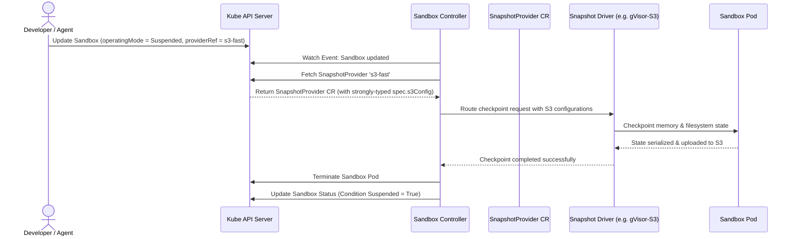
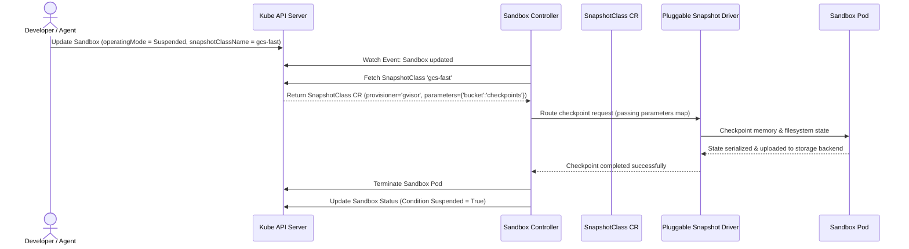

# KEP-0694: Suspend and Resume + Snapshot Provider API for Agent Sandboxes

<!-- toc -->
- [Motivation](#motivation)
- [Use Cases](#use-cases)
- [User Personas](#user-personas)
- [Goals](#goals)
- [Non-Goals](#non-goals)
- [Phased Approach](#phased-approach)
  - [Phase 1: Initial Implementation](#phase-1-initial-implementation)
  - [Phase 2: Future Additions](#phase-2-future-additions)
- [API for Triggering Suspend/Resume](#api-for-triggering-suspendresume)
  - [The <code>spec.operatingMode</code> Enum - <em>Implemented</em>](#the-specoperatingmode-enum---implemented)
  - [Alternatives Considered for Triggering Suspend/Resume](#alternatives-considered-for-triggering-suspendresume)
  - [Need for a Snapshotting API](#need-for-a-snapshotting-api)
- [Suspension Strategies Explained](#suspension-strategies-explained)
- [API for Snapshotting: SnapshotClass vs SnapshotProvider](#api-for-snapshotting-snapshotclass-vs-snapshotprovider)
  - [Option A: SnapshotProvider (Strongly Typed CRD)](#option-a-snapshotprovider-strongly-typed-crd)
    - [1. Go API Specification](#1-go-api-specification)
    - [2. Pros and Cons](#2-pros-and-cons)
    - [3. User Interaction](#3-user-interaction)
    - [4. Architecture Flow](#4-architecture-flow)
  - [Who uses these CRDs?](#who-uses-these-crds)
  - [Suspension Options](#suspension-options)
  - [How will the conditions be exposed?](#how-will-the-conditions-be-exposed)
- [Snapshot Driver gRPC Interface](#snapshot-driver-grpc-interface)
  - [Protobuf Service Definition](#protobuf-service-definition)
- [How Resume Works](#how-resume-works)
<!-- /toc -->

## Motivation

Long-running agents and development environments often exhibit bursty usage patterns, with periods of high activity followed by extended idle times (e.g., waiting for API responses, human input, or scheduled triggers). Currently, maintaining the execution context of these workloads requires keeping expensive compute resources active. While terminating pods via `replicas=0` and persisting disk state via Persistent Volumes is supported, the critical missing capability is capturing and restoring live memory state.

By introducing Suspend and Resume capabilities, we can take a memory and filesystem snapshot, scale resources down to zero, and quickly restore them when needed. This significantly reduces cloud spend while giving users the illusion of a permanently running agent. Additionally, this feature enables rapid scaling via "starter" templates, absolute control over infrastructure disruptions, and advanced parallel workflows.

## Use Cases

1. **The "Illusion of an Always-On" Agent (Efficiency during Idleness)**
   * **Scenario:** Agents operate in bursts followed by extended periods of inactivity.
   * **Need:** Take a memory and filesystem snapshot, scale resources down, and quickly restore them when needed to save idle costs without losing the execution context.

2. **Fast Launch via "Starter" Clones (Template Sandbox)**
   * **Scenario:** Launching new sandbox environments from scratch introduces significant cold-start latency.
   * **Need:** Spin up a "template" sandbox, install prerequisites, take a base snapshot, and suspend it. New agents can instantly "resume" from this starter snapshot instead of cold-booting.

3. **Absolute Disruption Control (Survival of Pod Evictions)**
   * **Scenario:** Kubernetes pods can be evicted or disrupted due to node maintenance, spot instance preemption, or autoscaling.
   * **Need:** Take regular snapshots or trigger emergency checkpoints prior to termination signals so the agent's execution can survive infrastructure disruptions and resume on a new node without losing progress.

4. **Advanced Workflows (Rewind & Fork)**
   * **Scenario:** An agent encounters a catastrophic error or takes an unwanted branch in code execution.
   * **Need:** Utilize snapshots to rewind the sandbox to a healthy checkpoint or fork an existing sandbox state into parallel environments to test different paths simultaneously.

## User Personas

| Customer Profile | How They Use It | Why Suspend/Resume Matters to Them |
| :--- | :--- | :--- |
| **SaaS Platform Builders** (Agent-as-a-Service / Dev Environments) | Integrating the API with custom runtimes (like gVisor or micro-VMs) via a pluggable `SnapshotProvider` model. | **Cost & Latency:** Support millions of user sandboxes by aggressively scaling-to-zero during idle time, and using cloned starter templates to eliminate cold-start times. |
| **Enterprise IT & Platform Engineers** | Operating Kubernetes clusters running untrusted LLM code, relying on automated scheduler policies. | **Resiliency & Resource Management:** Declarative "Auto-suspend" policies to clean up abandoned environments, snapshot retention/garbage collection, and scheduling controls (node affinity) upon resume. |
| **End-User Developers & Data Scientists** | Interacting with coding sandboxes (e.g., VSCode or Jupyter-based setups). | **Frictionless UX:** Persistent development environments that never lose terminal state, open file buffers, or running processes—even across weekends or node restarts. |

## Goals

* Provide trigger for manual suspension and resumption of sandboxes.
* Provide a unified, pluggable API that abstracts runtime-specific snapshotting implementations (e.g., gVisor, Firecracker) and separates infrastructure configuration (Cluster Admin) from sandbox lifecycle requests (Developer/Agent).

## Non-Goals

* Implementing the underlying snapshotting mechanisms natively inside the controller (these will be delegated to specific runtime drivers).
* Implementing an exhaustive list of extendible features like Snapshot retention, Garbage collection, Networking state, configuring auto suspend policies etc.

## Phased Approach

Implementing suspend and resume is complex because snapshotting is runtime-specific. To ensure a safe and manageable delivery, we are rolling out the capabilities in phases.

### Phase 1: Initial Implementation
* **Declarative Pausing via OperatingMode (Implemented):** Implemented a `spec.operatingMode: Running | Suspended` enum field on the Sandbox CRD to dictate the execution state. This aligns with standard Kubernetes API conventions by avoiding rigid booleans and preventing mutually exclusive field conflicts. Suspend and resume actions are manually invoked by developers or external agents modifying the Sandbox specification.
* **Suspension Strategy Configuration (Pending):** Introduce the `spec.suspensionStrategy` field to allow configuring different suspension styles (Stop, Freeze, Hibernate) when `operatingMode` is set to `Suspended`.
* **Pluggable Architecture (Pending):** A unified Snapshot API to route snapshot commands to the correct runtime driver.

### Phase 2: Future Additions
* **Automated / Policy-Based Triggers:** Kubernetes controllers automatically suspending sandboxes based on idle timeout policies defined in the sandbox lifecycle configuration (see [PR #972](https://github.com/kubernetes-sigs/agent-sandbox/pull/972/changes)).
* **Pre-Suspend / Post-Resume Hooks:** Providing triggers to notify workloads before suspending or after resuming.
* **Snapshot Retention & Garbage Collection:** Configuring the TTL for checkpoints in storage and automatically managing their lifecycle.
* **Metrics & Observability:** Detailed metrics to track snapshotting operations, including count, latency per driver, snapshot size, etc.

## API for Triggering Suspend/Resume

### The `spec.operatingMode` Enum - *Implemented*

This approach introduced a strongly-typed Enum (`spec.operatingMode: Running | Suspended`) block (designed and implemented in [KEP-0694: Suspend and Resume for Agent Sandboxes Beta](../694-kep-for-suspend-and-resume-for-beta/README.md)) to dictate how the suspension is physically handled.

* **Pros:**
  * **API Compliant:** Aligns perfectly with Kubernetes API conventions by avoiding rigid booleans and preventing mutually exclusive field conflicts.
  * **Semantic Meaning:** Clearly states the sandbox's execution state while leaving room for future expansion.
  * **Scale Constraints:** Matches the singleton nature of 1-to-1 interactive workspaces perfectly.
* **Cons:**
  * **Loss of Native Scaling:** By replacing `spec.replicas` with an enum, we lose out-of-the-box integration with native Kubernetes scaling tools (like HPA or KEDA) that depend on the `/scale` subresource. Although, we currently don't have plans around scaling Pods for a single Sandbox.

### Alternatives Considered for Triggering Suspend/Resume

The detailed analysis of alternative trigger designs (such as API aggregation, action resources, booleans, and scheduling gates) is documented in the [694-kep-for-suspend-and-resume-for-beta/README.md](../694-kep-for-suspend-and-resume-for-beta/README.md).

### Need for a Snapshotting API

While `spec.operatingMode` controls the target execution state, the mechanism used to pause the sandbox depends on the desired suspension strategy. As discussed below, strategies like **Stop** (stateless termination) and **Freeze** (process freezing in memory) do not require state serialization. However, the **Hibernate** strategy (which completely tears down compute resources while persisting process memory and filesystem state) depends on a pluggable snapshotting mechanism. The `SnapshotClass` and `SnapshotProvider` APIs defined in this proposal are specifically designed to coordinate this serialization and deserialization process for stateful suspension.

## Suspension Strategies Explained

When a Sandbox is marked as `operatingMode: Suspended`, the physical execution of that pause is dictated by the `spec.suspensionStrategy.type`. We propose three distinct strategies to accommodate different workloads and latency requirements:

| Strategy Type | What `operatingMode: Suspended` Does | When to Use It |
| :--- | :--- | :--- |
| **Stop** | Standard stateless scale-down. Deletes the Pod and its associated resources. The file system is deleted (unless tied to a Retained PVC). | Stateless agents, clean-slate workspaces, or standard developer playground resets. |
| **Freeze** | Keeps the Pod alive in Kubernetes, but freezes container CPU namespaces. Keeps RAM intact. | Fast-loop interactive agents. Highly responsive (microseconds latency) but actively consumes cluster node memory. |
| **Hibernate** | Serializes the RAM and filesystem to the specified storage class, then terminates the Pod. | Long-idle agents. Drops compute footprint entirely. The "Always-On" illusion. |

## API for Snapshotting: SnapshotClass vs SnapshotProvider

In a Kubernetes-native design, we need a configuration layer for the pluggable provider pattern to tell the agent-sandbox controller how and where to handle snapshotting. We are still actively discussing these two options.

### Option A: SnapshotProvider (Strongly Typed CRD)

This option introduces a custom cluster-scoped resource `SnapshotProvider` with a strongly-typed schema validating provider-specific configurations.

#### 1. Go API Specification

```go
// SnapshotProviderSpec defines the configurations for the snapshot provider.
type SnapshotProviderSpec struct {
	// providerType specifies the type of pluggable snapshot driver (e.g., "gvisor", "firecracker").
	// +required
	ProviderType string `json:"providerType"`

	// s3 contains configuration options specific to AWS S3 / S3-compatible endpoints.
	// +optional
	S3 *S3SnapshotConfig `json:"s3,omitempty"`

	// gcs contains configuration options specific to Google Cloud Storage.
	// +optional
	GCS *GCSSnapshotConfig `json:"gcs,omitempty"`
}

type S3SnapshotConfig struct {
	// bucket is the name of the S3 bucket to save checkpoints.
	// +required
	Bucket string `json:"bucket"`

	// region is the AWS region of the bucket.
	// +optional
	Region string `json:"region,omitempty"`
}

type GCSSnapshotConfig struct {
	// bucket is the name of the GCS bucket to save checkpoints.
	// +required
	Bucket string `json:"bucket"`
}

// +genclient
// +genclient:nonNamespaced
// +kubebuilder:object:root=true
// +kubebuilder:resource:scope=Cluster
type SnapshotProvider struct {
	metav1.TypeMeta   `json:",inline"`
	metav1.ObjectMeta `json:"metadata,omitempty"`

	Spec SnapshotProviderSpec `json:"spec"`
}

// Sandbox modification to reference SnapshotProvider:
type HibernateStrategy struct {
	// snapshotProviderRef references the SnapshotProvider configuration.
	// +required
	SnapshotProviderRef LocalObjectReference `json:"snapshotProviderRef"`
}
```

#### 2. Pros and Cons

* **Pros:**
  * **Strict Schema Validation:** Configuration options (such as AWS bucket name and region) are explicitly validated by the Kubernetes API server at request-creation time. Misconfigured or missing required fields are rejected immediately.
  * **Self-Documenting:** The API specification clearly reveals all supported cloud platforms and parameters.
* **Cons:**
  * **Tight Coupling:** Adding support for a new cloud provider or new driver options requires modifying the core CRD schema and releasing a new version of the API.
  * **Poor Portability:** The `Sandbox` spec directly targets a provider instance config, meaning copying the Sandbox YAML between environments (e.g., dev/prod, GCP/AWS) requires editing the provider details.

#### 3. User Interaction

**Cluster Admin defines the SnapshotProvider:**
```yaml
apiVersion: agents.x-k8s.io/v1beta1
kind: SnapshotProvider
metadata:
  name: s3-fast
spec:
  providerType: "gvisor-s3"
  s3:
    bucket: "sandbox-checkpoints"
    region: "us-west-2"
```

**Developer/Agent references the provider in Sandbox:**
```yaml
apiVersion: agents.x-k8s.io/v1beta1
kind: Sandbox
metadata:
  name: billing-agent-42
spec:
  operatingMode: "Suspended"
  suspensionStrategy:
    type: "Hibernate"
    hibernate:
      snapshotProviderRef:
        name: "s3-fast"
```

#### 4. Architecture Flow



---

### Option B: SnapshotClass (StorageClass Paradigm)

This option uses a generic cluster-scoped `SnapshotClass` mimicking the standard Kubernetes `StorageClass` / `PersistentVolumeClaim` dynamic.

#### 1. Go API Specification

```go
// +genclient
// +genclient:nonNamespaced
// +kubebuilder:object:root=true
// +kubebuilder:resource:scope=Cluster
type SnapshotClass struct {
	metav1.TypeMeta   `json:",inline"`
	metav1.ObjectMeta `json:"metadata,omitempty"`

	// provisioner indicates the pluggable driver responsible for execution.
	// +required
	Provisioner string `json:"provisioner"`

	// parameters holds free-form key-value configurations handled by the provisioner.
	// +optional
	Parameters map[string]string `json:"parameters,omitempty"`
}

// Sandbox modification to reference SnapshotClass:
type HibernateStrategy struct {
	// snapshotClassName specifies the SnapshotClass used for serialization.
	// +required
	SnapshotClassName string `json:"snapshotClassName"`
}
```

#### 2. Pros and Cons

* **Pros:**
  * **Loose Coupling:** Clean separation of concerns. Pluggable drivers can be registered without modifying the core `SnapshotClass` or `Sandbox` API specs.
  * **UX Familiarity:** Follows the widely understood `StorageClass` workflow.
  * **Portability:** High portability across environments. The `Sandbox` spec only requests a class type (e.g., `fast-memory-snapshot`), and the platform resolves it differently depending on cloud/cluster backend without changing the Sandbox YAML.
* **Cons:**
  * **Weak Schema Validation:** Because `parameters` is a free-form `map[string]string`, typos or invalid configs are not validated at request time and will only fail during runtime controller reconciliation.

#### 3. User Interaction

**Cluster Admin defines the SnapshotClass:**
```yaml
apiVersion: agents.x-k8s.io/v1beta1
kind: SnapshotClass
metadata:
  name: gcs-fast
provisioner: "agents.x-k8s.io/gvisor"
parameters:
  bucket: "sandbox-checkpoints"
  region: "us-west-2"
```

**Developer/Agent references the class in Sandbox:**
```yaml
apiVersion: agents.x-k8s.io/v1beta1
kind: Sandbox
metadata:
  name: billing-agent-42
spec:
  operatingMode: "Suspended"
  suspensionStrategy:
    type: "Hibernate"
    hibernate:
      snapshotClassName: "gcs-fast"
```

#### 4. Architecture Flow



---

### Who uses these CRDs?

1. **The Cluster Administrator:** Creates and maintains the `SnapshotClass` or `SnapshotProvider` resources globally. They configure storage buckets, credentials, and ensure nodes support runtime snapshotting (e.g. gVisor).
2. **The Agent-Sandbox Operator/Controller:** Watches Sandbox state changes. When `operatingMode` is `Suspended` and the strategy is `Hibernate`, it resolves the reference and delegates the action to the corresponding driver.

### Suspension Options

```yaml
# 1. THE HOT STRATEGY: Zero latency, high compute cost
spec:
  operatingMode: "Suspended"
  suspensionStrategy:
    type: "Freeze"

---

# 2. THE WARM STRATEGY: Medium latency (RESTORES RAM), zero compute cost, high storage cost
spec:
  operatingMode: "Suspended"
  suspensionStrategy:
    type: "Hibernate"
    hibernate:
      snapshotClassName: "fast-memory-snapshot" # Name-based snapshot class reference

---

# 3. THE COLD STRATEGY: High latency (REBOOTS DISK), zero compute cost, low storage cost
spec:
  operatingMode: "Suspended"
  suspensionStrategy:
    type: "Stop" # (Wipes the pod, but keeps the disk)
```


### How will the conditions be exposed?

The status of the suspension/resumption process is exposed through a first-class `Suspended` condition on the `Sandbox` resource. The detailed condition transition matrix, state diagram, and controller implementation are documented in the [119-sandbox-suspended-state/README.md](../119-sandbox-suspended-state/README.md).

## Snapshot Driver gRPC Interface

To maintain a pluggable architecture and decouple the core `agent-sandbox` controller from specific hypervisor or container runtime snapshotting APIs (like `gVisor` checkpointing or `Firecracker` microVM state serialization), drivers MUST implement a standard gRPC service. The controller communicates with the driver over a Unix Domain Socket (UDS) or a secure TCP endpoint specified in the cluster configuration.

### Protobuf Service Definition

```protobuf
syntax = "proto3";

package agents.x-k8s.io.v1beta1;

option go_package = "sigs.k8s.io/agent-sandbox/clients/go/pkg/apis/snapshot/v1";

// SnapshotDriver defines the RPC interface that pluggable snapshot drivers
// must implement to support Hibernate and Freeze strategies.
service SnapshotDriver {
  // Checkpoint serializes the memory and filesystem state of a running sandbox pod.
  rpc Checkpoint(CheckpointRequest) returns (CheckpointResponse);

  // Restore prepares and binds the saved state prior to the Pod shell boot.
  rpc Restore(RestoreRequest) returns (RestoreResponse);

  // Delete purges a saved checkpoint from the backend storage.
  rpc Delete(DeleteRequest) returns (DeleteResponse);
}

message CheckpointRequest {
  // Unique name identifying the sandbox resource.
  string sandbox_name = 1;
  string sandbox_namespace = 2;

  // The target running Pod name in the cluster.
  string pod_name = 3;

  // Key-value configuration parameters passed directly from the SnapshotClass.
  map<string, string> parameters = 4;
}

message CheckpointResponse {
  // Unique ID of the created snapshot, used for subsequent restore/delete.
  string snapshot_uid = 1;

  // Size of the serialized state in bytes.
  int64 size_bytes = 2;

  // Opaque metadata returned by the driver to store on the Sandbox status.
  map<string, string> driver_metadata = 3;
}

message RestoreRequest {
  string sandbox_name = 1;
  string sandbox_namespace = 2;

  // The unique ID of the snapshot to restore from.
  string snapshot_uid = 3;

  // Key-value configurations passed from the SnapshotClass.
  map<string, string> parameters = 4;
}

message RestoreResponse {
  // Opaque instructions returned by the driver (e.g. volume mounts, env vars)
  // that the controller should inject into the restored Pod shell spec.
  map<string, string> restore_metadata = 1;
}

message DeleteRequest {
  // The unique ID of the snapshot to delete.
  string snapshot_uid = 1;

  // Key-value configurations passed from the SnapshotClass.
  map<string, string> parameters = 2;
}

message DeleteResponse {}
```

## How Resume Works

The resume operation follows the native, level-triggered controller pattern of Kubernetes by continuously reconciling the desired state specified in `spec` against the observed state of physical cluster resources.

When `spec.operatingMode` is set to `Running` (or omitted), the controller executes the following logic sequence during its reconciliation loop:

- **Observe Current State:** The controller queries the API server to check for the existence of the underlying runner Pod associated with the AgentSandbox.
- **Evaluate Restore Necessity:** If no active runner Pod is found, the controller checks if a snapshot of the memory/filesystem state exists for this Sandbox.
- **Reconcile Discrepancy (Restore or Boot):**
  - **Stateful Restore (Hibernate/Freeze):** If a snapshot exists, the controller reads the `snapshotClassName` configuration referenced in `spec.suspensionStrategy` to retrieve storage backend parameters. It coordinates with the pluggable snapshot driver to restore the live process memory and filesystem state into a newly provisioned runner Pod shell.
  - **Cold Boot (Stop / Default):** If no snapshot exists, the controller invokes the Pod driver to construct a fresh runner Pod shell from scratch using the Sandbox's original `spec.podTemplate` and binds it to the existing Persistent Volume Claims (PVCs).
- **Reflect Status:** Only after physical resources are successfully restored or created and the Pod transitions to the running state does the controller update the status block to inform external clients of the current observed state (e.g., setting the `Suspended` condition to `False` and `Ready` condition to `True`).