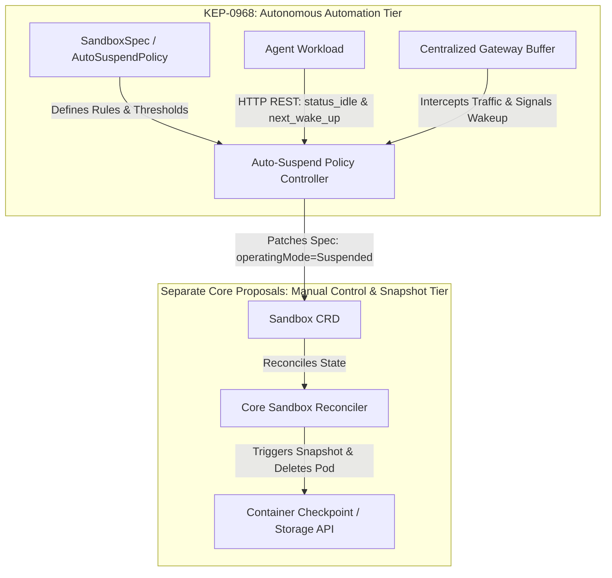
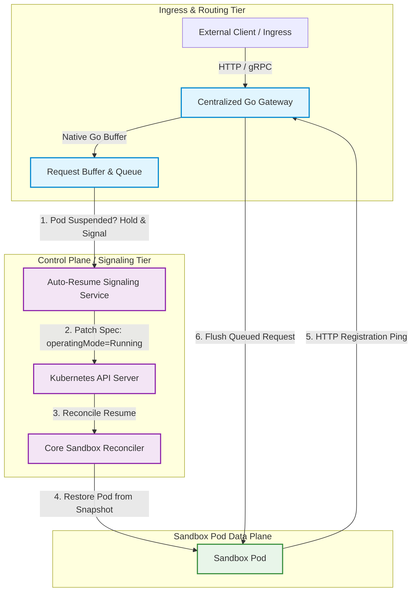
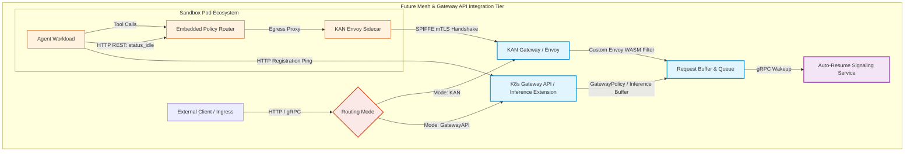

# KEP-0968: Intelligent Auto-Suspend and Resume Architecture

<!-- toc -->
- [Summary](#summary)
- [Motivation](#motivation)
  - [Goals](#goals)
  - [Non-Goals](#non-goals)
  - [High-Level Design](#high-level-design)
    - [Architectural Principle: Manual Control vs. Autonomous Automation](#architectural-principle-manual-control-vs-autonomous-automation)
    - [Centralized Gateway Ingress Interception &amp; Buffering](#centralized-gateway-ingress-interception--buffering)
    - [Solving the Reachability Handshake (Registration Ping)](#solving-the-reachability-handshake-registration-ping)
    - [Solving Workload Signaling (Centralized Gateway REST API)](#solving-workload-signaling-centralized-gateway-rest-api)
    - [Client SDK Resiliency (Jittered Retries)](#client-sdk-resiliency-jittered-retries)
    - [Warm Pool Integration for Sub-Second On-Demand Thaw](#warm-pool-integration-for-sub-second-on-demand-thaw)
- [Scalability](#scalability)
- [Alternatives (Optional)](#alternatives-optional)
  - [1. Monolithic Lifecycle Daemon (Namespace Supervisor)](#1-monolithic-lifecycle-daemon-namespace-supervisor)
  - [2. Per-Pod Sidecar Proxy Containers](#2-per-pod-sidecar-proxy-containers)
  - [3. External CronJob Polling](#3-external-cronjob-polling)
<!-- /toc -->

## Summary

To secure large-scale AI agent workloads in multi-tenant environments, Kubernetes platforms must deliver highly secure sandbox isolation while maintaining strict cost efficiency. Because agent runtimes often sit idle for extended periods waiting for human input or background tasks, maintaining continuously active, reserved compute resources is cost-prohibitive. 

This KEP defines an intelligent auto-suspend and resume automation architecture. While manual lifecycle control (`spec.operatingMode`) is already established in the core Sandbox API and low-level container snapshot mechanics are managed by separate proposals ([Issue #694](https://github.com/kubernetes-sigs/agent-sandbox/issues/694)), this proposal establishes the autonomous policy layer (`AutoSuspendPolicy`), centralized routing gateways, request buffering queues, and HTTP REST workload signaling contracts. By capturing idle status and scheduled wakeup events emitted by the workload, the autonomous controller automatically transitions idle pods to suspended states, releases underlying compute, and seamlessly restores the sandbox before scheduled cron executions or incoming user requests without dropping active connections.

## Motivation

AI agent runtimes exhibit unique traffic patterns that differ fundamentally from traditional microservices. Workloads experience bursty periods of intense LLM reasoning followed by long periods of inactivity (often sitting idle for extended periods) waiting for human-in-the-loop input or scheduled background cron tasks. 

While the established Sandbox core API already supports `spec.operatingMode: Running | Suspended` for manually pausing and resuming sandboxes, Kubernetes lacks an autonomous mechanism for an application to signal its semantic idleness and precise future wake-up requirements directly to the cluster control plane. Consequently, platform engineers are forced to manually supervise lifecycle states or pay for continuously active compute instances. This KEP bridges the gap by introducing a declarative `AutoSuspendPolicy` within `SandboxSpec` and establishing an ultra-low-latency HTTP REST signaling contract between the workload and the autonomous controller.

### Goals
*   **Autonomous Lifecycle Management:** Introduce `AutoSuspendPolicy` in `SandboxSpec` to automatically monitor timers, workload signals, and external metrics, autonomously driving the underlying `spec.operatingMode` manual API already established in the core Sandbox CRD.
*   **Aggressive Resource Overcommit:** Enable platform engineers to safely evict idle pods from a node, unlocking high-density cost efficiency targets on standard cloud or bare-metal infrastructure.
*   **Seamless Ingress Thawing:** Buffer incoming user requests while a suspended pod thaws, ensuring zero dropped connections during on-demand restores.

### Non-Goals
*   **Core Lifecycle, Snapshots & Storage:** The definition of core imperative lifecycle states, low-level container checkpoint/restore mechanics (CRIU), storage provider configurations (`SnapshotConfig`), and CSI volume claim persistence across pod deletion cycles are explicitly out of scope, delegated entirely to separate core proposals (e.g., Issue #694).
*   **Control Plane Hibernation:** This KEP focuses strictly on workload-level suspend/resume automation and does not address cluster control plane hibernation or node-level power management.

---

## Proposal

### User Stories (Optional)

#### Platform Engineer Managing High-Density Agent Workloads
As a platform engineer managing large-scale, multi-tenant AI agent pods on a Kubernetes cluster, I want to configure an `AutoSuspendPolicy` in my `SandboxSpec` so that idle pods are automatically transitioned to `Suspended` mode after 15 minutes of inactivity. When a user sends a new chat prompt or a scheduled cron job triggers, I want the centralized Gateway to buffer the request and restore the pod in under 3 seconds without dropping the user's connection, keeping my overall compute costs minimal.

#### Developer
As a developer building a lightweight agentic dev environment on a cluster, I want my idle sandboxes to automatically suspend after 3 minutes of inactivity and unfreeze instantly when I send an HTTP request, using a centralized Go gateway that avoids sidecar container resource bloat.

---

### High-Level Design

#### Architectural Principle: Manual Control vs. Autonomous Automation
A foundational design principle of this KEP is the strict separation of concerns between manual lifecycle control (`spec.operatingMode`) and autonomous lifecycle automation (`AutoSuspendPolicy`).



*   **Manual Control & Snapshot Tier (separate proposals):** Owns `SandboxSpec.OperatingMode` (`Running` vs. `Suspended`), manages container checkpointing APIs (CRIU), handles snapshot storage configurations (`SnapshotConfig`), orchestrates pod deletion/re-creation, and manages CSI volume claim persistence.
*   **Autonomous Automation Tier (this proposal):** Owns `AutoSuspendPolicy` within `SandboxSpec`. This autonomous controller monitors workload signals, inactivity timers, and Gateway buffers, deciding *when* to suspend or resume a sandbox by patching `spec.operatingMode`. 

#### Centralized Gateway Ingress Interception & Buffering
To eliminate the network hop latency and resource overhead of running sidecar proxy containers per pod (which can conflict with service meshes like Istio), `agent-sandbox` implements a **Centralized Go Gateway (`sandbox-gateway`)**:



Adapting the architectural pattern from `clients/python/agentic-sandbox-client/sandbox-router`, but **rewritten in compiled Go (`sandbox-gateway`) for maximum efficiency, concurrency, and scalability**, this centralized deployment manages routing, in-memory request buffering, and HTTP registration pings for thousands of sandboxes across the cluster without polluting individual pod namespaces with sidecar containers.

#### Solving the Reachability Handshake (Registration Ping)
When the core reconciler restores a suspended pod from object storage, the new pod receives a new IP and hostname. Once the container thaws, the agent workload executes an explicit HTTP registration ping directly to the centralized `sandbox-gateway` service (`http://sandbox-gateway.agent-sandbox.svc.cluster.local/v1/agent/register`). The successful completion of this registration ping serves as proof of reachability, prompting the Gateway to unblock the queued request buffer.

#### Solving Workload Signaling (Centralized Gateway REST API)
To enable agent workloads to signal `status_idle` and `nextWakeupTime`, the workload executes a simple HTTP POST directly to the centralized gateway (`http://sandbox-gateway.agent-sandbox.svc.cluster.local/v1/lifecycle/state`).

#### Client SDK Resiliency (Jittered Retries)
To complement our server-side Gateway buffering, the client-side SDKs implement a standardized transient-error HTTP retry engine featuring exponential backoff and full jitter. If a Gateway buffer queue experiences transient timeouts during an unusually large checkpoint thaw, the client SDK gracefully retries the connection without failing the user's application.

#### Warm Pool Integration for Sub-Second On-Demand Thaw
To achieve sub-second on-demand resume for latency-sensitive traffic, the Centralized Gateway integrates directly with `SandboxWarmPool`. When an unexpected on-demand user request arrives for a suspended sandbox configured with a warm pool reference (`SandboxClaim.Spec.WarmPoolRef`), the Gateway bypasses the standard GCS thaw pathway. Instead, it signals the Auto-Resume Signaling Service to instantly route the request to a pre-warmed, unallocated pod from the warm pool, instructing the warm instance to immediately adopt the suspended sandbox's memory snapshot and persistent volumes. This drops cold-start resume latency from 3 seconds down to milliseconds.

---

#### API Changes

To ensure a cohesive user experience for Platform Engineers and enable proper controller propagation, policy definitions are introduced in the core `agents.x-k8s.io/v1beta1` package (`SandboxSpec`).

```go
// Package agents.x-k8s.io/v1beta1 (Core API)
type SandboxSpec struct {
	// AutoSuspendPolicy defines the declarative auto-suspend/resume automation rules.
	// +optional
	AutoSuspendPolicy *AutoSuspendPolicy `json:"autoSuspendPolicy,omitempty"`

	// ScheduledWakeupTime specifies an optional time when the autonomous controller MUST restore 
	// the sandbox to Running state.
	// +optional
	ScheduledWakeupTime *metav1.Time `json:"scheduledWakeupTime,omitempty"`
    
	// ... existing fields (OperatingMode, PodTemplate, VolumeClaimTemplates, etc.) ...
}

// AutoSuspendPolicy defines the declarative auto-suspend/resume automation rules.
type AutoSuspendPolicy struct {
	// IdleDetectionStrategies defines the mechanisms used to detect idleness.
	IdleDetectionStrategies []IdleDetectionStrategy `json:"idleDetectionStrategies,omitempty"`

	// SuspendThresholdSeconds defines the delay before transitioning a Running pod to Suspended.
	// +kubebuilder:default=900
	SuspendThresholdSeconds int32 `json:"suspendThresholdSeconds,omitempty"`

	// PreWakeupBufferSeconds defines how many seconds before nextWakeupTime the controller 
	// should initiate the restoration process to ensure readiness.
	// +kubebuilder:default=30
	PreWakeupBufferSeconds int32 `json:"preWakeupBufferSeconds,omitempty"`
}

type IdleDetectionStrategy struct {
	// Type can be Timer, WorkloadSignal, or ExternalMetric
	// +kubebuilder:validation:Enum=Timer;WorkloadSignal;ExternalMetric
	Type IdleDetectionType `json:"type"`

	// TimerConfig configures inactivity thresholds if Type == Timer
	TimerConfig *TimerStrategyConfig `json:"timerConfig,omitempty"`

	// SignalConfig configures the gateway endpoint if Type == WorkloadSignal
	SignalConfig *WorkloadSignalConfig `json:"signalConfig,omitempty"`
}
```

#### Implementation Guidance

1.  **Autonomous Policy Controller:**
    *   Implement a new controller (`controllers/autosuspend_controller.go`) watching `Sandbox`.
    *   The controller evaluates `SandboxSpec.AutoSuspendPolicy`. When inactivity timers or `WorkloadSignal` thresholds are breached, it patches `SandboxSpec.OperatingMode` to `Suspended`.
    *   When `ScheduledWakeupTime` approaches or an ingress wakeup trigger is received, it patches `SandboxSpec.OperatingMode` to `Running`.
2.  **Centralized Go Gateway (`sandbox-gateway`):**
    *   Adapt the architectural pattern from `clients/python/agentic-sandbox-client/sandbox-router`, but rewrite it in compiled Go as a centralized cluster deployment (`sandbox-gateway`).
    *   The Gateway will intercept requests matching `*.sandbox.cluster.local`, check an in-memory state table for pod suspension status, queue pending HTTP streams, and fire a gRPC wakeup call to the Auto-Resume Signaling Service.
3.  **Signaling Interception:**
    *   Agent workloads execute HTTP POST signals directly to `http://sandbox-gateway.agent-sandbox.svc.cluster.local/v1/lifecycle/state`.

---

## Scalability

*   **Memory Footprint:** Using a centralized compiled Go Gateway (`sandbox-gateway`) eliminates interpreted language bottlenecks and maintains minimal per-worker memory overhead, allowing the Gateway tier to hold tens of thousands of concurrent pending connections during pod thaws without polluting individual pod namespaces with sidecar containers.
*   **Snapshot Thaw Latency & Buffer Queue Disconnect Behavior:** Restoring a container checkpoint from object storage takes 1 to 3 seconds depending on memory size. The Gateway buffer queue must be configured with a maximum holding timeout of 15 seconds to prevent socket terminal exhaustion during large-scale simultaneous thaws. If a thawing pod fails to execute its HTTP Registration Ping (`/v1/agent/register`) within this 15-second window, the Gateway must terminate the pending connection, return an HTTP 504 Gateway Timeout to the client, and fire a Kubernetes `Warning` event (`Reason: RegistrationTimeout`) on the target `Sandbox` CR to alert platform operators.
*   **API Server Load:** To prevent etcd churn during high-frequency `WorkloadSignal` emissions, the Auto-Resume Signaling Service utilizes in-memory debouncing, patching the `Sandbox` CRD only when state transition thresholds (`SuspendThresholdSeconds`) are actively breached.

---

## Future Work: Advanced Mesh & Gateway API Integration (KAN & Inference Gateway)

While this KEP focuses on establishing the mature, zero-dependency Centralized Go Gateway (`sandbox-gateway`) for standalone deployments, future iterations will explore advanced integration with `kube-agentic-networking` (KAN), the Kubernetes Gateway API (`gateway.networking.k8s.io`), and the Gateway API Inference Extension (e.g., GKE Inference Gateway).



1.  **`RoutingMode: KAN`:** Fully delegates networking (`networkPolicyManagement: Unmanaged`). Utilizes SPIFFE mTLS reachability handshakes, leverages OPA/Rego embedded policy routers (`kubernetes-agentic-policy-engine`) for local loopback signaling (`127.0.0.1:15020`), and utilizes custom Envoy WASM filters at the KAN Gateway for enterprise-grade request buffering.
2.  **`RoutingMode: GatewayAPI`:** Integrates natively with the Kubernetes Gateway API and the Gateway API Inference Extension. Request buffering is handled natively by GatewayPolicy CRDs or Inference Gateway queueing mechanisms, while wakeup signaling integrates seamlessly with the Auto-Resume Signaling Service.

---

## Alternatives (Optional)

### 1. Monolithic Lifecycle Daemon (Namespace Supervisor)
*   **Description:** Deploying a standalone server-side daemon per namespace to supervise TTLs, snapshots, and `operatingMode`.
*   **Consideration:** Violates Kubernetes `controller-runtime` idioms. Introduces a single point of failure and duplicates reconciliation logic that natively belongs in CRD controllers.

### 2. Per-Pod Sidecar Proxy Containers
*   **Description:** Injecting a dedicated lifecycle proxy sidecar container into every sandbox pod.
*   **Consideration:** Introduces severe network hop latency (especially when conflicting with Istio/Envoy meshes) and increases per-pod resource bloat. Our Centralized Go Gateway architecture (`sandbox-gateway`) provides vastly superior efficiency and scalability.

### 3. External CronJob Polling 
*   **Description:** Using external K8s CronJobs to wake the proxy and pull an idle status API from the agent workload.
*   **Consideration:** External polling introduces unnecessary API server load and latency. The push-based HTTP REST signaling contract (`WorkloadSignal`) is more efficient, generic, and secure.
