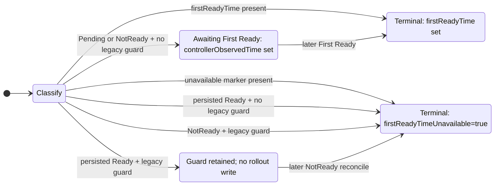

# KEP-NNNN: Observe SandboxClaim startup from status events

<!--
TOC is auto-generated via `make toc-update`.
-->

<!-- toc -->
- [Summary](#summary)
- [Motivation](#motivation)
  - [Problem](#problem)
  - [Goals](#goals)
  - [Non-goals](#non-goals)
- [Proposal](#proposal)
  - [Terminology](#terminology)
  - [High-Level Design](#high-level-design)
    - [API Changes](#api-changes)
    - [API Stability and Feature Enablement](#api-stability-and-feature-enablement)
    - [Timestamp Ownership](#timestamp-ownership)
    - [Startup Observer](#startup-observer)
    - [Metrics](#metrics)
    - [Annotation Migration](#annotation-migration)
    - [Existing Claim Migration](#existing-claim-migration)
- [Implementation Guidance](#implementation-guidance)
  - [API Markers and Validation](#api-markers-and-validation)
  - [Timestamp Capture and Reconcile Ordering](#timestamp-capture-and-reconcile-ordering)
  - [Startup Observer Controller and Reconcile Contract](#startup-observer-controller-and-reconcile-contract)
  - [Implementation Areas](#implementation-areas)
- [Rollout and Compatibility](#rollout-and-compatibility)
- [Risks and Mitigations](#risks-and-mitigations)
- [Scalability](#scalability)
  - [API Server Interaction Budget](#api-server-interaction-budget)
  - [Controller and Startup Observer Resource Bounds](#controller-and-startup-observer-resource-bounds)
- [Testing and Acceptance Criteria](#testing-and-acceptance-criteria)
  - [API and Status](#api-and-status)
  - [Controller and Migration](#controller-and-migration)
  - [Startup Observer](#startup-observer-1)
  - [End-to-End](#end-to-end)
  - [Performance](#performance)
- [Graduation Criteria](#graduation-criteria)
  - [Alpha](#alpha)
  - [Beta](#beta)
  - [GA](#ga)
- [Alternatives](#alternatives)
<!-- /toc -->

## Summary

The SandboxClaim controller writes up to two metadata PATCHes per Claim for startup observability
and records the metrics inside reconciliation. This KEP stores Admission Observation, Controller
Observation, and First Ready times as write-once fields in SandboxClaim status; the admission
annotation remains the webhook-to-controller handoff. A leader-elected `SandboxClaimMetricsObserver`
controller records the existing Prometheus histograms through its own workqueue when a cache Update
adds `firstReadyTime`. The Claim controller performs no observability metadata PATCHes for normal new
Claims, and status retains the timing data when the observer loses a sample.

## Motivation

### Problem

The SandboxClaim controller does observability work inside the authoritative reconcile path:

1. On the first reconcile it writes `controller-first-observed-at` and, when present, trace context
   to Claim metadata.
2. After the first Ready status transition it computes three latency metrics in Reconcile.
3. It writes `claim-first-ready-at` in a second metadata PATCH to stop duplicate histogram
   observations across Ready flaps, retries, and controller restarts.

Under the current default behavior, the controller sends up to two metadata PATCHes for a normal new
Claim that reaches Ready: one during its first active reconcile and one after its first Ready status
write. With one namespace and every Claim reaching Ready, the repository's default load scenarios
produce this write amplification:

| Workload | Default load | Additional Claim metadata PATCHes |
| --- | --- | --- |
| [Continuous burst](../../../test/benchmarks/config/agent-sandbox-continuous-burst.yaml) | 300 Claims/s for 120 seconds: 36,000 Claims | Up to 72,000 total; up to 600/s after Ready throughput reaches steady state. |
| [Rapid burst](../../../dev/load-test/test-recipes/rapid-burst-test.yaml) | 50 Claims per burst for 100 bursts: 5,000 Claims | Up to 10,000 total. |
| [Warm Claim burst](../../../test/benchmarks/scenarios/benchmarks-kops-gcp-claims/run) | 300 simultaneous Claims | Up to 600 during the burst. |

The table gives arithmetic upper bounds, not measured load. No controlled A/B benchmark or
production dataset exists, so this KEP does not attribute a share of apiserver or etcd traffic,
claim a Ready latency or p99 effect, or infer production rates from test defaults. The
first-reconcile PATCH precedes adoption and Ready computation. The First Ready guard PATCH follows
the Ready status write and can affect create-to-Ready latency only through shared control-plane
contention. Performance testing must quantify both effects before final approval; until then, the
only claimed result is removal of up to two writes per Ready Claim.

The metric side effect also runs after the authoritative status write. When the dedup PATCH fails,
Reconcile returns an error even though the Claim's real work succeeded. The guard annotation is
written in that second PATCH, so a crash between the Ready status write and the PATCH leaves the
Claim Ready without its guard; after restart, the controller would record the sample again.

The guard exists only because Prometheus histograms are process-local and Reconcile has no durable
record of First Ready. Status should own observed lifecycle facts while a separate controller
workqueue isolates best-effort metric delivery from Claim reconciliation.

### Goals

- Preserve these histograms, their labels, and their millisecond bucket behavior:
  - `agent_sandbox_claim_startup_latency_ms`
  - `agent_sandbox_claim_controller_startup_latency_ms`
  - `agent_sandbox_creation_latency_ms`
- Persist three write-once startup timestamps in SandboxClaim status, for v1alpha1 and v1beta1.
- Record all First Ready latency metrics outside `SandboxClaimReconciler.Reconcile`.
- Reduce observability-related Claim metadata PATCHes to zero on normal cold and warm-pool paths.
- Reuse the manager cache without adding a LIST, WATCH, or direct API read.
- Keep cache event handling and metric delivery off the Claim workqueue's critical path.
- Upgrade existing Claims without replaying metrics for Claims that were already Ready.
- Keep Claim status reconciliation and migration idempotent under retries, conflicts, leader
  changes, Ready flaps, and controller restarts.

### Non-goals

- Exactly-once or durable metric delivery. Prometheus observations stay process-local and
  best-effort.
- Measuring caller-to-apiserver latency. Admission timing starts when the webhook receives the
  AdmissionReview, not when the caller sends the CREATE.
- Removing the webhook timestamp annotation after copying it into status would require a separate
  metadata PATCH because the `/status` subresource cannot update annotations.
- Cleaning old annotations from existing Claims. Cleanup would create write amplification without
  improving correctness.
- Changing `AssignedSandboxNameAnnotation`, the assigned Sandbox transaction, or other business
  mutations.
- Persisting trace transport data in Claim status or preserving trace continuity across every Claim
  reconcile.
- Reconstructing a historical First Ready time when no trustworthy persisted source exists.

## Proposal

### Terminology

- **Admission Observation**: the optional admission webhook receives a CREATE request.
- **Controller Observation**: the earliest known observation of a Claim by an active Claim controller.
- **First Ready**: the first `Ready=True` result computed by the Claim controller; recovery and resume
  do not count.
- **Startup Observer**: the independent `SandboxClaimMetricsObserver` controller that records
  best-effort metrics from persisted First Ready transitions.

Use the capitalization above for full terms and lowercase for shortened common nouns. Write named
condition types as the `Ready` condition and the `Finished` condition. Write literal identifiers in
backticks without changing their spelling.

### High-Level Design

```mermaid
flowchart LR
    C["Client CREATE"] --> A["API server admission"]
    A --> W["Optional webhook overwrites admission annotation"]
    W --> S["SandboxClaim stored"]
    S --> R["Claim controller initializes startup status"]
    R --> P["Existing optimistic status PATCH"]
    P --> U["Manager cache Update"]
    U -->|"firstReadyTime: nil to non-nil"| Q["Startup Observer workqueue"]
    Q --> O["Startup Observer Reconcile"]
    O --> M["Prometheus histograms"]
```



The status write is authoritative. The cache event and Prometheus observation are downstream
best-effort consequences. Losing a metric event never changes the Claim or triggers an API retry.

#### API Changes

Add the same status type to the two served extensions API versions. v1beta1 remains the storage
version; the v1alpha1 conversion functions must copy the new fields.

| JSON field under `status.startup` | Go type | Meaning |
| --- | --- | --- |
| `admissionObservedTime` | `*metav1.MicroTime` | Optional time when the admission webhook received CREATE. |
| `controllerObservedTime` | `*metav1.MicroTime` | Earliest known observation by an active Claim controller. |
| `firstReadyTime` | `*metav1.MicroTime` | First time the Claim controller computed `Ready=True`. |
| `firstReadyTimeUnavailable` | `bool`, optional and true-only | Migration evidence that First Ready occurred but its time cannot be recovered. |

All three fields use `metav1.MicroTime` because the persisted values feed
millisecond-resolution histograms. `metav1.Time` serializes JSON at whole-second precision;
`metav1.MicroTime` retains microsecond precision across apiserver round trips. The observer
converts durations to milliseconds only after subtracting the persisted values, preserving the
existing histogram bucket behavior.

CEL transition rules enforce the API contract for every `/status` writer. Each timestamp permits a
first write, then rejects value changes and removal. Parent and root rules prevent bypass by deleting
an optional field, `status.startup`, or `status`. The unavailable marker permits only its first
`true` write and cannot coexist with `firstReadyTime`.
[API markers and validation](#api-markers-and-validation) lists the exact markers.

This proposal adds no entry to `status.conditions`. The normal states need no extra field: a missing
`firstReadyTime` means the controller has not persisted an accurate First Ready time, while a
non-nil value means it has. During migration, the existing `Ready` condition and legacy guard can
prove that First Ready occurred even when the controller cannot recover its time.
`firstReadyTimeUnavailable: true` records that terminal exception. It does not report whether the
observer recorded, skipped, or lost a Prometheus sample.

Project RBAC grants `/status` write access only to the Claim controller. Administrators may grant
that permission to other principals, which remain trusted for the first write because CEL cannot
identify the writer. The controller maintains these lifecycle invariants:

- A Claim with `firstReadyTime` must also have `controllerObservedTime`.
- The controller sets `firstReadyTimeUnavailable=true` only when legacy evidence proves that First
  Ready occurred and no trustworthy time is available. A Claim with this marker cannot also have
  `firstReadyTime`.
- `admissionObservedTime` is optional in every state because the webhook is optional.
- First Ready is based on the Claim `Ready` condition computed by the Claim controller. The
  underlying Sandbox `Ready` condition cannot be reused because a warm Sandbox may have been Ready
  before the Claim existed.
- Once either terminal field is present, later spec changes, Ready flaps, resumes, webhook edits,
  and observer outcomes cannot update it.

#### API Stability and Feature Enablement

This proposal adds no dedicated feature gate. Installing the CRD publishes the fields in both
served schemas, and running the new controller activates status writes and observation. A feature
gate would only stop future writes; the fields would remain in the v1beta1 schema. Disabling such a
gate after Claims contain startup status would leave a mixed population, and the CEL rules prevent
the controller from clearing terminal fields. The supported rollback remains a controller-only
downgrade that retains the new CRD, as described in
[Rollout and Compatibility](#rollout-and-compatibility).

The fields enter v1beta1 as beta API in their first release. The deprecated v1alpha1 API converts
through v1beta1 storage, so publishing the fields only in v1alpha1 would still require the storage
schema to preserve them. This KEP treats the field names, JSON paths, types, precision, absence
semantics, writer ownership, and write-once rules as v1beta1 compatibility commitments. The project
may not remove these fields or change their meaning within v1beta1. Retraction requires a new API
version whose conversion preserves stored data, plus a documented migration and deprecation under
the [Kubernetes API deprecation policy](https://kubernetes.io/docs/reference/using-api/deprecation-policy/).

#### Timestamp Ownership

By design, the SandboxClaim controller is the only project component that writes
`status.startup`:

| Module | Responsibility |
| --- | --- |
| SandboxClaim controller | Computes and persists every `status.startup` transition. |
| Admission webhook | Writes the CREATE-time annotation; never writes Claim status. |
| Startup Observer | Records best-effort metrics; never writes or acknowledges delivery through Claim status. |
| Sandbox controller | Maintains Sandbox state; never writes SandboxClaim startup status. |

#### Startup Observer

The read-only Startup Observer runs as a separate leader-elected controller with its own workqueue.
It accepts only a stored nil-to-non-nil `firstReadyTime` Update, reads from the shared manager cache,
and never writes a Kubernetes object. Its Create predicate rejects the synthetic Add events delivered
at startup, which prevents metric replay after restart or leader handoff. A leader failure may lose
queued requests under the best-effort delivery contract. Running multiple replicas without leader
election may duplicate samples and is unsupported.

#### Metrics

For one accepted transition, compute durations by subtracting persisted timestamps. The two Claim
intervals use `metav1.MicroTime` inputs and convert the result to milliseconds only after
subtraction. Never use `time.Since`, so workqueue delay is excluded:

```text
Admission Startup  = firstReadyTime - admissionObservedTime
Controller Startup = firstReadyTime - controllerObservedTime
Sandbox Creation   = Sandbox Ready lastTransitionTime - Sandbox creationTimestamp
```

Sandbox Creation keeps its current inputs and precision: both values already come from persisted
`metav1.Time` fields.

The observer evaluates Admission Startup and Controller Startup as separate intervals. A missing or
invalid Admission Observation skips only `agent_sandbox_claim_startup_latency_ms`. Negative
intervals are invalid. Positive intervals remain valid above the 240s explicit bucket because
`+Inf` represents them. A lagging source clock can inflate a sample, but timestamps alone cannot
distinguish that skew from a real slow startup. Deployments must synchronize cluster clocks.

The observer looks up the assigned Sandbox in the manager cache to preserve each metric's existing
label set. The two Claim histograms use only `launch_type` and `sandbox_template`; Sandbox Creation
also uses `namespace`. The observer must not fall back to `APIReader` or another client. On a cache
miss, the observer records Claim intervals with present inputs and non-negative durations using
`launch_type="unknown"` and `sandbox_template="__unknown__"`; it skips Sandbox Creation latency.

Add bounded-cardinality self-observation:

- `agent_sandbox_claim_startup_observer_samples_total{metric,result}` reports per-sample outcomes.
  `metric` is one of `admission`, `controller`, or `sandbox_creation`; `result` is one of
  `recorded`, `missing_input`, `invalid_interval`, or `sandbox_not_found`.

Do not add Claim names, UIDs, resource versions, timestamps, or raw errors as metric labels. The
observer retains the existing `sandbox_template` label behavior but adds no new object-derived label
and does not expand its use.

#### Annotation Migration

A Claim has a legacy First Ready guard when `ClaimFirstReadyAnnotation` has a non-empty value. The
controller treats the value as an opaque string and does not parse or validate it. An RFC3339Nano
timestamp and `ClaimFirstReadyUnknownSentinel` (`"unknown"`) both satisfy the guard.

| Annotation | New Claims | Existing Claims | Final ownership |
| --- | --- | --- | --- |
| `agents.x-k8s.io/controller-first-observed-at` (`ObservabilityAnnotation`) | Stop writing. | Read once when initializing startup status for an existing Pending or NotReady Claim with no legacy First Ready evidence; never delete. | Replaced by `status.startup.controllerObservedTime`. |
| `agents.x-k8s.io/claim-first-ready-at` (`ClaimFirstReadyAnnotation`) | Stop writing and backfilling. | Use as the legacy First Ready guard; never parse or delete it. | Replaced by `firstReadyTime` and `firstReadyTimeUnavailable`. |
| `agents.x-k8s.io/webhook-first-observed-at` (`WebhookFirstObservedAtAnnotation`; currently internal `WebhookAnnotation`) | Webhook overwrites during CREATE; controller copies once. | Copy a valid value only during startup status initialization. | Retained as the admission-to-controller carrier. |
| `agents.x-k8s.io/creation-latency-recorded` (`CreationLatencyRecordedAnnotation`) | Remove the unused constant. | Ignore and never delete. | No production reader or writer exists. |
| `opentelemetry.io/trace-context` on Claim (`TraceContextAnnotation`) | Stop persisting. | Existing values may still seed legacy trace extraction; never delete. | Current Reconcile context is propagated directly to Sandbox. |

`TraceContextAnnotation` remains valid on Sandbox resources. This proposal changes only Claim
persistence. It does not place trace context in Claim status.

Keep `--disable-claim-observability-annotations` accepted for one release as a deprecated no-op so
existing deployments continue to start. Remove it only through a separately announced CLI
deprecation. The new status fields and webhook-owned annotation are not controlled by this flag.

`AssignedSandboxNameAnnotation` is business state, not an observability marker. It remains a public
constant in both API versions and is outside this proposal.

#### Existing Claim Migration

The Claim controller migrates objects lazily and idempotently during normal reconciliation; it runs
no bulk LIST or migration job. It classifies the persisted startup status and `Ready` condition
before computing a new Ready result, then follows the state machine below. This boundary prevents a
new warm-pool Claim that becomes Ready in the same pass from entering a legacy branch. For a Claim
with neither terminal field nor a guard, the controller copies valid legacy admission and controller
times. It leaves invalid or absent admission input unset and uses its clock when no controller input
is available. Only a later First Ready transition records startup metrics.



Ready without a guard covers cases where the old metadata PATCH never persisted or the annotation
was later lost. The controller records the unavailable marker instead of fabricating a timestamp,
so a later recovery cannot become First Ready.

A Claim that was historically Ready, is NotReady during upgrade, and has lost its legacy guard is
indistinguishable from one that has never been Ready. The controller treats it as pending and may
record its next Ready transition. The KEP accepts this limitation under the best-effort metric
contract.

## Implementation Guidance

### API Markers and Validation

Apply the same markers in v1alpha1 and v1beta1. On `SandboxClaimStartupStatus`:

```go
// +kubebuilder:validation:XValidation:rule="!has(oldSelf.admissionObservedTime) || has(self.admissionObservedTime)",message="admissionObservedTime may not be removed once set"
// +kubebuilder:validation:XValidation:rule="!has(oldSelf.controllerObservedTime) || has(self.controllerObservedTime)",message="controllerObservedTime may not be removed once set"
// +kubebuilder:validation:XValidation:rule="!has(oldSelf.firstReadyTime) || has(self.firstReadyTime)",message="firstReadyTime may not be removed once set"
// +kubebuilder:validation:XValidation:rule="!has(oldSelf.firstReadyTimeUnavailable) || has(self.firstReadyTimeUnavailable)",message="firstReadyTimeUnavailable may not be removed once set"
// +kubebuilder:validation:XValidation:rule="!has(self.firstReadyTime) || !has(self.firstReadyTimeUnavailable)",message="firstReadyTime and firstReadyTimeUnavailable are mutually exclusive"
```

On the timestamp fields and `firstReadyTimeUnavailable`, respectively:

```go
// +kubebuilder:validation:XValidation:rule="self == oldSelf",message="admissionObservedTime is immutable once set"
// +kubebuilder:validation:XValidation:rule="self == oldSelf",message="controllerObservedTime is immutable once set"
// +kubebuilder:validation:XValidation:rule="self == oldSelf",message="firstReadyTime is immutable once set"
// +kubebuilder:validation:XValidation:rule="self",message="firstReadyTimeUnavailable may only be true"
```

On `SandboxClaim`:

```go
// +kubebuilder:validation:XValidation:rule="!has(oldSelf.status) || !has(oldSelf.status.startup) || (has(self.status) && has(self.status.startup))",message="status.startup may not be removed once set"
```

Field equality rules apply when a timestamp exists in both objects. Kubernetes skips a
field-scoped transition rule when an optional field is added or removed, so the parent rules block
removal. The marker's field rule rejects an explicit `false`; its parent rule blocks removal. The
cross-field rule prevents both terminal fields, and the root rule blocks removal of `status.startup`
or `status`. Initial creation and a later first write of either terminal field remain valid. These
rules use base `oldSelf` semantics and do not require `optionalOldSelf`.

### Timestamp Capture and Reconcile Ordering

Declare `WebhookFirstObservedAtAnnotation` in both public extensions API packages. The optional
webhook matches SandboxClaim CREATE in both versions, overwrites caller input with its UTC
RFC3339Nano clock, keeps `failurePolicy: Ignore`, and sets `timeoutSeconds: 1`. Its nested module may
use a local constant, but its test must assert the public key. It does not handle UPDATE or delete the
annotation.

The existing timing predicate continues to hold the earliest process-local controller observation
by namespace, name, and UID. Startup initialization selects existing status, a valid legacy
controller annotation, a UID-matched predicate observation, then the current controller clock. Once
`controllerObservedTime` is stored, the controller does not reconsider admission or controller
inputs.

Reconcile maintains startup status in this order:

1. Classify the persisted `Ready` condition and startup state before computing Ready. Use that
   condition as legacy evidence; ignore the Ready result computed later in the pass.
2. Apply the legacy guard and migration rules.
3. Initialize controller time and copy a valid webhook annotation in memory.
4. Reconcile the Sandbox and compute the existing Claim `Ready` condition.
5. Set `firstReadyTime` from the controller clock when the controller first computes `Ready=True` and
   the Claim has neither a terminal startup field nor a legacy First Ready guard.
6. Persist startup fields and condition changes with the existing optimistic status PATCH.

A conflict produces no metric event. Only the winning stored update can reach the observer. Direct
trace propagation travels with the Sandbox CREATE or required warm-adoption mutation and adds no API
operation.

### Startup Observer Controller and Reconcile Contract

Register `SandboxClaimMetricsObserver` as a separate controller-runtime controller named
`sandboxclaim-metrics-observer`. Attach SandboxClaim as its primary source through the controller
builder, with predicates that reject Create, Delete, and Generic events and Updates without a
nil-to-non-nil `firstReadyTime` transition. The controller uses the manager cache, so adding it
attaches another handler to the existing SandboxClaim informer without creating another LIST or
WATCH connection.

The observer uses its own default controller-runtime workqueue. A request carries only namespace and
name. CEL keeps `firstReadyTime` immutable, so Reconcile can read the latest Claim and assigned
Sandbox from the cache. Key coalescing cannot discard a second valid First Ready transition because
no such transition can occur for the same Claim UID. If a Claim is deleted and its namespace and
name are reused before Reconcile runs, the request may resolve to the new UID and the old sample may
be lost. If the Claim is gone or the current object lacks `firstReadyTime`, Reconcile returns without
recording.

Reconcile completes all fallible work before recording its first histogram sample: fetch the Claim,
fetch or classify a missing Sandbox, validate timestamps, and derive every label and interval. Once
it records any sample, it returns without an error or requeue. This ordering prevents a retry from
duplicating samples after partial emission. Missing optional input, an invalid interval, or a missing
Sandbox produces the documented bounded-cardinality outcome and does not trigger a retry.

Use the default single worker initially. The default workqueue has no fixed capacity, so benchmarks
must show that queue depth returns to zero after the supported bursts and remains stable under the
documented sustained rate. Increase `MaxConcurrentReconciles` only if those results show that one
worker cannot keep up. Do not add a custom queue without a separate design review.

A controller-runtime controller implements `manager.LeaderElectionRunnable`, and its default
`NeedLeaderElection()` value is `true`. The manager cache runs on every replica, but only the elected
leader starts the observer controller and its registered source and handler. When that source starts
against an existing informer, client-go delivers cached objects as synthetic Add events; the Create
predicate must reject them to prevent restart and leader-handoff replay.

### Implementation Areas

- **API:** Update both `extensions/api` versions and conversion tests, then regenerate CRDs, deepcopy
  code, clients, manifests, and OLM configuration. Do not hand-edit generated files.
- **Controllers:** Update `SandboxClaimReconciler` and register a new
  `SandboxClaimMetricsObserver` under `extensions/controllers`.
- **Metrics:** Change `internal/metrics` to accept explicit durations and expose the bounded outcome
  counter.
- **Webhook:** Update `examples/webhook-inject-timestamp` and its configuration for both served API
  versions.
- **Compatibility:** Deprecate the annotation flag and update the metrics and configuration
  documentation.

## Rollout and Compatibility

Recommended rollout order:

1. Apply regenerated CRDs containing the v1alpha1 and v1beta1 status schema.
2. Deploy the optional webhook update.
3. Deploy the controller and observer.

Deployments with more than one controller replica must keep the default `--leader-elect=true`.
Without manager leader election, every replica starts the Startup Observer controller and may record
the same transition; this KEP does not support that configuration.

The controller remains functional if the webhook is absent or unavailable. It then leaves Admission
Observation unset and skips that histogram; Controller Startup still records.

The transition rules use the same base `oldSelf` semantics as the Sandbox CRD and do not require
`optionalOldSelf`. Legacy Claims can therefore acquire `status.startup` during reconciliation and
add `firstReadyTime` later.

Metric names, buckets, existing labels, and Claim startup timestamp precision remain unchanged, so
dashboards do not need query migration. The new observer self-metrics are additive.

Operators may downgrade only the controller and must retain this release's CRD schema. The current
pre-feature controller uses optimistic merge status patches, so it ignores `status.startup` without
deleting it; it may resume legacy annotation writes and their metadata PATCH cost. Controllers that
replace the entire status object fall outside this guarantee. A later upgrade to the new controller
preserves `firstReadyTime` and does not replay samples.

Rolling the SandboxClaim CRD back to a schema without `status.startup` is unsupported. On a later
object write,
[Kubernetes CRD field pruning](https://kubernetes.io/docs/tasks/extend-kubernetes/custom-resources/custom-resource-definitions/#field-pruning)
may persist the object without those now-unknown fields and permanently delete the timestamps.
Reinstalling the new CRD cannot recover them. Operators who proceed must first back up SandboxClaim
objects. After data loss, the migration rules mark a Ready Claim without a retained legacy guard
with `firstReadyTimeUnavailable=true`; the observer does not replay a sample.

Before merge, replace `NNNN` in the directory, title, links, and `kep.yaml` with the associated
agent-sandbox tracking issue number.

## Risks and Mitigations

| Risk | Mitigation |
| --- | --- |
| Observer work delays informer dispatch. | The standard source handler only evaluates predicates and enqueues a NamespacedName; cache reads and metric calculation run in the observer Reconcile. |
| First Ready arrivals exceed observer throughput and increase manager memory. | The separate workqueue holds at most one key per Claim and starts with one worker. Benchmark queue depth and work duration; require the queue to drain after supported bursts. Sustained backlog blocks rollout or requires more workers. |
| A Claim name is reused before an older observer request runs. | The NamespacedName request resolves to the latest UID, so the older sample may be lost. The KEP accepts this loss under the best-effort contract; the observer does not reconstruct timestamps from the deleted object. |
| Leader failure loses queued work, while disabled leader election duplicates metrics. | The best-effort contract permits loss during handoff, and the new leader rejects initial Add events instead of replaying. Require the default `--leader-elect=true` to prevent multi-replica duplicates. |
| Clock skew makes an interval negative or inflates it. | Validate each interval independently and skip negative values. Require synchronized cluster clocks; persisted timestamps cannot distinguish positive skew from slow startup. Values above the 240s explicit bucket remain valid in `+Inf`. |
| Persisted Claim timestamps lose sub-second precision. | Use `metav1.MicroTime` for all startup fields and test JSON round trips against the existing millisecond buckets. |
| An authorized status writer persists an incorrect timestamp first. | Treat `/status` write permission as trusted. CEL prevents later mutation but cannot identify the first writer; correcting a stored value requires a versioned schema migration. |
| Caller forges admission annotation. | Webhook overwrites on CREATE; controller freezes the first successfully persisted initialization and ignores later edits. |
| Public status grows into a metrics state machine. | Do not add an observer-specific entry to `status.conditions` or a delivery acknowledgement. Timestamps represent lifecycle facts; one true-only marker covers the legacy case where evidence proves First Ready but the controller cannot recover its time. |
| An operator rolls the CRD back with the controller. | Support controller-only downgrade and require operators to retain the new CRD schema. Document CRD rollback as data-destructive and cover both downgrade paths with envtest. |
| Upgrade writes every old Ready Claim. | Ready Claims with a guard receive no write. Ready Claims without one receive only the unavailable marker during normal reconciliation; the controller runs no bulk migration. |

## Scalability

### API Server Interaction Budget

The table counts observability-related operations only. Sandbox creation, adoption, assignment, and
normal Claim status are business operations and remain unchanged.

| Lifecycle point | Current behavior | Proposed behavior |
| --- | --- | --- |
| Claim CREATE | One CREATE; optional webhook mutation is part of admission. | Same. |
| First Reconcile | One Claim metadata PATCH for controller time and optional trace context, plus normal status PATCH. | No observability metadata PATCH; startup timestamps join the normal status PATCH. |
| First Ready | Normal status PATCH, metric calculation in Reconcile, then one Claim metadata PATCH for the guard. | First Ready joins the normal status PATCH; observer work is process-local. |
| Metric label lookup | Reconcile already has Sandbox state. | Observer reads manager cache only. |
| Ready legacy object without guard | Metadata PATCH backfills `unknown`. | One exceptional status PATCH sets `firstReadyTimeUnavailable=true`. |

For each normal new Claim, the proposed controller removes up to two metadata PATCHes. The observer
adds zero apiserver reads, writes, LISTs, or WATCHes.

### Controller and Startup Observer Resource Bounds

- Each Claim can add `firstReadyTime` once. The observer workqueue coalesces NamespacedName keys and
  contains one key for each distinct First Ready transition awaiting Reconcile. The default queue has
  no fixed capacity and shares manager memory.
- Processing uses one Reconcile worker by default. Increase `MaxConcurrentReconciles` only if
  benchmarks show that cache reads and local metric calculation cannot keep up.
- Each Claim stores at most three RFC3339 timestamps and one true-only migration marker.
- During upgrade, the controller initializes timestamps for existing Pending or NotReady Claims
  without a legacy guard. It writes the unavailable marker for Ready Claims without a guard and
  NotReady Claims with one; Ready Claims with a guard cause no write.

## Testing and Acceptance Criteria

### API and Status

| Area | Level | Acceptance |
| --- | --- | --- |
| Serialization and conversion | Unit | All timestamps round-trip between v1alpha1, v1beta1, and JSON with microsecond precision. Optional timestamps and `startup` remain absent instead of becoming zero values; `firstReadyTimeUnavailable` serializes identically in both versions. |
| Generated schemas | Generation and API lint | Both served schemas contain the same root-presence, terminal-field-presence, equality, true-only, and mutual-exclusion CEL rules. Commit all generated output. |
| Allowed transitions | Envtest | The apiserver accepts first initialization, unchanged timestamps, and later first writes of either terminal field. Objects without startup status can update spec or unrelated status; objects with terminal startup status can update spec or unrelated entries in `status.conditions` without changing protected fields. |
| Rejected transitions | Envtest | The apiserver rejects timestamp changes or removal, `firstReadyTimeUnavailable=false` or removal, both terminal fields together, removal of `status.startup`, and clearing status to bypass nested rules. |

### Controller and Migration

| Area | Level | Acceptance |
| --- | --- | --- |
| New Claims | Unit and envtest | A Pending Claim adds controller time and any valid admission time to its normal status PATCH without adding an observer-specific condition. A warm Claim persists all available timestamps with `Ready=True` in one status PATCH; a cold Claim sets `firstReadyTime` only on its first Ready transition. |
| Reconcile invariants | Unit and envtest | Ready flaps, resume, retry, spec updates, and controller restart preserve all timestamps and terminal fields. The controller preserves the existing `Ready` and `Finished` conditions and adds no observer-specific condition. Missing or invalid webhook time does not fail reconciliation and remains absent after controller observation persists. |
| Side effects and conflicts | Unit and envtest | A status conflict emits no metric; only the winning write creates the cache transition. New Claims receive no controller-observed, First Ready, or trace-context metadata PATCH. Cold creation and warm adoption propagate current trace context with no additional API operation. |
| Legacy classification | Unit and envtest | Pending Claims copy valid legacy timestamps independently. Ready Claims with a guard produce no write or sample; Ready Claims without one receive `firstReadyTimeUnavailable=true` without a metadata mutation. NotReady Claims with a guard, including `ClaimFirstReadyAnnotation="unknown"`, receive the marker and never record recovery latency. Terminal startup status remains unchanged, and the controller never deletes legacy annotations. |
| Controller-only downgrade | Envtest | Install the new CRD, persist every startup field, and apply a legacy optimistic merge status patch that omits `status.startup` while retaining the CRD. Every field survives downgrade and re-upgrade. Restart the Startup Observer controller and deliver the Claim through its initial Add path; it records no sample. |
| CRD rollback | Envtest | Replace both served schemas with the pre-feature schema, wait for apiserver propagation, and apply a legacy status patch. After restoring the new CRD, `status.startup` is absent. Reconciling a Ready Claim without a guard writes `firstReadyTimeUnavailable=true` and produces zero observer samples. |

Downgrade tests must use envtest because a fake client implements neither structural schema pruning
nor CRD schema propagation.

### Startup Observer

| Area | Level | Acceptance |
| --- | --- | --- |
| Predicates and queue | Unit and envtest | Create events, including initial Add delivery, plus Delete, Generic, unavailable-marker, condition-only, and non-transition Updates enqueue nothing. A nil-to-non-nil `firstReadyTime` Update enqueues once; rejecting Create does not suppress that later Update, which records all metrics when their documented inputs are available. |
| Missing or stale requests | Unit | Reconcile records nothing when the Claim is gone or lacks `firstReadyTime`. If a Claim is deleted and recreated under the same NamespacedName, the observer reads only the new UID and does not reconstruct the deleted Claim's metrics. |
| Interval validation | Unit | Missing or future admission time skips only Admission Startup; future controller time skips only Controller Startup. An interval above 240s records in `+Inf`, including positive clock skew, rather than producing `invalid_interval`. JSON-round-tripped 100ms, 250ms, and 750ms intervals retain their millisecond values and reach distinct existing buckets. |
| Cache and labels | Unit and envtest | A Sandbox cache hit preserves `launch_type` and `sandbox_template` on Claim samples. With a valid Sandbox Ready timestamp, Sandbox Creation also includes `namespace`. A miss uses `launch_type="unknown"` and `sandbox_template="__unknown__"` for Claim samples, skips Sandbox Creation, and makes no direct client call. |
| Emission ordering | Unit | Cache reads, label derivation, and validation finish before the first observation. An injected pre-emission error may retry with zero samples; after the first observation, Reconcile returns no error or requeue. Recorded and skipped outcomes write no Kubernetes object. |
| Lifecycle and leadership | Envtest | Register a separately named controller on the shared SandboxClaim informer. A follower with a synced cache does not start the source or enqueue; two leader-elected replicas record one sample set. Starting against a populated cache records no historical samples. |

### End-to-End

| Area | Acceptance |
| --- | --- |
| Startup path | Replace the annotation-only metrics e2e with a kind test that deploys the optional webhook. Cold and warm Claims reach Ready with all three startup timestamps, sub-second precision, and none of the retired observability annotations. |
| Metrics path | Scrape through the apiserver pod proxy before and after Claim creation. Each histogram count increases once per Claim with its documented labels, covering webhook, apiserver, Claim controller, and Startup Observer. |
| Leader handoff | Run two replicas with `--leader-elect=true` and capture per-replica counts. After a completed Claim and forced handoff, the new leader does not replay initial Add events; a Claim created after handoff increments all three histograms once on the new leader. |

Keep clock-skew cases in deterministic observer tests. Changing node clocks in e2e couples the test
to host time synchronization and makes failures ambiguous.

### Performance

| Evidence | Acceptance |
| --- | --- |
| API actions | Fake-client or envtest logs show zero controller-generated observability metadata PATCHes on normal cold and warm paths. Instrumentation shows no observer LIST/WATCH connection or direct GET, PATCH, or UPDATE. |
| A/B design | Against identical cluster and controller settings, run warm-pool bursts for the current default controller, the current controller with `--disable-claim-observability-annotations`, and the proposed build with both metadata PATCHes removed. Run each variant at least five times and alternate their order. |
| Measurements | For each variant, report median and range for Claim create-to-Ready p50, p95, and p99; time until all Claims are Ready; SandboxClaim PATCH count and peak rate; apiserver request latency and CPU; and SandboxClaim etcd update count and latency. Treat global etcd revision rate only as context because unrelated writes share it. |
| Reporting | Before final KEP approval, add the measured table and comparison plot to Motivation. State the environment, controller commits, Claim count, worker settings, client connections, and raw artifact locations. Do not present kind or kOps results as production measurements. |
| Latency gate | The proposed build limits any Claim Ready p95 or p99 regression to 5% relative to baseline. Claim an improvement only when the effect exceeds run-to-run variation. |
| Observer load | Run a burst that creates a measurable observer queue. Claim informer dispatch and primary Reconcile throughput remain stable; queue depth returns to zero. Report queue depth, work duration, retries, and sample outcomes. Sustained growth blocks rollout until benchmarks identify the required concurrency or processing cost. |

## Graduation Criteria

### Alpha

These fields do not ship at alpha. SandboxClaim already uses v1beta1 as its storage version, and the
deprecated v1alpha1 version cannot trial fields that the storage schema does not preserve.

### Beta

The first release of this proposal adds the four `status.startup` fields as beta API. Release
requires:

- API review approval, matching v1alpha1 and v1beta1 generated schemas, conversion and CEL
  enforcement tests, and API lint.
- All coverage in Testing and Acceptance Criteria, including supported
  upgrade-downgrade-upgrade, the benchmark table and plot, the p95 and p99 gate, and no unexplained
  sustained observer queue growth.
- User-facing API, metrics, rollout, and rollback documentation that states there is no dedicated
  feature gate.

### GA

The fields may graduate with SandboxClaim to a future v1 API after:

- The beta fields have shipped enabled by default for at least two consecutive releases with no
  unresolved correctness, security, conversion, or compatibility issue that requires a change to
  their semantics.
- Upgrade, controller-only downgrade, and re-upgrade tests preserve startup status and prevent
  replay; production or representative benchmarks show stable controller latency and no sustained
  observer backlog.
- The v1 schema preserves the fields and write-once rules, and conversion tests preserve stored
  v1beta1 data.

If the GA criteria are not met, the fields remain beta. The project does not remove them from
v1beta1 or relax their compatibility commitments.

## Alternatives

| Alternative | Decisive cost |
| --- | --- |
| Enforce write-once only in the Claim controller | Another authorized status writer could change or remove a timestamp. Restoring a removed `firstReadyTime` could create another cache transition and duplicate a sample. |
| Use only field-scoped `self == oldSelf` rules | Kubernetes skips field-scoped transition rules when optional fields are added or removed; parent and root presence rules must block deletion. |
| Use `metav1.Time` | Whole-second JSON encoding quantizes sub-second startup samples to 0ms or 1000ms and collapses the lower histogram buckets. |
| Record metrics in `SandboxClaimReconciler.Reconcile` | Metric work would consume latency-sensitive Claim workers. The separate controller isolates it without adding an API operation. |
| Record every Ready transition and accept duplicates | Later transitions measure age-to-recovery instead of startup. A flapping Claim could emit an unbounded series of increasingly large samples and distort histogram quantiles. |
| Keep timestamps in annotations and add an observer | Metadata PATCHes remain, timestamps bypass API conversion and schema, and First Ready stays an implementation marker instead of lifecycle status. |
| Add a `StartupObserved` condition | `firstReadyTime` already represents normal pending and observed states. The condition would duplicate them and could look like workload health; `firstReadyTimeUnavailable` covers the migration exception. |
| Reuse `ClaimFirstReadyUnknownSentinel` as the terminal state | Affected Claims would still require an exceptional metadata PATCH, and the status model would depend on a legacy annotation. The controller reads the sentinel once and stores the result in status. |
| Record synchronously in the informer callback | Cache lookup, label resolution, validation, and Prometheus work would delay informer dispatch for every consumer. |
| Use a bounded channel and manager Runnable | A custom Runnable duplicates controller-runtime lifecycle, leader election, queueing, concurrency, and instrumentation. The channel caps memory by dropping events, which adds another overload contract. |
| Replay completed status at observer startup | Prometheus histograms have no exactly-once identity, so Add replay duplicates samples after restarts and leader handoffs. |
| Remove the webhook annotation | An admission webhook cannot update status during the original CREATE; replacing the annotation requires another durable, replica-independent handoff. |
| Enforce annotation immutability on UPDATE | An UPDATE webhook places every Claim update behind more admission logic for a best-effort metric; copy-once status semantics already ignore later edits. |
| Store trace context in Claim status | Transport-specific trace data is not observed lifecycle state and would create another public API contract. |
