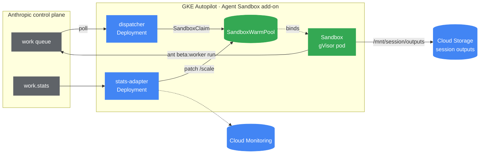

# Anthropic Managed Agents: self-hosted sandboxes on GKE Agent Sandbox

This example shows how to use a `SandboxWarmPool` and `SandboxClaim` to run
Anthropic's
[**self-hosted sandbox**](https://docs.claude.com/en/docs/agents-and-tools/managed-agents/self-hosting)
worker on a GKE cluster with the Agent Sandbox add-on.

[Anthropic Managed Agents](https://docs.claude.com/en/docs/agents-and-tools/managed-agents)
is a hosted agent loop: Claude, conversation state, and a per-environment work
queue all live on Anthropic's control plane. With a **self-hosted sandbox**,
Anthropic still runs the agent — it just queues each tool call (`bash`, `read`,
`write`, `grep`, …) and waits for *your* infrastructure to pull it, execute it,
and post the result back. That pull worker is exactly the shape Agent Sandbox
is built for: untrusted, LLM-generated commands running in an isolated,
short-lived, pre-warmed pod.



The full reference implementation — Terraform, Kustomize overlays, three
container images, and an end-to-end smoke test — lives in
[`GoogleCloudPlatform/kubernetes-engine-samples/ai-ml/anthropic-agent-sandbox`](https://github.com/GoogleCloudPlatform/kubernetes-engine-samples/tree/main/ai-ml/anthropic-agent-sandbox).
This document walks through the Agent Sandbox pieces and why they're shaped the
way they are.

> [!IMPORTANT]
> This integration is **early-stage**. Anthropic Managed Agents self-hosting is
> a beta API and the GKE Agent Sandbox add-on is in Preview. Treat this example
> as a reference pattern, not a production-hardened configuration.
>
> The manifests below use `extensions.agents.x-k8s.io/v1beta1` (the version
> served by this repo's controller). The **GKE Agent Sandbox add-on** currently
> serves `v1alpha1` — change the `apiVersion` to
> `extensions.agents.x-k8s.io/v1alpha1` when targeting GKE. The reference
> implementation in `kubernetes-engine-samples` ships the GKE versions.

## Prerequisites

Here the prerequisites to run this example:

- A GKE Autopilot cluster, version `1.35.2-gke.1269000` or later, with the
  Agent Sandbox add-on enabled:

  ```bash
  gcloud beta container clusters update CLUSTER_NAME \
    --enable-agent-sandbox --region REGION
  ```

- `enable_fqdn_network_policy = true` on the cluster (Dataplane V2).
- An Anthropic environment with `config.type = self_hosted`, its environment
  ID (`env_...`), and the generated environment key (`sk-ant-oat01-...`). See
  the [Anthropic self-hosting guide](https://docs.claude.com/en/docs/agents-and-tools/managed-agents/self-hosting).
- The container images built and pushed (see the
  [reference repo](https://github.com/GoogleCloudPlatform/kubernetes-engine-samples/tree/main/ai-ml/anthropic-agent-sandbox)).

## Why a warm pool, not a Deployment of N workers

Anthropic's reference for self-hosting is "run N copies of `ant beta:worker
poll`". That works, but every replica is a long-lived process that holds the
environment key and an open egress to `api.anthropic.com`, and every session
that lands on it shares the same `/workspace`.

With Agent Sandbox we split the responsibilities. One small **dispatcher**
Deployment polls the queue. Each work item gets a `SandboxClaim`, which binds a
pre-warmed gVisor pod from the `SandboxWarmPool` in well under a second. The
pod runs `ant beta:worker run` for exactly one session and is torn down when
the session ends. The blast radius of any one sandbox is one session, and the
warm pool refills behind it so the next session never waits on an image pull.

## The SandboxTemplate

[`sandbox-template.yaml`](./sandbox-template.yaml) defines the worker pod the
warm pool keeps ready:

```yaml
apiVersion: extensions.agents.x-k8s.io/v1beta1
kind: SandboxTemplate
metadata:
  name: claude-agent-worker
spec:
  podTemplate:
    spec:
      runtimeClassName: gvisor
      automountServiceAccountToken: false
      securityContext:
        runAsNonRoot: true
        runAsUser: 1000
      containers:
        - name: worker
          image: REGION-docker.pkg.dev/PROJECT_ID/anthropic-agents/claude-agent-worker:TAG
          ports:
            - { name: dispatch, containerPort: 8080 }
          env:
            - name: ANTHROPIC_ENVIRONMENT_KEY
              valueFrom:
                secretKeyRef: { name: anthropic-environment-key, key: latest }
          securityContext:
            allowPrivilegeEscalation: false
            readOnlyRootFilesystem: true
            capabilities: { drop: ["ALL"] }
```

Two things to call out:

- **`runAsUser: 1000` is required alongside `runAsNonRoot: true`.** With only
  `runAsNonRoot` and a _named_ `USER worker` in the Dockerfile, kubelet can't
  verify the user is non-root and the pod fails `CreateContainerConfigError`.
- **`automountServiceAccountToken: false`** means the LLM-driven `bash` tool
  has no path to the Kubernetes API or the GCP metadata server. The only
  credential inside the pod is the narrowly-scoped Anthropic environment key.

The admission webhook enforces these. Try deleting `runAsNonRoot` and applying:

```text
admission webhook "vsandboxtemplate.kb.io" denied the request:
spec.podTemplate.spec.securityContext.runAsNonRoot: Required value
```

## Late binding: how a warm pod learns its session

A pre-warmed pod is already running before the dispatcher knows which session
it will serve, so we can't pass `ANTHROPIC_SESSION_ID` as a container env var.
Instead the worker image starts a tiny HTTP listener on `:8080` and blocks
until the dispatcher POSTs `{session_id, work_id}`. Then it exec's:

```bash
ant beta:worker run --workdir /workspace --max-idle 60s --log-format json
```

`ant` acks the work item, downloads the agent's skills into `/workspace`, runs
each tool call, and streams results back to `api.anthropic.com`. When the
session goes idle for 60 s the process exits, the controller deletes the
sandbox, and the warm pool spins up a fresh replacement.

## The dispatcher

[`dispatcher.py`](./dispatcher.py) is the bridge between the two control
planes. The core loop is short:

```python
ant = anthropic.Anthropic(auth_token=os.environ["ANTHROPIC_ENVIRONMENT_KEY"])
sbx = SandboxClient(
    connection_config=SandboxInClusterConnectionConfig(use_pod_ip=True, server_port=8080)
)

while True:
    item = ant.beta.environments.work.poll(ENV_ID, block_ms=900)
    if item is None:
        continue

    sb = sbx.create_sandbox(
        template="claude-agent-worker",
        namespace=NAMESPACE,
        warmpool="claude-agent-worker",
        labels={"anthropic.com/session-id": item.data.id},
    )
    pod = sb.k8s_helper.core_v1_api.read_namespaced_pod(sb.get_pod_name(), sb.namespace)
    urllib.request.urlopen(f"http://{pod.status.pod_ip}:8080/", data=...)
```

A few details that matter in practice:

- **`auth_token=`, not `api_key=`.** The environment key is a bearer token; the
  Anthropic SDK sends it as `Authorization: Bearer …`. Passing it as `api_key`
  sends `x-api-key:` and the server returns a confusing
  `401 Missing Authorization header`.
- **`block_ms=900`.** The work queue caps the long-poll at 999 ms, so this loop
  runs roughly once a second when idle.
- **Pod IP, not Service DNS.** The per-claim headless Service is created at
  claim time, so its DNS record is ~1 s old when we first need it and the
  lookup fails. Reading the bound pod's IP from the core API skips both that
  race and the SDK's `get_pod_ip()` (which returns `None` against the GKE
  controller's `.status` schema).
- **Label the claim with the session ID.** Anthropic re-offers an unacked work
  item after `reclaim_older_than_ms`. Labelling lets the dispatcher delete any
  stale claim for the same session before creating a new one, so an idle-exited
  worker doesn't leak its sandbox.

The dispatcher needs RBAC across **two** API groups — `Sandbox` lives in
`agents.x-k8s.io`, `SandboxClaim`/`SandboxTemplate`/`SandboxWarmPool` live in
`extensions.agents.x-k8s.io` on GKE:

```yaml
rules:
  - apiGroups: ["extensions.agents.x-k8s.io"]
    resources: ["sandboxclaims"]
    verbs: ["create", "get", "list", "watch", "delete"]
  - apiGroups: ["agents.x-k8s.io"]
    resources: ["sandboxes"]
    verbs: ["get", "list", "watch", "delete"]
  - apiGroups: [""]
    resources: ["pods"]
    verbs: ["get", "list", "watch"]
```

## Locking down egress

[`network-policy.yaml`](./network-policy.yaml) pairs a default-deny
`NetworkPolicy` with a GKE `FQDNNetworkPolicy` allow-list:

```yaml
apiVersion: networking.gke.io/v1alpha1
kind: FQDNNetworkPolicy
spec:
  podSelector: { matchLabels: { app: claude-agent-worker } }
  egress:
    - matches: [{ name: api.anthropic.com }]
      ports: [{ protocol: TCP, port: 443 }]
---
apiVersion: networking.k8s.io/v1
kind: NetworkPolicy
spec:
  podSelector: { matchLabels: { app: claude-agent-worker } }
  policyTypes: [Ingress, Egress]
  ingress:
    - from: [{ podSelector: { matchLabels: { app: dispatcher } } }]
      ports: [{ protocol: TCP, port: 8080 }]
  egress:
    - to:
        - namespaceSelector: {}
          podSelector: { matchLabels: { k8s-app: kube-dns } }
      ports: [{ protocol: UDP, port: 53 }]
```

`FQDNNetworkPolicy` is allow-list only, so the vanilla `NetworkPolicy` supplies
the default-deny (plus a DNS carve-out so the FQDN match can resolve, and an
ingress rule so only the dispatcher can post a session binding to a warm pod).

## Scaling the warm pool on Anthropic's queue depth

`SandboxWarmPool` exposes the `/scale` subresource
(`specReplicasPath: .spec.replicas`), so an HPA can target it directly. On a
fresh Autopilot cluster, though, there's no `external.metrics.k8s.io` adapter
installed, and Anthropic's signal is an HTTP endpoint, not a Kubernetes metric.
The simplest path is a small **stats-adapter** Deployment that reads
`work.stats` and patches `/scale` itself:

```python
stats = ant.beta.environments.work.stats(environment_id=ENV_ID)
target = max(MIN, min(MAX, stats.depth + stats.pending))
k8s.patch_namespaced_custom_object_scale(
    group="extensions.agents.x-k8s.io", version="v1beta1",
    namespace=NAMESPACE, plural="sandboxwarmpools", name="claude-agent-worker",
    body={"spec": {"replicas": target}},
)
```

`depth` is the unacked queue and drains in <1 s once warm pods exist; `pending`
counts acked-and-heartbeating workers. Summing both gives a stable target equal
to concurrent sessions. This is the only component that holds the org-scoped
`ANTHROPIC_API_KEY`; sandboxes never see it.

```yaml
rules:
  - apiGroups: ["extensions.agents.x-k8s.io"]
    resources: ["sandboxwarmpools/scale"]
    verbs: ["get", "patch", "update"]
```

## Persisting session outputs to Cloud Storage

The Anthropic worker harness instructs Claude to write final deliverables to
`/mnt/session/outputs`. We back that path with a Cloud Storage bucket via the
[GCS FUSE CSI driver](https://cloud.google.com/kubernetes-engine/docs/how-to/persistent-volumes/cloud-storage-fuse-csi-driver),
so outputs survive the pod and you can pull them with `gcloud storage cat`.

Because a warm pod doesn't yet know its session ID, we mount the whole bucket
at `/mnt/gcs` and let `entrypoint.py` symlink `/mnt/session/outputs` →
`/mnt/gcs/<session_id>/` after dispatch — the same late-binding trick as the
session ID itself. See [`sandbox-template.yaml`](./sandbox-template.yaml) for
the CSI volume and the `gke-gcsfuse/volumes: "true"` annotation, and
[`network-policy.yaml`](./network-policy.yaml) for the extra
`storage.googleapis.com` and GKE metadata-server egress the sidecar needs.

The pod's KSA is bound (via Workload Identity) to a GSA that holds **only**
`roles/storage.objectUser` on this one bucket. The metadata-server egress means
that bucket-scoped token is technically reachable from the worker container; for
stricter isolation use one bucket per trust boundary or IAM Conditions on the
object prefix.

## Try it

The reference repo wraps the above in three `make` targets. From a fresh
Google Cloud project:

```bash
git clone https://github.com/GoogleCloudPlatform/kubernetes-engine-samples
cd kubernetes-engine-samples/ai-ml/anthropic-agent-sandbox
cp .env.example .env   # fill in PROJECT_ID + Anthropic credentials
source .env

make infra    # Autopilot cluster + Agent Sandbox add-on (~15 min)
make images   # Cloud Build × 3
make deploy   # kustomize | kubectl apply
```

Then ask the agent where it's running:

```bash
ant auth login
AGENT_ID=$(ant beta:agents create \
  --name gke-sandbox-probe \
  --model '{"id":"claude-sonnet-4-6"}' \
  --tool '{"type":"agent_toolset_20260401"}' \
  --format json --transform 'id' -r)
SESSION_ID=$(ant beta:sessions create \
  --agent '{"id":"'"$AGENT_ID"'","type":"agent"}' \
  --environment-id "$ANTHROPIC_ENVIRONMENT_ID" \
  --format json --transform 'id' -r)
ant beta:sessions:events send --session-id "$SESSION_ID" \
  --event '{"type":"user.message","content":[{"type":"text","text":"Run uname -a and tell me what sandbox you are in."}]}'
```

In another terminal, watch the claim bind:

```bash
kubectl -n agent-sandbox get sandboxclaim,sandbox,pods -w
```

You should see a `SandboxClaim` appear and bind within ~3 s, and the worker pod
log `Linux claude-agent-worker-… 4.4.0 …` — gVisor's synthetic kernel. The model's
answer (via `ant beta:sessions:events list`) will name gVisor and GKE on its
own.

## Clean up

```bash
ant beta:sessions delete --session-id "$SESSION_ID"
kubectl -n agent-sandbox delete sandboxclaim --all
make destroy
```

## References

- Full reference implementation:
  [`GoogleCloudPlatform/kubernetes-engine-samples/ai-ml/anthropic-agent-sandbox`](https://github.com/GoogleCloudPlatform/kubernetes-engine-samples/tree/main/ai-ml/anthropic-agent-sandbox)
- [Anthropic Managed Agents — self-hosting](https://docs.claude.com/en/docs/agents-and-tools/managed-agents/self-hosting)
- [GKE Agent Sandbox concepts](https://cloud.google.com/kubernetes-engine/docs/concepts/machine-learning/agent-sandbox)
- [GKE FQDN Network Policy](https://cloud.google.com/kubernetes-engine/docs/how-to/fqdn-network-policies)
- Agent Sandbox installation: [`../../README.md#installation`](../../README.md#installation)
