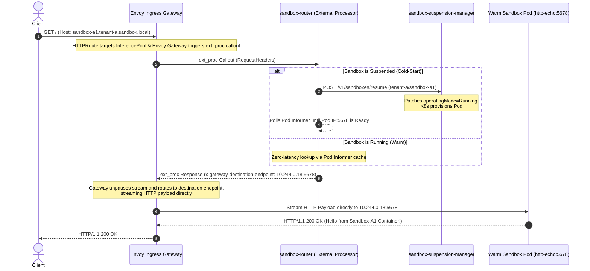

# Auto-Resume Sandbox & Gateway API Integration Example

This directory provides the reference implementation for request-driven auto-resume in `agent-sandbox` ([KEP-1174](../../docs/keps/1174-agent-sandbox-gateway/README.md)). It demonstrates multi-tenant request buffering and auto-resume across isolated namespaces (`tenant-a` with 2 sandboxes, `tenant-b` with 1 sandbox) using standard Kubernetes Gateway API `HTTPRoute` and Gateway API Inference Extension (`InferencePool`) on a local Kind cluster.

---

## 🏛️ Architecture & External Processor (`ext_proc`) with InferencePool via HTTPRoute

Each tenant namespace defines an **`InferencePool`** custom resource (GAIE model) tracking its Sandbox Pods and attaching **1 single ext_proc callout service** (`sandbox-router`). Standard Gateway API **`HTTPRoute`** targets the `InferencePool` directly as its `backendRef`.

At runtime, Envoy Edge Gateway processes requests:
1. **Interception**: Request arrives at Ingress Gateway targeting an `HTTPRoute` whose backend is an `InferencePool`.
2. **ext_proc Callout**: Gateway holds the request stream and sends a gRPC callout to `sandbox-router` (acting as the protocol-compliant External Processor).
3. **Thaw/Wait (Cold-Start)**: If the Sandbox is asleep, `sandbox-router` signals `sandbox-suspension-manager` out-of-band and waits for Pod readiness while Envoy holds the stream using TCP Zero-Window / L7 flow control.
4. **ext_proc Response**: Once awake, `sandbox-router` returns `x-gateway-destination-endpoint: <Pod-IP>:5678` in standard ext_proc metadata keys.
5. **Direct Data-Plane Proxying**: Envoy unpauses the HTTP pipeline and streams the payload directly to the target Sandbox Pod IP (`10.244.x.x:5678`).



---

## 📁 Directory Structure

* `cmd/`:
  - `sandbox-router/`: Go source code for `sandbox-router` gRPC `ext_proc` callout engine.
  - `suspension-manager/`: Go source code for `sandbox-suspension-manager` authenticated signaling controller.
* `Dockerfile`: Multi-stage Docker build file for `sandbox-router` and `sandbox-suspension-manager`.
* `Makefile`: Automation targets (`make deploy-envoy-epp`, `make test`, `make clean`).
* `manifests/`:
  - `common/`: Core infrastructure deployments (`sandbox-router-deployment.yaml`, `manager-deployment.yaml`).
  - `envoy-gateway-epp/`: Multi-tenant Gateway API `HTTPRoute` & `InferencePool` manifests (`gateway.yaml`, `patch-eg-config.yaml`, tenant infra & sandbox resources).

---

## 🚀 How to Deploy & Test

### 1. Deploy Auto-Resume Workloads

```bash
make deploy-envoy-epp
```
*This deploys the high-performance router-less architecture where Envoy routes directly to Pod IPs using ext_proc metadata.*

### 2. Stream Logs & Port-Forward Ingress (Terminals 1 & 2)

* **Terminal 1 (Stream `sandbox-router` Callout Logs)**:
  ```bash
  kubectl logs -f deployment/sandbox-router -n tenant-a
  ```

* **Terminal 2 (Port-Forward Envoy Edge Gateway)**:
  ```bash
  kubectl port-forward -n envoy-gateway-system $(kubectl get svc -n envoy-gateway-system -l gateway.envoyproxy.io/owning-gateway-name=sandbox-edge-gateway -o name) 8080:80
  ```

### 3. Execute Auto-Resume Requests (Terminal 3)

* **Tenant-A Sandbox-A1 (Cold-Start Auto-Thaw)**:
  ```bash
  curl -i -H "Host: sandbox-a1.tenant-a.sandbox.local" http://localhost:8080/
  ```
  *Output:* `Hello from Tenant-A Sandbox-A1 Container!`

* **Tenant-A Sandbox-A2 (Cold-Start Auto-Thaw)**:
  ```bash
  curl -i -H "Host: sandbox-a2.tenant-a.sandbox.local" http://localhost:8080/
  ```
  *Output:* `Hello from Tenant-A Sandbox-A2 Container!`

* **Tenant-B Sandbox-B1 (Cold-Start Auto-Thaw across Namespace Boundary)**:
  ```bash
  curl -i -H "Host: sandbox-b1.tenant-b.sandbox.local" http://localhost:8080/
  ```
  *Output:* `Hello from Tenant-B Sandbox-B1 Container!`

### 4. Verify Sub-Millisecond Warm Latency

Re-send any request to a running sandbox:
```bash
curl -i -H "Host: sandbox-a1.tenant-a.sandbox.local" http://localhost:8080/
```
*Output:* Instant `< 5ms` sub-millisecond response served directly via Envoy in-memory cache verification.
