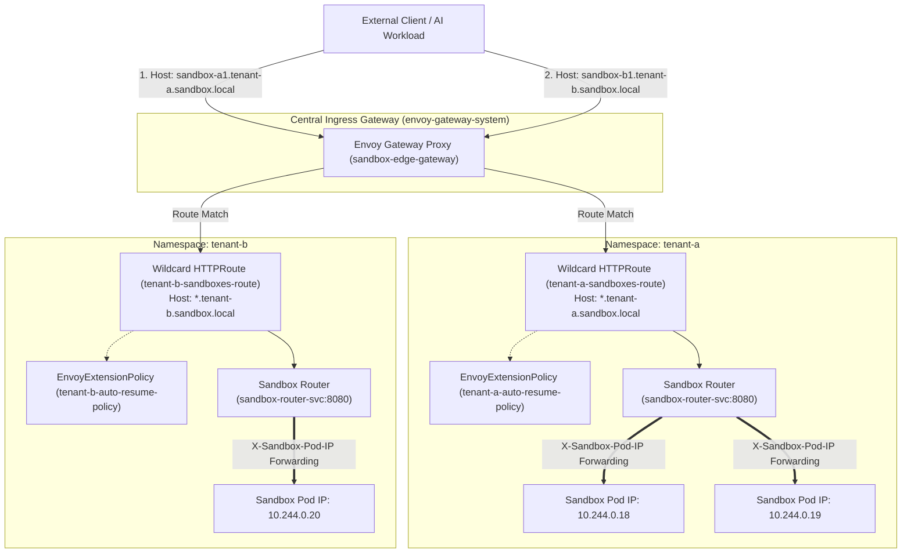

# Auto-Resume Sandbox & Gateway API Integration Example

This directory provides the reference implementation for request-driven auto-resume in `agent-sandbox` ([KEP-1174](../../docs/keps/1174-agent-sandbox-gateway/README.md)). It demonstrates multi-tenant request buffering and auto-resume across isolated namespaces (`tenant-a` with 2 sandboxes, `tenant-b` with 1 sandbox) using standard Kubernetes Gateway API resources (`Gateway`, `HTTPRoute`, `EnvoyExtensionPolicy`) and Envoy's External Processing (`ext_proc`) interface on a local Kind cluster.

---

## 🏛️ Architecture & Sandbox Router Pattern

Each tenant namespace deploys **1 single backend service** (`sandbox-router-svc`) to handle L7 routing to Sandbox Pod IPs.

At runtime, `sandbox-state-informer` (`ext_proc`) intercepts request headers, wakes sleeping sandboxes out-of-band via `sandbox-suspension-manager`, and injects routing headers (`X-Sandbox-Pod-IP`, `X-Sandbox-Port`, `X-Sandbox-ID`, `X-Sandbox-Namespace`). The request is then routed to `sandbox-router`, which proxies the request to the target Sandbox Pod IP.



---

## 📁 Directory Structure

* `cmd/`:
  - `state-informer/`: Go source code for `sandbox-state-informer` gRPC `ext_proc` callout engine.
  - `suspension-manager/`: Go source code for `sandbox-suspension-manager` authenticated signaling controller.
* `Dockerfile`: Multi-stage Docker build file for `sandbox-state-informer` and `sandbox-suspension-manager`.
* `Makefile`: Automation targets (`make deploy`, `make test`, `make clean`).
* `manifests/`:
  - `common/`: Core infrastructure deployments (`state-informer-deployment.yaml`, `manager-deployment.yaml`).
  - `envoy-gateway/`: Multi-tenant Gateway API & CRD manifests (`namespaces.yaml`, `gateway.yaml`, `tenant-a-sandboxes.yaml`, `tenant-b-sandboxes.yaml`).

---

## 🚀 How to Deploy & Test

### 1. Prerequisites & Installation

Install standard Kubernetes Gateway API v1.2 CRDs and the Envoy Gateway Operator:

```bash
# Install Kubernetes Gateway API CRDs v1.2.0
kubectl apply -f https://github.com/kubernetes-sigs/gateway-api/releases/download/v1.2.0/standard-install.yaml

# Install CNCF Envoy Gateway Operator v1.2.0
kubectl apply --server-side -f https://github.com/envoyproxy/gateway/releases/download/v1.2.0/install.yaml
```

### 2. Deploy Auto-Resume Workloads

From this directory, run:

```bash
make deploy
```

This target builds the Go binaries, loads the Docker images into Kind, and applies all multi-tenant manifests.

### 3. Stream Logs & Port-Forward Ingress (Terminals 1 & 2)

* **Terminal 1 (Stream `sandbox-state-informer` Callout Logs)**:
  ```bash
  kubectl logs -f deployment/sandbox-state-informer -n tenant-a
  ```

* **Terminal 2 (Port-Forward Envoy Edge Gateway)**:
  ```bash
  kubectl port-forward -n envoy-gateway-system $(kubectl get svc -n envoy-gateway-system -l gateway.envoyproxy.io/owning-gateway-name=sandbox-edge-gateway -o name) 8080:80
  ```

### 4. Execute Auto-Resume Requests (Terminal 3)

* **Tenant-A Sandbox-A1 (Cold-Start Auto-Thaw)**:
  ```bash
  curl -i -H "Host: sandbox-a1.tenant-a.sandbox.local" http://localhost:8080/
  ```
  *Output:* `Hello from Tenant-A Sandbox-A1 Container!`

* **Tenant-A Sandbox-A2 (Cold-Start Auto-Thaw)**:
  ```bash
  curl -i -H "Host: sandbox-a2.tenant-a.sandbox.local" http://localhost:8080/
  ```
  *Output:* `Hello from Tenant-A Sandbox-A2 Container!`

* **Tenant-B Sandbox-B1 (Cold-Start Auto-Thaw across Namespace Boundary)**:
  ```bash
  curl -i -H "Host: sandbox-b1.tenant-b.sandbox.local" http://localhost:8080/
  ```
  *Output:* `Hello from Tenant-B Sandbox-B1 Container!`

### 5. Verify Sub-Millisecond Warm Latency

Re-send any request to a running sandbox:
```bash
curl -i -H "Host: sandbox-a1.tenant-a.sandbox.local" http://localhost:8080/
```
*Output:* Instant `< 5ms` sub-millisecond response served directly via Envoy in-memory cache verification.
