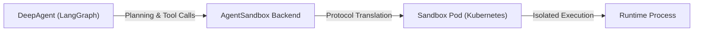

# LangChain DeepAgents with Agent-Sandbox

This example demonstrates how to use LangChain DeepAgents with Kubernetes-native sandboxes for secure, isolated code execution. The `langchain-agent-sandbox` backend implements the DeepAgents `BackendProtocol`, enabling agents to run shell commands and manage files in a containerized environment.

## Architecture



The backend translates DeepAgents protocol calls (`execute`, `read`, `write`, `edit`) into sandbox operations via the `k8s-agent-sandbox` SDK.

## Prerequisites

- Python 3.11+
- Kubernetes cluster with agent-sandbox controller deployed
- `kubectl` installed and configured
- API key for your LLM provider (OpenAI, Anthropic, or Google)

## Quick Start

### 1. Deploy the Sandbox Template

```bash
kubectl apply -f sandbox-template.yaml
```

This creates a `SandboxTemplate` that defines the container image and resources for sandbox pods.

### 2. Install Dependencies

```bash
# Using uv (recommended)
uv sync

# Or using pip
pip install -e "../../clients/python/agentic-sandbox-client"
pip install -e "../../clients/python/langchain-agent-sandbox"
pip install langchain-anthropic  # or langchain-openai, langchain-google-genai
```

### 3. Set Environment Variables

```bash
# LLM API key (choose one)
export ANTHROPIC_API_KEY="your-key"
# export OPENAI_API_KEY="your-key"
# export GOOGLE_API_KEY="your-key"

# Optional: LangSmith tracing
export LANGCHAIN_TRACING_V2=true
export LANGCHAIN_API_KEY="your-langsmith-key"
```

### 4. Run the Agent

```bash
# Interactive mode
uv run python main.py

# Single query mode
uv run python main.py --query "Create a Python script that calculates prime numbers"
```

## Connection Modes

The example supports three connection modes to the sandbox:

### Developer Mode (Default)

For local development with `kubectl port-forward`:

```bash
uv run python main.py
```

The backend automatically creates a tunnel to the Router service.

### Gateway Mode

For production deployments with Kubernetes Gateway:

```bash
uv run python main.py --gateway external-http-gateway --gateway-namespace agent-sandbox-system
```

### Direct Mode

For in-cluster agents or custom domains:

```bash
uv run python main.py --api-url http://sandbox-router.default.svc.cluster.local:8080
```

## Example Usage

### Code Generation and Execution

```
You: Create a Python script that generates the first 20 Fibonacci numbers

Agent: I'll create a Python script to generate Fibonacci numbers.

[Writes /app/fibonacci.py]
[Executes: python fibonacci.py]

Output:
0, 1, 1, 2, 3, 5, 8, 13, 21, 34, 55, 89, 144, 233, 377, 610, 987, 1597, 2584, 4181
```

### File Operations

```
You: Read the contents of /etc/os-release

Agent: [Reads /etc/os-release]

The sandbox is running Debian GNU/Linux 12 (bookworm).
```

### Multi-step Tasks

```
You: Create a web scraper for Hacker News headlines and save them to a file

Agent:
1. [Writes /app/scraper.py with requests and BeautifulSoup]
2. [Executes: pip install requests beautifulsoup4]
3. [Executes: python scraper.py]
4. [Reads /app/headlines.txt to verify output]

Successfully scraped 30 headlines and saved them to headlines.txt.
```

## Skills

The example includes pre-configured skills that enhance agent capabilities:

| Skill | Trigger Phrases | Description |
|-------|-----------------|-------------|
| `python-script` | "write a script", "create Python code" | Generate and run Python scripts |
| `data-analysis` | "analyze data", "show statistics" | Analyze CSV, JSON, and text files |
| `file-organizer` | "organize files", "sort by type" | Organize files by extension or criteria |

### Using Skills

Skills are automatically loaded from `.deepagents/skills/`. The agent discovers relevant skills based on your query:

```bash
# The agent will use python-script skill
uv run python main.py --query "Write a script to calculate factorials"

# The agent will use data-analysis skill
uv run python main.py --query "Analyze the sales.csv file"
```

### Adding Custom Skills

Create a new skill by adding a `SKILL.md` file:

```
.deepagents/skills/my-skill/SKILL.md
```

With YAML frontmatter:
```markdown
---
name: my-skill
description: "Description of when to use this skill. Trigger on phrases like 'do X'."
version: 1.0.0
---
# My Skill

Instructions and procedures...
```

See the [agentskills.io specification](https://agentskills.io/specification) for details.

## Files

| File | Description |
|------|-------------|
| `main.py` | Interactive agent with CLI argument parsing |
| `sandbox-template.yaml` | Kubernetes SandboxTemplate and SandboxWarmPool |
| `pyproject.toml` | Python dependencies |
| `run-test-kind.sh` | End-to-end test script for Kind clusters |
| `.deepagents/skills/` | Pre-configured skills for code and file operations |

## Advanced Usage

### Factory Pattern with create_deep_agent

```python
from deepagents import create_deep_agent
from langchain_agent_sandbox import create_sandbox_backend_factory

# Create a backend factory
factory = create_sandbox_backend_factory(
    template_name="python-deepagent",
    namespace="default",
    root_dir="/workspace",
)

# Pass factory to create_deep_agent
agent = create_deep_agent(
    model="claude-sonnet-4-20250514",
    backend=factory,
)

result = agent.invoke({"messages": [("user", "List files in the workspace")]})
```

### Policy Enforcement

```python
from langchain_agent_sandbox import AgentSandboxBackend, SandboxPolicyWrapper

with AgentSandboxBackend.from_template("python-deepagent") as backend:
    # Wrap with security policies
    secured = SandboxPolicyWrapper(
        backend,
        deny_prefixes=["/etc", "/sys", "/proc"],
        deny_commands=["rm -rf", "curl", "wget"],
        audit_log=lambda op, target, meta: print(f"[AUDIT] {op}: {target}")
    )

    agent = create_deep_agent(backend=secured)
    result = agent.invoke({"messages": [("user", "Run analysis")]})
```

Policy wrapper checks are best-effort guardrails. Paths are canonicalized before prefix checks (for example, `/app/../etc` is treated as `/etc`), but command pattern blocking can still be bypassed with shell variations or aliases. Use sandbox/container isolation controls for real security boundaries (for example gVisor or Kata Containers).

### WarmPool for Fast Startup

```python
from langchain_agent_sandbox import WarmPoolBackend

# Uses pre-warmed pods for faster startup
with WarmPoolBackend.from_warmpool(
    template_name="python-deepagent",
    warmpool_name="python-pool",
) as backend:
    agent = create_deep_agent(backend=backend)
    # Agent starts quickly with pre-warmed pod
```

## Troubleshooting

### Connection Issues

```bash
# Check if sandbox controller is running
kubectl -n agent-sandbox-system get pods

# Check if template exists
kubectl get sandboxtemplates

# View sandbox claim status
kubectl get sandboxclaims
kubectl describe sandboxclaim <name>
```

### Agent Errors

```bash
# Enable debug logging
export LANGCHAIN_VERBOSE=true
uv run python main.py --query "test"

# Check sandbox pod logs
kubectl logs <sandbox-pod-name>
```

### Timeout Issues

The default sandbox creation timeout is 180 seconds. For slow cluster provisioning:

```python
with AgentSandboxBackend.from_template(
    "python-deepagent",
    sandbox_ready_timeout=300,  # 5 minutes
) as backend:
    ...
```

## Testing on Kind

Run the full end-to-end test on a local Kind cluster:

```bash
./run-test-kind.sh
```

This script:
1. Creates a Kind cluster (if needed)
2. Deploys the agent-sandbox controller
3. Creates the SandboxTemplate
4. Runs the agent with a test query
5. Cleans up resources

## References

- [agent-sandbox](https://github.com/kubernetes-sigs/agent-sandbox) - Kubernetes CRD and controller
- [LangChain DeepAgents](https://docs.langchain.com/oss/python/deepagents/overview) - Agent framework documentation
- [langchain-agent-sandbox](../../clients/python/langchain-agent-sandbox/) - Backend implementation
- [k8s-agent-sandbox client](../../clients/python/agentic-sandbox-client/) - Core Python SDK
