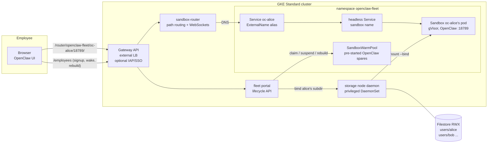
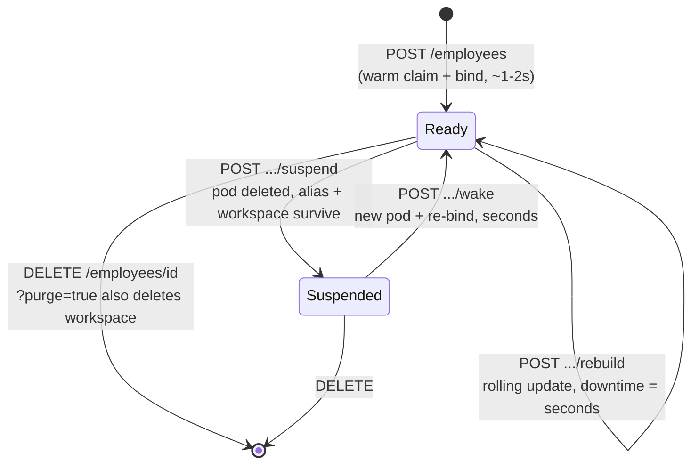

# OpenClaw Fleet on GKE: sub-second claims, per-employee workspaces, full lifecycle

This example is a complete, measured blueprint for operating a **fleet of
per-employee [OpenClaw](https://openclaw.ai) sandboxes on GKE Standard** —
the shape an enterprise takes when it gives every employee (thousands of
them) a personal, persistent AI-agent workspace. It demonstrates, with an
asserting test script, the six capabilities such a deployment must prove:

| # | Fleet requirement | Mechanism | Verified by |
|---|---|---|---|
| 1 | Startup: sub-second sandbox claims, image-cache-accelerated batch creation | `SandboxWarmPool` + warm `SandboxClaim` adoption; image streaming + optional secondary boot disk | `run-test-gke.sh` §1, [`tools/measure-claim-latency.sh`](tools/measure-claim-latency.sh) |
| 2 | Deletion releases every resource | claim delete cascades sandbox/pod/Service; portal purges alias + workspace | `run-test-gke.sh` §2 |
| 3 | Sleep releases resources; wake-up duration recorded | `Sandbox.spec.operatingMode` (disk-tier) and GKE Pod Snapshots (memory-tier) | `run-test-gke.sh` §3, [`60-snapshots/`](60-snapshots/) |
| 4 | Image/config updates + CPU/memory changes across the fleet | template bump → `Recreate` pool refresh → rate-limited per-employee rebuilds | `run-test-gke.sh` §4, [`70-rolling-update.sh`](70-rolling-update.sh) |
| 5 | NAS storage that scales to thousands of users (20 GB each) | ONE shared Filestore RWX volume, per-employee subdirectories **late-bound** into running warm pods | `run-test-gke.sh` §5, [`tools/fio-workspace-job.yaml`](tools/fio-workspace-job.yaml) |
| 6 | Distinct, stable address per employee (e.g. employee ID) | per-sandbox headless Service + `oc-<employee>` alias + Gateway API + [sandbox-router](../../sandbox-router/) path routing | `run-test-gke.sh` §6 |

The central design rule, from which everything else follows: **a warm claim
is only sub-second because it changes nothing about the running pod except
metadata.** Per-claim env vars or volumes force a cold start, so *everything
per-employee arrives at claim time without touching the pod spec* — the
employee's Filestore subdirectory is bind-mounted into the already-running
pod by a node daemon, and OpenClaw loads its profile, settings and assets
from that mount. One unified `SandboxTemplate` therefore serves every
employee.

## Architecture



How a claim stays sub-second — the pod is already running before the
employee exists:

```mermaid
sequenceDiagram
    participant P as fleet portal
    participant K as API server
    participant C as claim controller
    participant D as storage daemon
    participant O as OpenClaw pod (warm, spin-waiting)

    Note over O: started minutes ago by the warm pool;<br/>waiting for /workspace/.ready
    P->>K: create SandboxClaim oc-alice
    C->>K: adopt warm sandbox (2-3 metadata writes)
    Note over C,K: SUB-SECOND: no scheduling, no image pull,<br/>no container start
    P->>D: bind users/alice -> pod emptyDir/.openclaw
    D->>O: mount --bind + write .ready signal
    O->>O: OpenClaw starts, HOME=/workspace,<br/>profile & state from the bound mount
    P->>K: alias Service oc-alice -> sandbox DNS
    P-->>P: report adopted_ms / bound_ms / app_ready_ms
```

The employee lifecycle (every transition is a portal endpoint and a
checklist item):



## Files

| File | Role |
|---|---|
| [`setup/provision-gke.sh`](setup/provision-gke.sh) | GKE Standard cluster: gVisor node pool, image streaming, Filestore CSI, Gateway API, snapshot bucket, controller install. [`setup/teardown-gke.sh`](setup/teardown-gke.sh) removes everything. |
| [`00-prereqs.yaml`](00-prereqs.yaml) | Namespace, fleet-shared OpenClaw base config, secret shapes (daemon token, provider keys). |
| [`10-storage.yaml`](10-storage.yaml) | Shared Filestore RWX PVC + privileged **storage node daemon** that late-binds `users/<employee>` into warm pods (token-authenticated, NetworkPolicy-scoped). |
| [`20-openclaw-template.yaml`](20-openclaw-template.yaml) | The unified `SandboxTemplate`: gVisor, real OpenClaw image, spin-wait entrypoint, injection policies `Disallowed`, per-sandbox Service, managed fleet NetworkPolicy. |
| [`30-warmpool.yaml`](30-warmpool.yaml) | `SandboxWarmPool` (`updateStrategy: Recreate`) + sizing notes for large fleets. |
| [`40-fleet-portal/`](40-fleet-portal/) | The lifecycle control plane (~300 lines of Python, pattern from [hermes-agents-as-a-service](../hermes-agents-as-a-service/)): signup/suspend/wake/rebuild/delete with per-phase timings. |
| [`50-router/`](50-router/) | Go [sandbox-router](../../sandbox-router/) + GKE Gateway + HTTPRoutes + optional IAP policy: the stable per-employee URL. |
| [`60-snapshots/`](60-snapshots/) | Memory-tier sleep/wake: GKE Pod Snapshots manifests + runbooks for both sleep tiers. |
| [`70-rolling-update.sh`](70-rolling-update.sh) | Rate-limited fleet-wide rebuild after a template change. |
| [`tools/`](tools/) | Claim-latency measurement (percentiles) and a fio job for NAS I/O testing. |
| [`run-test-gke.sh`](run-test-gke.sh) | Asserting end-to-end walkthrough of items 1–6. |

## Walkthrough

### 1. Provision the cluster

```sh
PROJECT_ID=<your-project> ./setup/provision-gke.sh
```

Creates a GKE **Standard** cluster (the storage daemon needs
`privileged` + writable `hostPath`, which Autopilot rejects — see
[Autopilot notes](#autopilot) below), with a gVisor node pool on
`n2-standard-8` (non-E2, so Pod Snapshots work), image streaming, the
Filestore CSI driver, Gateway API, and the agent-sandbox controller with
extensions.

### 2. Secrets, storage, template, pool

```sh
kubectl apply -f 00-prereqs.yaml
kubectl -n openclaw-fleet create secret generic storage-daemon-token \
  --from-literal=token="$(openssl rand -hex 24)"
kubectl apply -f 10-storage.yaml     # first Filestore bind takes minutes
kubectl apply -f 20-openclaw-template.yaml -f 30-warmpool.yaml
kubectl -n openclaw-fleet get sandboxwarmpool openclaw-fleet-pool -w
```

Warm spares go `Ready` while parked at their spin-wait — the OpenClaw
process itself starts only after an employee's workspace is bound.

### 3. Portal + router + gateway

```sh
docker build -t $REPO/fleet-portal:demo 40-fleet-portal/ && docker push $REPO/fleet-portal:demo
sed "s|image: fleet-portal:demo|image: $REPO/fleet-portal:demo|" 40-fleet-portal/portal.yaml | kubectl apply -f -
kubectl apply -f 50-router/10-router.yaml -f 50-router/20-gateway.yaml
kubectl -n openclaw-fleet get gateway openclaw-fleet-gateway -w   # wait for an address
```

### 4. Provision employees and measure

```sh
GW=$(kubectl -n openclaw-fleet get gateway openclaw-fleet-gateway -o jsonpath='{.status.addresses[0].value}')
curl -X POST http://$GW/employees -H 'Content-Type: application/json' -d '{"employee": "alice"}'
```

```json
{
  "employee": "alice",
  "path": "/router/openclaw-fleet/oc-alice/18789/",
  "timings": {"adopted_ms": ..., "bound_ms": ..., "app_ready_ms": ..., "total_ms": ...}
}
```

`adopted_ms` is the warm-pool claim — the sub-second number. `total_ms` is
what the employee actually waits, dominated by OpenClaw's own boot. Open
`http://$GW/router/openclaw-fleet/oc-alice/18789/` for alice's UI (add the
gateway origin to `controlUi.allowedOrigins` in
[`00-prereqs.yaml`](00-prereqs.yaml) first). For percentiles across a batch:
`PORTAL_URL=http://$GW tools/measure-claim-latency.sh 20`.

### 5. Sleep, wake, update, delete

```sh
curl -X POST http://$GW/employees/alice/suspend -H "Authorization: Bearer $TOKEN"
curl -X POST http://$GW/employees/alice/wake    -H "Authorization: Bearer $TOKEN"   # reports wake_ms
# fleet-wide image rollout after editing 20-openclaw-template.yaml:
PORTAL_URL=http://$GW ADMIN_TOKEN=... RATE=1 ./70-rolling-update.sh
curl -X DELETE "http://$GW/employees/alice?purge=true" -H "Authorization: Bearer $TOKEN"
```

Memory-tier hibernation (state of the running process preserved, not just
disk): [`60-snapshots/30-snapshot-hibernate.md`](60-snapshots/30-snapshot-hibernate.md).

### 6. Or run the whole thing as one asserting script

```sh
IMAGE_REPO=us-central1-docker.pkg.dev/<project>/fleet ./run-test-gke.sh
```

## Measured results

Measured 2026-09-14 on GKE Standard `1.36.4-gke.1247000`, gVisor node pool
on `c3-standard-8` (`GVISOR_MACHINE_TYPE=c3-standard-8`), image streaming
on, Filestore Basic HDD (`standard-rwx`), warm pool of 5, OpenClaw
`2026.3.23`. `run-test-gke.sh` asserted every row; percentiles are from
`tools/measure-claim-latency.sh` over 5 provisions.

| Checklist item | Expected | Measured |
|---|---|---|
| Warm claim adoption (`adopted_ms`) | < 1 s | **p50 174 ms, max 201 ms** |
| + workspace bind (`bound_ms`) | sub-second | p50 177 ms |
| + OpenClaw boot (`app_ready_ms`) | seconds | p50 2.9 s |
| Signup end-to-end (`total_ms`) | a few seconds | **p50 3.26 s, max 3.32 s** |
| Cold start (pool empty, image cached via streaming) | ~3–15 s | 5.7 s end-to-end |
| Suspend → resources released | pod gone | ~1.7 s, pod deleted; Service/alias/workspace retained |
| Wake (`wake_ms`, disk tier: pod recreate + re-bind + boot) | seconds | 22.3 s |
| Rebuild downtime (`downtime_ms`, template image/CPU change) | seconds | 5.2 s |
| Deletion → everything released (incl. workspace purge) | complete | verified, no residue |

The warm-vs-cold contrast is the warm pool's value: the *claim* is ~174 ms
vs ~5.7 s cold — and cold assumes the image is already node-local (the
first-ever pull of the 1.2 GB OpenClaw image took ~27 s, which is what
image streaming / secondary boot disks remove for batch creation). Wake is
dominated by pod recreation and OpenClaw's boot; for wake-with-memory-state
(skipping the boot), see the Pod Snapshots tier in
[`60-snapshots/`](60-snapshots/).

## Design notes for large fleets

### Storage: why one shared volume + subdirectories

At 20 GB per employee, thousands of individual PVs hit two walls: NAS
volume-count limits and cost. The two workable Filestore shapes:

| | Shared volume + subdirectories (this example) | [Filestore multishares](https://cloud.google.com/filestore/docs/multishares) |
|---|---|---|
| PVs for 9,000 users | **1 per ~5,000 users** (zonal tier scales to 100 TiB/instance) | 9,000 (80 shares/instance ⇒ ~113 Enterprise instances) |
| Claim-time attach | instant `mount --bind` into a running pod | PVC attach ⇒ pod restart ⇒ cold start |
| Isolation | directory-level: the bind mount scopes each pod to its own subdir, but the boundary is the daemon, not the storage API | true per-share capacity isolation, per-PV observability, CMEK |
| Resizing | grow the instance; per-user quotas are your controller's job | per-share resize, both directions |
| Snapshots | subdirectory copies (`snapshots/<id>`, restorable in sub-seconds via bind) | not supported on multishare instances |

This example chooses subdirectories because it is the only shape compatible
with **sub-second claims** (nothing about the pod spec changes per user).
Fleets needing hard storage isolation should weigh multishares and accept
direct-built sandboxes (~15 s) for persistent-workspace users.

### <a name="autopilot"></a>Autopilot

The storage daemon requires `privileged: true` and a writable `hostPath`;
GKE Warden rejects both on Autopilot (`autogke-disallow-privilege`,
`autogke-no-write-mode-hostpath`). Current options:

- **GKE Standard** (this example): everything works today; node management
  is the trade-off.
- **Autopilot + customer-managed
  [WorkloadAllowlist](https://cloud.google.com/kubernetes-engine/docs/how-to/autopilot-privileged-allowlists)**:
  Autopilot can exempt exactly these two constraints for approved
  workloads, but customer-managed allowlists require eligibility approval
  through Cloud Customer Care.
- **Autopilot without the daemon**: pre-provisioned per-user PVCs (e.g.
  multishares) with direct-built sandboxes — zero node ops, but claim time
  moves from ~1 s to ~15 s for persistent-workspace users.

### Warm pool sizing and batch creation

Pool size covers the peak **claim rate**, not the fleet size: 9,000
employees who claim over a morning hour need warm spares ≈ peak
claims/minute × replenishment lag, not 9,000 spares. Shard high rates
across multiple pools (`--sandbox-warm-pool-concurrent-workers` ≥ pool
count) and shape refill bursts with the pool controller's
`MaxRefillRate`/`ReplenishDelay`. For the batch-creation path (pool refill,
cold starts), image pull dominates — enable
[image streaming](https://cloud.google.com/kubernetes-engine/docs/how-to/image-streaming)
(done by `provision-gke.sh`) and preload the OpenClaw image on a
[secondary boot disk](https://cloud.google.com/kubernetes-engine/docs/how-to/data-container-image-preloading)
(optional section in the provisioning script) so a node-pool's worth of
sandboxes starts without registry pulls.

### SSO / IdP integration

The demo runs unauthenticated at the edge (portal/router tokens only).
For production: enable **IAP on the Gateway** via the provided
[`50-router/30-iap-optional.yaml`](50-router/30-iap-optional.yaml)
(`GCPBackendPolicy`); enterprise SAML/OIDC IdPs plug into IAP through
[Workforce Identity Federation](https://cloud.google.com/iap/docs/use-workforce-identity-federation).
IAP asserts the employee's identity in signed headers; mapping that
identity to `oc-<employee>` authorization is the thin piece a production
portal adds (the router's `scoped-token`/`tokenreview` modes are the
building blocks — see its [README](../../sandbox-router/README.md)).

### Cost dials

Suspend (`operatingMode`) releases all compute while keeping identity +
storage: an employee active 8h/day costs ~1/3 of always-on. The portal's
idle sweeper (`IDLE_TIMEOUT`) automates this; Pod Snapshots
([`60-snapshots/`](60-snapshots/)) make the wake seamless for in-flight
sessions. Warm pools can follow the daily curve with HPA/KEDA
([hpa-swp-scaling](../hpa-swp-scaling/), [keda-scale-to-zero](../keda-scale-to-zero/)).

## Production hardening notes

The storage daemon and portal are example-grade orchestration, kept small
so every mechanism is visible. A production fleet manager adds: a durable
job queue with rate-limited bulk operations, audit logging, per-user
storage quotas, HA for the portal, TLS + real edge auth throughout, and the
router's non-demo authorization modes. The daemon's HTTP contract
(`bind`/`unbind`/`delete`) is deliberately tiny so it can be replaced by a
proper controller reconciling a `WorkspaceBinding`-style CRD.

Two teardown rules learned from live validation (both encoded in the
portal, both worth a finalizer in production, as in
[latebind-storage-gke-sandbox](../latebind-storage-gke-sandbox/)):

1. **Always unbind before any pod teardown begins.** If the bind is still
   mounted when termination starts, the emptyDir cleanup deletes THROUGH
   it and wipes the employee's NFS workspace; if it is unbound first, the
   workspace provably survives.
2. **Pods deleted outside the portal wedge in `Terminating`.** Any path
   that bypasses the unbind (kubectl delete pod, namespace deletion, node
   drain) leaves the mount in place and the kubelet cannot clean the
   volume — recover with a manual daemon `unbind` (or force-delete when
   discarding the cluster). A finalizer on the claim/sandbox is the
   production answer.
