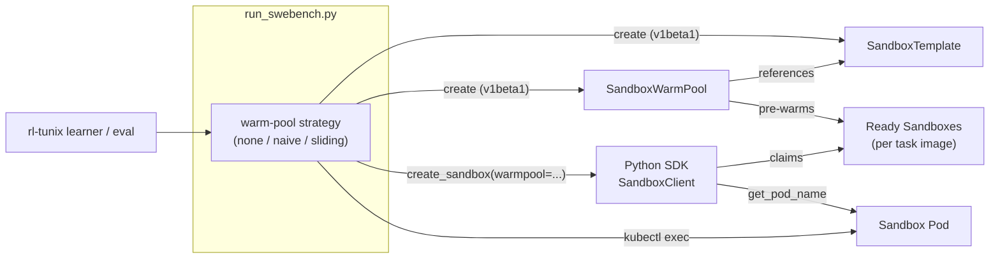

# rl-tunix SWE-bench Warm Pools

This example shows how a reinforcement-learning / evaluation pipeline —
[**rl-tunix**](https://github.com/google/tunix) (the `tunix` post-training
library together with [`R2E-Gym`](https://github.com/R2E-Gym/R2E-Gym)) — uses
**Agent Sandbox warm pools** to run [SWE-bench](https://www.swebench.com/) tasks
at scale, securely and with low per-task startup latency.

Each SWE-bench task ships as its own multi-GB Docker image (the repository
checked out at a specific commit, with its toolchain installed). An RL learner
generates thousands of trajectories across hundreds of these images, so two
things matter: **isolation** (untrusted, model-generated code runs inside each
sandbox) and **startup latency** (a cold sandbox must pull a large image and
start a pod). Agent Sandbox `SandboxWarmPool`s solve the latter by keeping a
configurable number of sandboxes pre-warmed per task image; this example adds
the orchestration that decides *which* pools to keep warm, and *when*.

### This is a simulator for the downstream RL use case

There is **no model in the loop here.** This example is a **simulator / harness**
for the infrastructure path that an RL training or evaluation run exercises. In a
real [rl-tunix](https://github.com/google/tunix) run, the learner does, per
trajectory: *claim a sandbox for the task's image → run the agent's actions in
it → score → release.* This example stands in for the learner by claiming a
sandbox per task and running a **lightweight probe command** instead of an actual
agent rollout.

That lets you **develop, benchmark, and tune the warm-pool infrastructure**
(provisioning strategies, pool sizing, claim/scale behavior) in isolation —
cheaply and reproducibly, without TPUs, a served model, or RL machinery — and
then carry the same provisioning/claiming code into the real training/eval
pipeline. The optimizations explored here (e.g. parallel claims, image pre-pull,
pool sizing) map directly onto how the downstream RL job will provision and claim
sandboxes at scale.

## Architecture



For each task the driver **claims** a pre-warmed sandbox from the image's pool
with the Python SDK (`client.create_sandbox(warmpool=...)`), runs a command
inside it, and **terminates** it. Commands run via `kubectl exec` (the
router-free path), so the [Sandbox Router](../python-sdk-quickstart/) is *not*
required.

## Warm-pool strategies

| Strategy | Behavior | Use case | Idle cost |
| :--- | :--- | :--- | :--- |
| `none` | Provision a size-1 pool on demand per task, tear it down after. | Debugging, tiny budgets. | Lowest (every task pays cold-start). |
| `naive` | Pre-warm a pool for **every** unique image up front; tear all down at the end. | Small batches, ample capacity, maximum task shuffle. | Highest (all pools idle together). |
| `sliding` | Sort tasks by image; keep only `WARMPOOL_WINDOW_SIZE` pools warm, rolling forward as each image's tasks complete. | Large, image-diverse batches with limited capacity. | Balanced. |

Per-image pool size is concurrency-aware (`sizing.compute_replicas`): each image's
share of the `MAX_CONCURRENT` budget — `round(MAX_CONCURRENT × tasks_for_image /
tasks_total)`, clamped to `[1, min(tasks_for_image, MAX_WARMPOOL_SIZE)]`.

## Prerequisites

**What to clone:** just this repo (`kubernetes-sigs/agent-sandbox`) — the example
lives in it. You do **not** need to clone `tunix` or `R2E-Gym`: the example is
self-contained, the SDK comes from PyPI, the dataset from Hugging Face, and the
task images from Docker Hub.

**Cluster:**
- A Kubernetes cluster with the Agent Sandbox **controller and extensions**
  installed (the `SandboxTemplate` / `SandboxClaim` / `SandboxWarmPool` CRDs,
  API `v1beta1`). See the [installation guide](../../README.md#installation); if
  you don't have a cluster, you can install the controller from this repo.
- `kubectl` configured for the cluster. **On GKE** this also needs the
  `gke-gcloud-auth-plugin` on your `PATH` (both `kubectl` and the Python SDK
  authenticate through your kubeconfig, which invokes it):
  `gcloud components install gke-gcloud-auth-plugin`.

**For the Python driver + notebook (Options A & C):**
- Python ≥ 3.10.
- `pip install -r requirements.txt` (installs `k8s-agent-sandbox`, `kubernetes`,
  `datasets` from PyPI — no extra repo needed).

**For the bash e2e test (Option D):**
- `kubectl`, `curl`, and `jq` (no Python/SDK).

**Optional:**
- A Docker Hub pull secret named via `IMAGE_PULL_SECRET` if anonymous pulls of
  the SWE-bench images get rate-limited.
- A gVisor-enabled node pool for strong isolation (set `RUNTIME_CLASS=gvisor`).

> **Heads up:** SWE-bench images are multi-GB. On a small cluster keep
> `TASKS_LIMIT` and pool sizes tiny, and allow time for the first image pull
> (raise `SANDBOX_READY_TIMEOUT`).

### Optional: pre-pull images (faster warm-up)

The multi-GB image pull is what gates warm-pool readiness. Since the task set is
known up front, you can pre-pull the images onto every node first with
[`prepull.sh`](./prepull.sh) (a DaemonSet, one init container per image):

```bash
./prepull.sh -n 4                       # pre-pull the first 4 dataset images
# ...run the driver / e2e as usual; warm pools now skip the pull...
./prepull.sh --delete                   # remove the DaemonSet (cached images stay)
```

Measured here (fresh repo family, 1 task): the `wait warm` phase dropped from
**~81s cold → ~6s** after pre-pull, and the pull ran in parallel across all
nodes (and auto-covers newly autoscaled nodes). Note `slimshetty/swebench`
images **share base layers within a repo family**, so the *second* image of a
family is already cheap (~11s) — pre-pull pays off most for each **fresh repo
family** and for **node scale-up**, not per instance.

## Run it and what to expect

First-time setup (once per cluster/shell):

```bash
kubectl apply -f manifests/namespace.yaml
pip install -r requirements.txt
```

### Option A — Python driver (all three strategies)

```bash
# Naive, a single task, on a standard node pool:
WARMPOOL_STRATEGY=naive \
TASKS_LIMIT=1 \
MAX_WARMPOOL_SIZE=1 \
NAMESPACE=rl-tunix-swebench \
NODE_SELECTOR_KEY=cloud.google.com/gke-nodepool \
NODE_SELECTOR_VAL=standard-pool \
SANDBOX_READY_TIMEOUT=1200 \
python run_swebench.py
```

**What the driver does, in order:** loads the dataset → creates a
`SandboxTemplate` + `SandboxWarmPool` for each task image → waits for the warm
pool to report `readyReplicas` (this is the slow step on a cold node: the
multi-GB image pull) → claims a pre-warmed sandbox per task with the SDK → execs
the probe command inside `/testbed` → terminates the sandbox → tears the pools
down → prints a JSON summary.

**Expected console output** (abridged; the first run is dominated by the image
pull, subsequent claims are seconds):

```text
INFO ... Loading dataset R2E-Gym/SWE-Bench-Verified [test]
INFO ... Loaded 1 tasks (1 unique images)
INFO ... Running 'naive' strategy over 1 tasks
INFO ... [naive] pre-warming slimshetty/swebench-verified:...astropy__astropy-12907 (replicas=1)
INFO ... Creating SandboxTemplate 'r2e-img-a8d0235275f3' ...
INFO ... Created SandboxWarmPool 'pool-r2e-img-a8d0235275f3' (replicas=1)
INFO ... WarmPool 'pool-r2e-img-a8d0235275f3': 0/1 ready
INFO ... WarmPool 'pool-r2e-img-a8d0235275f3': 1/1 ready
INFO ... [astropy__astropy-12907] pod=pool-r2e-img-a8d0235275f3-n5whj output=READY ...
INFO ... Deleted SandboxWarmPool 'pool-r2e-img-a8d0235275f3'
```

```json
{
  "strategy": "naive",
  "results": [
    {
      "instance_id": "astropy__astropy-12907",
      "docker_image": "slimshetty/swebench-verified:sweb.eval.x86_64.astropy__astropy-12907",
      "pod": "pool-r2e-img-a8d0235275f3-n5whj",
      "output": "READY pool-r2e-img-a8d0235275f3-n5whj\nd16bfe05a7 Merge pull request #12900 from Cadair/custom_compound_model",
      "elapsed_s": 2.2
    }
  ]
}
```

The `output` field is proof the real task environment is live: the git line is
the actual repository checked out at the task's commit under `/testbed`. After
the run, `kubectl get all,sandboxwarmpools,sandboxtemplates -n rl-tunix-swebench`
should be empty — the driver cleans up after itself.

**Watch it work** (in a second terminal, while the driver runs):

```bash
kubectl get pods,sandboxwarmpools -n rl-tunix-swebench -w
# pool-...-xxxxx   0/1   ContainerCreating   <- pulling the image
# pool-...-xxxxx   1/1   Running             <- pre-warmed, ready to claim
```

**Try the other strategies** (with a couple of tasks so the difference shows):

```bash
WARMPOOL_STRATEGY=sliding TASKS_LIMIT=4 WARMPOOL_WINDOW_SIZE=1 MAX_WARMPOOL_SIZE=2 \
  NAMESPACE=rl-tunix-swebench python run_swebench.py
WARMPOOL_STRATEGY=none     TASKS_LIMIT=2 \
  NAMESPACE=rl-tunix-swebench python run_swebench.py
```

What to expect from each:

| Strategy | What you'll see on the cluster | Trade-off |
| :--- | :--- | :--- |
| `naive` | All image pools appear up front and stay Ready until the end. | Fastest per-task claim; highest idle footprint. |
| `sliding` | Only `WARMPOOL_WINDOW_SIZE` pools exist at once; pools disappear as their image's tasks finish and the next image's pool appears. | Balanced footprint; tasks are run grouped by image. |
| `none` | A single size-1 pool blinks into existence per task, then is deleted. | Lowest idle footprint; every task pays the cold-start. |

### Option B — Pure kubectl (single image, no Python)

```bash
kubectl apply -f manifests/namespace.yaml
kubectl apply -f manifests/sandbox-template.example.yaml
kubectl apply -f manifests/sandboxwarmpool.example.yaml

kubectl get sandboxwarmpool -n rl-tunix-swebench -w   # wait for readyReplicas
kubectl get pods -n rl-tunix-swebench
```

Expect the warm pool's `READY` column to go to `2` once the image is pulled, and
two `pool-r2e-img-astropy-12907-xxxxx` pods `Running`. Tear it down:

```bash
kubectl delete -f manifests/sandboxwarmpool.example.yaml
kubectl delete -f manifests/sandbox-template.example.yaml
```

To pre-warm **multiple** images at once (the naive strategy by hand), apply the
whole `manifests/warmpools/` directory — each file is a `SandboxTemplate` +
`SandboxWarmPool` pair for one image:

```bash
kubectl apply -f manifests/warmpools/                  # one pool per image
kubectl get sandboxwarmpools -n rl-tunix-swebench -w   # each goes to READY
kubectl delete -f manifests/warmpools/
```

### Option C — Notebook

Open [`rl-tunix-swebench-demo.ipynb`](./rl-tunix-swebench-demo.ipynb) for an
interactive walk-through of all three strategies. The committed copy includes
the outputs from a real run (two `astropy` tasks) so you can see expected
results before running it yourself. Run it from this directory so
`import strategies, warmpool` resolves.

### Option D — End-to-end bash test (`e2e_test.sh`)

A self-contained smoke/perf test that walks the whole flow with `kubectl` only
(no Python/SDK) — pick a strategy and task count from a menu, then it provisions
the warm pools, claims a sandbox per task, execs inside it, **prints every
created object** (`SandboxTemplate`/`SandboxWarmPool`/`SandboxClaim`/`Sandbox`/
`Pod`), tears everything down, and reports **per-phase benchmark timers plus the
total end-to-end time**. Requires `kubectl`, `curl`, and **`jq`**.

```bash
./e2e_test.sh                          # interactive menu (strategy, #tasks)
./e2e_test.sh -s naive -n 2 -y         # non-interactive
STRATEGY=sliding TASKS=3 WINDOW_SIZE=1 \
  NODE_SELECTOR_KEY=cloud.google.com/gke-nodepool NODE_SELECTOR_VAL=standard-pool \
  ./e2e_test.sh -y
```

It fetches real task images from the dataset (HF datasets-server REST API),
labels everything `app=rl-tunix-e2e`, and an EXIT trap cleans up even on
Ctrl-C (use `--no-cleanup` to keep objects for inspection). For accurate
sub-second timing it runs a transient `kubectl proxy` (auth once) and hits the
local API over curl for hot-path polls/claims — avoiding the ~1 s/call kubectl
tax on GKE, so the reported `claim` reflects the controller, not the harness.
Sample tail:

```text
▶ Created objects in namespace rl-tunix-swebench
  --- SandboxTemplates / SandboxWarmPools ---
  sandboxtemplate.../r2e-img-a8d0235275f3      ...
  sandboxwarmpool.../pool-r2e-img-a8d0235275f3   READY 1
  --- SandboxClaims ---
  e2e-claim-1-17857   ...
  --- Sandboxes / Pods ---
  pod/pool-r2e-img-a8d0235275f3-qlcq4   1/1   Running   ...

── Benchmark (strategy=none, tasks=1) ───────────────
  preflight              1.9s
  fetch tasks            4.1s
  create namespace       1.0s
  provision pools        4.1s
  wait warm (pull)       1.1s
  claim sandboxes        4.1s
  exec probes            2.6s
  teardown               5.0s
  ──────────────────────────────────────────
  TOTAL e2e             30.9s
```

(The `wait warm (pull)` phase dominates the first run while the multi-GB image
is pulled; it drops to ~1s once images are node-cached.)

## Configuration

| Env var | Default | Description |
| :--- | :--- | :--- |
| `WARMPOOL_STRATEGY` | `naive` | `none`, `naive`, or `sliding`. |
| `WARMPOOL_WINDOW_SIZE` | `0` | (sliding) unique images kept warm; `0` = auto-pick so the warm footprint ≈ `MAX_CONCURRENT`. |
| `MAX_WARMPOOL_SIZE` | `8` | Hard cap on replicas per image pool. |
| `MAX_CONCURRENT` | `1` | Concurrency budget used to size pool replicas (see `sizing.py`); raise with parallel execution. |
| `TASKS_LIMIT` | `1` | Number of tasks from the dataset (`0` = all). |
| `DATASET_NAME` | `R2E-Gym/SWE-Bench-Verified` | HF dataset with a `docker_image` column. |
| `DATASET_SPLIT` | `test` | Dataset split. |
| `NAMESPACE` | `rl-tunix-swebench` | Namespace for the CRs. |
| `NODE_SELECTOR_KEY` / `NODE_SELECTOR_VAL` | _(unset)_ | Optional node pinning. |
| `RUNTIME_CLASS` | _(unset)_ | e.g. `gvisor` for isolation. |
| `IMAGE_PULL_SECRET` | _(unset)_ | Optional Docker Hub pull secret. |
| `SANDBOX_READY_TIMEOUT` | `900` | Seconds to wait for a sandbox/pool to be ready. |

## Cleanup

The driver tears down everything it creates. To remove anything left over:

```bash
kubectl delete sandboxwarmpools,sandboxtemplates,sandboxclaims,sandboxes \
  --all -n rl-tunix-swebench
kubectl delete namespace rl-tunix-swebench
```

## Scaling notes

For production-scale runs (thousands of concurrent trajectories) the strategies
here pair with two infra optimizations from the rl-tunix design:

- **Image pre-pull** — pre-pull task images onto nodes before the run so warm
  pods skip the multi-GB pull. See [`prepull.sh`](./prepull.sh) (DaemonSet);
  measured ~81s→~6s warm-up on a fresh repo family.
- **Proportional sizing** — size each image's pool to its share of the batch,
  `replicas_image ≈ GlobalConcurrency × tasks_image / tasks_total`, capped by
  `MAX_WARMPOOL_SIZE`.
- **Autoscaling** — combine with cluster autoscaler / capacity buffers, or scale
  pools on claim-rate metrics (see [`../hpa-swp-scaling`](../hpa-swp-scaling)).

Measured numbers and the working notes behind these live in
[`performance.md`](./performance.md), [`optimizations.md`](./optimizations.md),
and [`image-analysis.md`](./image-analysis.md).

## Relation to the rl-tunix branches

This example is a self-contained re-implementation of the warm-pool integration
prototyped in the `agentic-sandbox-integration` branches of `tunix`
(`examples/deepswe/eval_deepswe.py`) and `R2E-Gym` (the `kubernetes-sandbox`
backend in `agenthub/runtime/docker.py`). It differs from those prototypes in a
few deliberate ways so it runs against current Agent Sandbox:

- **API `v1alpha1` → `v1beta1`.** Warm pool spec fields are `replicas` /
  `sandboxTemplateRef` here (the prototype used `size` / `templateRef`).
- **Current Python SDK.** Sandboxes are claimed with
  `SandboxClient().create_sandbox(warmpool=...)`; the prototype used an older
  `SandboxClient(template_name=..., api_url=...)` context-manager API that no
  longer exists.
- **gVisor optional.** `runtimeClassName` is unset by default for portability;
  set `RUNTIME_CLASS=gvisor` on a gVisor-enabled pool.
- **No model in the loop.** The driver execs a lightweight probe command per
  task instead of running an RL agent, to keep the example focused on the
  warm-pool orchestration.

The original (v1alpha1) template from the R2E-Gym branch is kept verbatim under
[`manifests/reference/`](./manifests/reference/) for side-by-side comparison.
